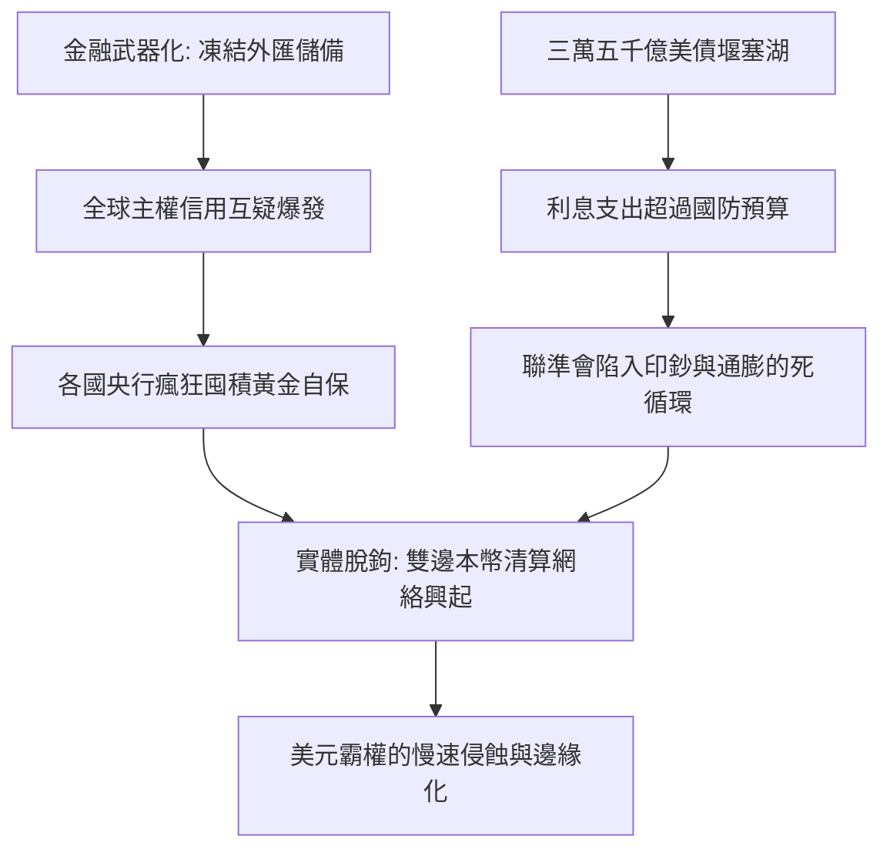

# 美元霸權還能撐多久？全球去美元化浪潮下的真實局勢

> **迷因導讀**：打開社群平台或短影音，你大概每隔三個月就會刷到一次「美元明天就要崩潰！金磚共同貨幣即將登基！美國印鈔自焚，全球拋售美債！」的震撼彈標題。各路財經自媒體講得唾沫橫飛，彷彿聯準會明天就要宣布破產清算、美元廢紙化進入倒數計時。然而，當你真正點開國際結算銀行（BIS）與 SWIFT 的最新每月資金結算報告，揉揉眼睛一看——美元結算市佔率依然高懸在 47%～49% 之間；全球央行外匯儲備裡，美元依然老神在在地佔據近六成江山。一邊是全球大國領袖在峰會上群情激憤、高喊「擺脫美元霸凌」的宏大敘事，另一邊卻是實體跨國貿易與外匯存底上「嘴上說不要，身體很誠實」的超強路徑依賴。究竟這場「去美元化」是大排長龍的革命起義，還是各國央行在台前擺拍、私下默默按表操課的慢速拆彈？今天我們就扒開狂熱的地緣迷因，帶你看清全球貨幣體系最冷酷、最硬核的底層權力博弈。

---

## 一、 美元霸權的「神聖同盟」：布雷頓森林解體到石油美元的血色契約

要談「美元何時會死」，你必須先搞清楚「美元究竟是怎麼封神的」。很多人誤以為美元的霸道地位是二戰後天然降臨的聖旨，但事實上，現代我們所熟知的「純信用法幣美元帝國」，是一場在歷史絕境中殺出重圍的精密地緣政治魔術。

### 1. 尼克森衝擊（1971）：信用違約反而造就了無限開火權
二戰末期的 1944 年，44 國代表在美國新罕布夏州確立了「布雷頓森林體系」（Bretton Woods System）。當時的玩法很單純粗暴：各國貨幣錨定美元（固定匯率），而美元以每盎司黃金 35 美元的硬標準，向全世界承諾「隨時兌換黃金」。這就是「美金」這個歷史名詞的由來——你拿著綠色紙鈔，背後是一座座實打實的金庫。

然而，到了 1960 年代後期，越戰的無底洞泥淖與「偉大社會」的巨額福利開支，讓美國印鈔機開得飛快。法蘭西狂人戴高樂率先看破手腳，直接派軍艦載著成箱的美元現鈔開赴紐約港，要求美方「按照協議全部換成金磚運回巴黎」。全美金庫黃金儲備眼看著急速縮水過半。

1971 年 8 月 15 日，時任美國總統理查·尼克森（Richard Nixon）發表了震撼世界的電視講話，單方面宣佈：「暫停美元與黃金的自由兌換窗口。」

在傳統商業邏輯中，這叫做「主權違約」；如果你去銀行存錢，銀行突然告訴你「我們不再承兌現金，請直接把存摺當錢花」，你大概會當場掀桌。然而在主權暴力的現實世界裡，尼克森的這記「流氓拳」非但沒有讓美國破產，反而彻底解開了束縛在印鈔機上的黃金枷鎖。從那一秒開始，美元正式從「黃金抵押券」昇華為「以美軍航母戰鬥群與美國綜合國力為信用背書」的純法幣（Fiat Currency）。

### 2. 季辛吉與沙烏地阿拉伯的「黑金血色契約」
解除了黃金錨定，全世界為什麼還要拿著這張隨時可能超發的綠色紙鈔？美國國務卿亨利·季辛吉（Henry Kissinger）展現了教科書級別的地緣政治手腕。

1973 年第四次中東戰爭引發全球石油危機，油價狂飆四倍，全球工業國哀鴻遍野。1974 年，季辛吉親赴利雅德，與沙烏地阿拉伯王室達成了一項改寫半個世紀世界經濟版圖的絕密協議：
1. **唯一定價權**：石油輸出國組織（OPEC）龍頭沙烏地阿拉伯承諾，其出口的所有原油，**必須且只能用美元計價與結算**。
2. **美元回收閉環（Petrodollar Recycling）**：沙烏地賣石油賺取的天量美元利潤，必須回流投資於美國國債與金融資產，替美國財政部買單。
3. **終極安全保障**：作為交換，美國提供沙烏地阿拉伯王室無條件的軍事安全保護、先進軍售，並在動盪的中東政局中永遠充當保鏢。

這就是威名赫赫的**「石油美元體系」（Petrodollar System）**。

這套機制的精妙毒辣之處在於：**黃金是可有可無的儲備，但石油是整個現代工業文明的血液。** 全球任何一個非美經濟體（無論是日本、德國，還是新興工業國），只要工廠要開工、卡車要加油、電網要發電，你的中央銀行就必須儲備足夠的美元去買油。如果沒有美元怎麼辦？你就必須生產襯衫、電視、汽車、晶片，賣給美國消費者，換取這張綠色紙鈔。

美國人用一台印刷機（以及日後的電子帳本跳動），換取了全世界源源不絕的實物商品與能源供應；而全球各國賺到了美元，為了保值增值，又只能把美元買成美債，資金回流華爾街，再次推升美股與美國科技資本的繁榮。這個完美的「向全球徵收鑄幣稅」（Seigniorage）與資本回流永動機，就是過去五十年美元霸權不可動搖的底層架構。

---

## 二、 去美元化浪潮的真實進度條：誰在口嗨，誰在真做？

近年來，「去美元化」（De-dollarization）成為金磚國家峰會與國際論壇上的最熱關鍵字。然而，把地緣政治的「外交姿態」翻譯成冰冷的「金融數據」，真實的戰況究竟如何？

我們必須把「貨幣的三大職能」（價值儲藏、交易媒介、計價單位）拆開來看，才能看清到底誰在打嘴砲，誰在真正挖牆腳。

### 1. 2000 年 vs 2015 年 vs 2026 年：全球央行外匯儲備與支付份額全景對比

以下根據國際貨幣基金組織（IMF COFER 數據庫）、國際清算銀行（BIS）以及 SWIFT 最新統計進行橫向與縱向的全面梳理：

| 評估指標 / 貨幣幣種 | 2000 年（歐元初生/單極鼎盛） | 2015 年（SDR納入人民幣前夕） | 2026 年（當前現狀/多極拉扯） | 26年趨勢與現實診斷 |
| :--- | :--- | :--- | :--- | :--- |
| **美元 (USD)** | 儲備佔比：**71.5%** SWIFT結算：**~48.0%** | 儲備佔比：**65.7%** SWIFT結算：**43.2%** | 儲備佔比：**57.8%** SWIFT結算：**47.4%** | **「儲備降、結算穩」**：各國央行因地緣避險降低美債配置，但實體貿易與流動性非美不可。 |
| **歐元 (EUR)** | 儲備佔比：**18.3%** SWIFT結算：**~31.0%** | 儲備佔比：**19.1%** SWIFT結算：**32.8%** | 儲備佔比：**19.6%** SWIFT結算：**22.5%** | **高開低走**：歐洲內部碎片化、地緣受困俄烏危機與能源轉型拖累，難堪大任。 |
| **日圓 (JPY)** | 儲備佔比：**6.1%** SWIFT結算：**~5.5%** | 儲備佔比：**3.8%** SWIFT結算：**3.1%** | 儲備佔比：**5.4%** SWIFT結算：**3.6%** | **套利工具化**：極低利率與高負債比率，難以成為全球主流結算霸主。 |
| **英鎊 (GBP)** | 儲備佔比：**2.7%** SWIFT結算：**~7.0%** | 儲備佔比：**4.7%** SWIFT結算：**7.4%** | 儲備佔比：**4.8%** SWIFT結算：**6.8%** | **區域性樞紐**：守成有餘，進取無力，依靠倫敦城金融底蘊維持體面。 |
| **人民幣 (CNY)** | 儲備佔比：**0.0%** SWIFT結算：**<0.1%** | 儲備佔比：**1.1%** SWIFT結算：**2.3%** | 儲備佔比：**2.3%** SWIFT結算：**4.7%** | **雙軌突圍**：資本項目管制限制了全球通用度，但在雙邊本幣結算（CIPS系統）中急速擴張。 |
| **黃金儲備 (總量)** | 全球央行：**3.3 萬噸** 外儲資產佔比：**~11%** | 全球央行：**3.2 萬噸** 外儲資產佔比：**~10%** | 全球央行：**3.67 萬噸** 外儲資產佔比：**~16.8%** | **真正的大贏家**：不講意識形態、無對手方風險的「終極硬通貨」，央行連年爆買創歷史新高。 |

### 2. 數據背後的殘酷真相：儲備多元化 ≠ 結算去美元化
仔細解讀上面的數據矩陣，你會發現兩個看似矛盾、實則極其合理的現實：

1. **美元作為「儲備資產」的比例確實降了**：從 2000 年的 71.5% 崩退到現在的 57.8%，整整蒸發了近 14 個百分點。這部分的份額去哪了？並沒有被單一貨幣（如歐元或人民幣）通吞，而是被**「黃金 + 澳幣/加幣等二線非主權商品貨幣」**給蠶食分流。這說明全球各國央行在「防守端」都在做同一件事：**去中心化避險**。
2. **美元作為「交易結算」的比例幾乎紋絲不動**：在 2026 年的今天，美元在 SWIFT 的市佔率仍高達 47% 以上（若加上美元在歐洲外匯市場的場外交易，廣義份額甚至超過 80%）。
   
為什麼各國央行在儲備上減少買美債，做生意時卻依然離不開美元？
這牽涉到國際金融學中最核心的**「網絡外部性」（Network Externality）與「流動性深度」**。

假設印尼想向巴西買黃豆，如果用印尼盾結算，巴西農場主拿著印尼盾在聖保羅根本買不到拖拉機；如果用巴西雷亞爾結算，印尼進口商需要去銀行把盾換成雷亞爾，因為市場交易量極小，銀行報出的買賣點差（Spread）可能高達 3%～5%，利潤當場被匯率滑價吞噬。
但如果雙方用美元計價，由於美元外匯市場每天有數兆美元的成交量，買賣點差只有萬分之一，資金進出秒級結算。

**「大家用美元，是因為大家都在用美元。」** 這種網路效應就像辦公室裡的微信或微軟 Windows 系統，即使每個人都抱怨它臃腫、難用、隨時搞監控，但只要你的客戶與供應商都在上面，你就無法單方面「退群」。

---

## 三、 霸權動搖的真正阿基里斯之踵：金融武器化與三萬五千億美債堰塞湖

如果說外部的挑戰者（歐元碎片化、金磚貨幣內部利益錯綜複雜）暫時難以對美元形成致命一擊，那麼真正讓這座帝國基石產生嚴重裂縫的，不是別人，正是**美國財政部與華府政治精英自己的「內部爆破」**。

歷史上所有金融霸權的衰落，無一例外都是死於自我信用透支。當前美元體系正面臨兩顆隨時可能引爆的深水炸彈：

### 1. 殺雞儆猴的代價：凍結俄羅斯央行儲備的信用反噬
2022 年俄烏戰爭爆發後，美歐聯手祭出了金融核武器：**無預警凍結俄羅斯央行存放在海外的約 3,000 億美元外匯儲備**，並將多家俄羅斯主要銀行逐出 SWIFT 系統。

在西方政客眼裡，這是伸張正義的制裁手段；但在全球非西方陣營（中東王室、東南亞國家、印度、拉丁美洲）的中央銀行行長眼裡，這場制裁無疑是一記振聾發聵的警鐘：
> 「原來私有財產神聖不可侵犯是騙人的。我買美債借錢給你，當有一天我們吵架時，你竟然可以按個鍵就沒收我的存款！」

外匯儲備的核心屬性是**「絕對的安全資產」**。一旦主權貨幣被政治立場綁架、成為地緣威懾的勒索工具，「無風險資產」（Risk-free Asset）的神話便徹底破滅。

這直接導致了 2022 年以降全球央行對黃金的恐慌性爆買。根據世界黃金協會（WGC）統計，全球央行近幾年的年購金量持續維持在 1,000 噸以上的歷史天花板。不論是中國、波蘭、新加坡還是沙烏地阿拉伯，都在瘋狂將電子帳本上的美債憑證，轉移為運回本國地下金庫的沉重金磚。**黃金的非主權性，成為對抗美元「金融武器化」的最佳防彈衣。**

### 2. 三萬五千億美債堰塞湖：特里芬難題的終極末路
第二顆炸彈則是純粹的數學問題。

截至 2026 年，美國聯邦政府債務規模已經突破了驚人的 **35 兆（Trillion）美元**，債務佔 GDP 比例超過 120%。更致命的是，在經歷了聯準會過去幾年的高利率週期後，美債滾動發行的利息支出已經正式突破 **每年 1.1 兆美元**！

這是個什麼概念？
- 美國全年的利息支出，已經徹底超過了美國引以為傲的**國防總預算**（約 8,800 億美元）。
- 美國聯邦政府徵收的個人所得稅中，每 5 塊錢就有超過 1 塊錢純粹拿去支付美債的利息，連本金的一根毫毛都沒還到。

這就是國際金融學著名的**「特里芬難題」（Triffin Dilemma）**在二十一世紀的畸形變體：
美國要維持美元作為全球儲備貨幣，就必須長期保持貿易逆差，向全球輸出美元流動性；但長期逆差與巨額財政赤字，必然導致美債無限制膨脹，最終讓全世界對美債的長期償付能力產生根本懷疑。

當美債利息像雪球一樣越滾越大，美國政府只有三條路可走：
1. **財政緊縮大砍福利**：政治自殺，選民會用選票讓執政黨就地解散。
2. **直接債務違約**：全球金融體系瞬間核爆，華爾街直接休克。
3. **財政赤字貨幣化（讓聯準會開印鈔機下場買單）**：這是唯一的政治現實解，但代價是美元購買力在未來數十年間被永久性稀釋，引發漫長而隱蔽的惡性通膨。

當全球債權人意識到美國只能靠「借新債還舊債、印鈔稀釋購買力」來維持運轉時，誰還願意把一輩子的血汗積蓄，死死綁定在 30 年期美債上？

---

## 四、 結語：帝國的黃昏漫長如夜，散戶如何做好多幣種防禦？

羅馬不是一天建成的，羅馬帝國的崩潰也花了三百年的漫長歲月。

千萬不要被短影音那些「下週美元變廢紙」的末日爽文給帶偏。即便到了今天，全球大宗商品合約、全球衍生品清算、離岸美元拆借市場（Eurodollar）的龐大黏性，依然像一張深不見底的蜘蛛網，將全球金融牢牢扣在美元架構之上。至少在未來的十年內，沒有任何單一主權貨幣具備足夠的體量、法治信譽與資本自由流動性來「徹底替代」美元。

未來的世界，既不是「美元千秋萬代」，也不是「人民幣或金磚幣全面取代美元」，而是一個**「去中心化、碎片化、貨幣巴爾幹化（Balkanization）」**的多極叢林：
- 石油與大宗商品領域，本幣結算與人民幣結算份額持續爬升；
- 全球央行資產負債表上，黃金作為非信用底層的比重將重回半個世紀前的高位；
- 歐美主流金融體系內，美元依然是流動性最強、無法替代的交易過渡幣。

### 散戶的資產防禦實操手冊

面對這個「美元霸權裂而未崩、赤字通膨暗潮洶湧」的百年未有之大變局，身為普通投資者與打工人，你該如何調整資產配置？

1. **破除單一主權貨幣迷信，告別「全倉法幣」思維**：
   無論你手裡拿的是台幣、人民幣還是美元，在政府無節制印鈔的年代，所有法幣本質上都是在向持有人徵收隱形通膨稅。長期資產配置必須建立在**「抗通膨實物資產」**（優質股權、高技術壁壘龍頭企業）與**「非主權硬通貨」**（實物黃金、具備抗審查稀缺性的數位資產比特幣）之上。
2. **建立雙軌流動性緩衝，拒絕極端對賭**：
   千萬不要聽信末日預言就把所有美元資產拋空，去追逐缺乏流動性的投機品。在國際貿易與海外留學、旅遊、美股投資中，美元依然是你最鋒利的工具箱；但必須配置 10%～15% 的黃金（實物金條或黃金 ETF）作為「地緣極端避險壓艙石」。黃金不賺利息，但它能在主權信用坍塌、金融制裁風暴刮起時，保證你不會被連根拔起。
3. **緊盯「美債殖利率曲線」與「央行購金風向標」**：
   不要看政治家在演講台上說了什麼，緊盯每季度 IMF 的央行外匯儲備報告與世界黃金協會的數據。當各國央行在淨賣出美債、淨買入黃金的趨勢沒有逆轉之前，長期資產配置的指南針永遠偏向「去主權化硬資產」。

帝國的夕陽拉得很長，在漫長如夜的黃昏中，最先凍死的往往是那些誤以為白天永遠不會結束的人。

---

#財經 #冷知識 #搞錢思維 #硬核科普 #歷史 #避坑指南
