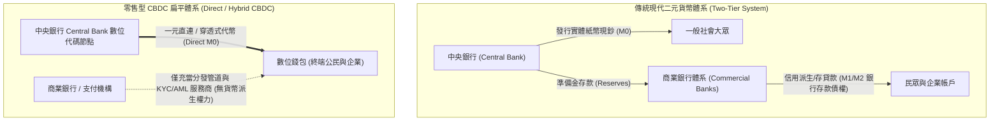
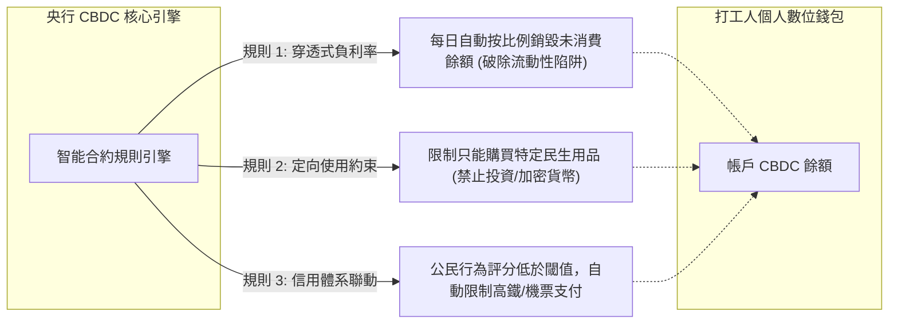

# 現代中央銀行數位貨幣 CBDC：可編程貨幣、隱私終結與金融監控全景

> **迷因導讀**：傳統鈔票塞在床底下，就算發霉生蟲了它也還是你的錢；未來的央行數位貨幣（CBDC）如果帶有「過期銷毀」或者「限期消費」的智能合約代碼，到了月底你沒花掉，系統直接歸零！打工人看著手機錢包冷汗直流：「這哪裡是貨幣，這簡直是帶著倒計時的財務手榴彈！」當貨幣被寫入「只能購買綠色蔬菜、不得用於課金抽卡」的邏輯判斷式，現代人終於領悟：最可怕的不是你沒錢，而是你錢包裡的數字代碼比你媽還懂得教你做人。

---

## 一、 貨幣形態的三千年終局：從金銀、紙幣到央行中心化代碼

人類貨幣的演化史，本質上是一部「信任載體不斷脫水、主權控制力步步緊逼」的技術史詩。

從西元前呂底亞王國敲擊出第一枚金銀合金幣（Electrum），到宋代四川出現世界上第一張紙質交子；從布列敦森林體系（Bretton Woods System）的黃金錨定破裂，到現代高度抽象的二元商業銀行帳本信用，貨幣的物理實體每一次退場，伴隨而來的都是中央權力對交換媒介控制力的指數級擴張。

要理解 CBDC（Central Bank Digital Currency，中央銀行數位貨幣）的劃時代本質，我們必須先刺破現代金融常識的迷霧：**你現在手機銀行（如玉山銀行、中國信託或台銀 App）裡看見的餘額，根本不是央行發行的「法幣」本身，而是商業銀行對你的「負債憑證」！**



在現行成熟的**二元銀行體系（Two-Tier Banking System）**下：
1. **一級市場（央行層）**：中央銀行發行法定貨幣現鈔（M0）以及商業銀行存放在央行的準備金（Reserve Balances）。
2. **二級市場（商行層）**：民眾把錢存進商業銀行，銀行透過部分準備金制度（Fractional Reserve Banking）發放貸款、派生存款（Credit Creation），這才構成了我們日常流通的廣義貨幣（M1/M2）。

當你在 ATM 提領 1000 元現鈔時，你才真正擁有了對中央銀行的直接債權（具有無限法償性的法幣現金）；當你在手機上轉帳 1000 元時，實質上只是商業銀行在結算系統裡扣除了它對你的負債，並把等額債權轉移給他人。如果這家商業銀行突發流動性擠兌宣告破產，你的存款只受存款保險條例有限保護（例如台灣的 300 萬台幣上限）。

然而，CBDC 的降臨彻底終結了這個維持了百餘年的二元分工格局！

零售型 CBDC（Retail CBDC）是中央銀行直接向公眾發行的**數位化 M0**。它具備中央銀行的最高國家主權信用背書，完全排除了商業銀行的信用違約風險。更致命的是，它打通了央行與一般民眾之間的「直連通道」：過去央行調控貨幣政策需要透過商行隔靴搔癢——降息降準、公開市場操作，希望商業銀行多放款，但往往卡在銀行「惜貸」或資金沉澱在房地產金融資產中；而一旦進入 CBDC 時代，央行擁有了一根直插每個打工人手機錢包的超級吸管與輸液管，主權金融的掌控力迎來了歷史三千年未有的中心化集權極致。

---

## 二、 當代主流數字貨幣形態全景橫評

當代網路金融世界的混亂，在於普通用戶經常把電子銀行轉帳、LINE Pay、比特幣、泰達幣（USDT）與 CBDC 混為一談。為了徹底搞清楚誰是真正的李逵、誰是套皮的李鬼，我們從底層架構、法律信用主體、隱私顆粒度與國家強制力維度展開一場硬核博弈橫評：

| 評估維度 | 實體紙幣現鈔 (Cash) | 商業銀行電子存款 (Commercial Bank Money) | 中心化穩定幣 (USDT / USDC) | 去中心化公鏈幣 (BTC / ETH) | 零售型央行數位貨幣 (Retail CBDC) |
| :--- | :--- | :--- | :--- | :--- | :--- |
| **底層信用發行主體** | 國家主權央行 (中央法定負債) | 私人商業銀行 (商行資產負債表承兌) | 離岸開曼/美註冊私人機構 (Tether/Circle) | 無主權信用 (純數學密碼學與分散式共識) | **國家主權央行 (中央法定代碼資產)** |
| **貨幣層級定位** | 實體基礎貨幣 (M0) | 廣義信用派生貨幣 (M1/M2) | 鏈上流動性代幣 (私人抵押/商業信用) | 原生鏈上數位商品 / 去中心化價值儲存 | **數位基礎貨幣 (純純的數位 M0)** |
| **交易匿名性與隱私等級** | **極致匿名** (線下握手即結算，零數字指紋) | **低** (商行內部帳本記錄，受金融合規審查) | **偽匿名** (鏈上帳本完全透明，但跨交易所需 KYC) | **偽匿名 / 密碼學自主** (公開帳本，但無預設現實身分) | **絕對透明 / 受控匿名** (央行上帝視角後端全局透視) |
| **可編程性 / 智能合約能力** | **零** (實體紙張，無法寫入執行代碼) | **極低** (依賴銀行 API 預約轉帳，無法自託管代碼) | **極高** (相容 EVM / 智能合約無許可調用) | **極高 / 圖靈完備** (以太坊等鏈上原生智能合約) | **全方位可編程 (央行單向設定的強制執行邏輯)** |
| **司法凍結與黑名單難易度** | **不可能遠程凍結** (除非物理查封或破門抄家) | **容易** (法院或金融監管函送，分行點擊凍結) | **極易** (發行商合約代碼內置 `freeze()` 黑名單方法) | **鏈上幾無可能** (無人能篡改私鑰，僅能鏈下追繳) | **即時、全自動、零摩擦、秒級定向權限封鎖** |
| **跨國跨境結算摩擦損耗** | 物理攜帶極難，海關通報審查高壓 | 高摩擦 (經 SWIFT 網絡，耗時 2~5 天且多重手續費) | 低摩擦 (幾秒至幾分鐘，手續費依 Gas 波動) | 極低摩擦 (無國界無審查結算，抗審查性最強) | 取決於雙邊央行多邊走廊 (如 mBridge 專用協議) |
| **擠兌風險場景** | 無 (除非國家政權崩潰惡性通膨) | 高 (歷史經典銀行擠兌 Bank Run 脆弱點) | 中高 (儲備金透明度疑慮、脫錨與踩踏擠兌) | 無擠兌 (以波動率釋放壓力，無承兌保證) | **理論零信用擠兌** (央行隨時具備無限流動性印刷能力) |

這份數據與架構對比徹底揭示了殘酷的現實：
去中心化加密貨幣（如比特幣）的誕生，原本是中本聰為了反抗 2008 年雷曼兄弟倒閉後各國央行無限量化寬鬆（QE）的貨幣稀釋霸權，試圖建立一套**「私鑰自持、代碼即法律、抗審查、免准入」**的超主權自由現金；
然而，全球央行看著區塊鏈的分散式帳本與非對稱加密技術，微微一笑：「感謝極客老鐵們開源的代碼輪子，這項技術正好可以用來完成人類有史以來最強悍的**金融全景監獄**。」

CBDC 繼承了密碼學的不可偽造性與可編程結算特徵，卻徹底剔除了「去中心化」與「抗審查性」，把發行權、審查權、合約制定權牢牢收歸中央節點。

---

## 三、 可編程貨幣的潘朵拉魔盒

如果說實體紙幣是純粹中性的交易媒介，那麼當代碼注入法幣，貨幣就擁有了「強制意識」。央行數位貨幣的可編程性（Programmability），絕非簡簡單單的自動扣款或自動找零，它意味著**主權者可以對貨幣的每一道流向、存續期限、購買類別與定價邏輯進行量子級別的微觀干預**。

當潘朵拉魔盒被掀開，現代人即將面對三大顛覆性衝擊：



### 1. 穿透式負利率的深淵：破除凱因斯「流動性陷阱」的屠刀
在傳統宏觀經濟學中，有一個讓中央銀行行長們夜不能寐的噩夢——**名義利率零下限（Zero Lower Bound, ZLB）**與凱因斯的**流動性陷阱（Liquidity Trap）**。
當經濟衰退、通貨緊縮來襲，即便央行把基準利率降到 0%，甚至向商業銀行收取負利率（比如歐洲央行和日本銀行曾短暫嘗試），民眾依然可以把錢從商業銀行全領出來，換成花花綠綠的千元大鈔鎖進保險箱。老百姓心想：「你銀行敢扣我保管費，老子把現金藏在枕頭底下，收益率至少保底 0%！」這種物理現鈔的存在，阻斷了極端貨幣政策的向下傳導。

然而，在全面鋪開零售型 CBDC 且逐步消滅實體紙幣的世界裡，遊戲規則被殘酷改寫：
- 央行只需要在底層核心帳本上敲一行代碼：
  $$\text{Balance}_{t+1} = \text{Balance}_{t} \times (1 - \lambda)^{\Delta t}$$
  其中 $\lambda$ 為年化負利率參數（例如設定為 $5\%$ 或 $10\%$）。
- 你放在手機錢包裡的 100,000 元 CBDC，只要放置不動，系統每秒都在按微積分級別自動融化扣除手續費。
- 想逃？你沒有實體鈔票可以領取，也沒有民間商業銀行可以避難。除了把錢砸進消費市場買買買，或者接盤高風險資產，你別無選擇。**可編程貨幣直接將「儲蓄」這項人類古老的延遲享受美德，透過智能合約變成了每日定時引爆的財務懲罰。**

### 2. 定向刺激與限期消費：戴著鎖鏈的「直升機撒錢」
在 2020 年全球疫情期間，各國政府發現發放現金補助是一場行政災難：發了支票，民眾轉手存進銀行或買了美股期權；發了實體消費券，黑市立即出現 8 折回收換現套利。

CBDC 讓「定向精準滴灌」達到了科幻級的精確度：
- **時間約束（Time-bound Spending）**：政府紓困發放 30,000 元 CBDC，智能合約寫入 `expire_at: 2026-12-31 23:59:59`。到了除夕夜沒消費完，餘額瞬間清零蒸發。
- **空間與品類約束（Category Filtering）**：這筆代碼貨幣被強制打上標籤，代碼邏輯如下：
  ```python
  if merchant.category in ["Entertainment", "CryptoExchange", "LuxuryGoods"]:
      revert("Transaction Denied: Policy does not allow discretionary luxury spending.")
  elif merchant.category == "DomesticProduce":
      execute_transfer(sender, merchant, amount)
  ```
- 你想拿紓困金課金手遊、抽卡、買茅台、買比特幣？系統直接在最底層報錯回滾。貨幣不再是「一般等價物」，它退化成了具備特定用途的「糧票 2.0」與「數位供銷社點數」。

### 3. 全景監控（Panopticon）與公民財務信用體系的絕對整合
這才是哲學與人權維度最令人背脊發涼的終局。

實體現金之所以是自由社會的壓艙石，是因為它具有**「去中心化無許可流通」**的偉大特質：你在街角向流浪漢買一份自製雜誌、在二手書攤買一本禁書、給政治異見人士捐款，都不需要任何伺服器給予「200 OK」的批准。現金保護了邊緣群體與主流意識形態偏差者的生存邊界。

而在中心化 CBDC 體系下，央行獲得了前所未有的**「全知全能上帝視角」**：
- 每一枚 CBDC 都有唯一的加密哈希標識符（Hash Identifier）。它從發行、流經哪一家外賣店、找零給哪一輛計程車、最終進了哪一個人的錢包，全生命週期軌跡清晰可溯。
- 司法凍結不再需要經歷繁冗的行政審批和銀行分行聯動。一旦某個公民的信用評分下降、捲入爭議訴訟，或者只是違反了某些行為規範，中央系統只需在資料庫裡切換一個布林值（`is_frozen = true`），該個體的一切現代經濟生存能力在物理上瞬間休克。你無法買水、無法坐車、甚至連乞討時別人都無法掃碼轉給你。**這不是剝奪財產，這是直接在數位維度抹除你的經濟生命體徵。**

---

## 四、 結語：技術讓貨幣擁有了靈魂，但靈魂由誰掌控才是人類文明的終極難題

貨幣從貝殼走來，歷經重金屬的沉重錘鍊，躍遷至紙幣的印刷符號，再到今日螢幕上跳動的位元。長久以來，貨幣一直被視為一種**「冷酷、客觀、無意識」**的價值尺度與交易媒介——鈔票不在乎握住它的是慈善家還是強盜，它只遵循最純粹的數學守恆。

CBDC 的出現，象徵著人類歷史上第一次**讓貨幣擁有了「靈魂」與「主觀意志」**。

然而，當貨幣被賦予代碼邏輯，這個「靈魂」究竟是維護金融穩定、杜絕逃漏稅、打擊洗錢與精準脫貧的現代天使，還是將每位公民的隱私、儲蓄自主權與消費自由徹底收繳至中央處理器的利維坦巨獸？

技術永遠是中立的加速器，但人性對權力的渴求從未改變。當金融的最後一塊隱私遮羞布——實體紙幣——在「無現金社會」的便捷口號中被逐漸掃入歷史博物館，我們或許必須在便利與自由的鋼絲繩上，重新審視那個古老而沉重的拷問：

> **「如果你的錢不再無條件屬於你，你還能算是自己的主人嗎？」**

---
#財經 #科技 #搞錢思維 #避坑指南 #硬核科普 #當代打工人
