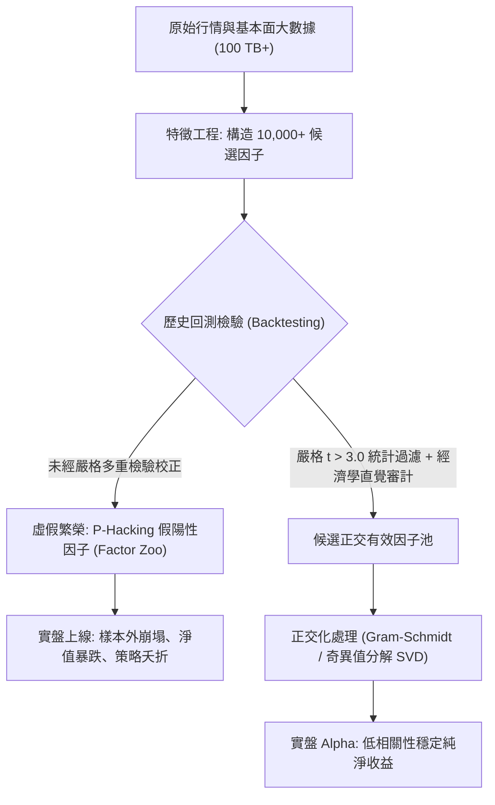

# 現代量化對沖基金的多因子模型：Fama-French 五因子、Alpha 與 Beta 的數學幾何

> **迷因導讀**：散戶炒股看 K 線圖和技術指標，天天在各個股票群裡求「內幕消息」與「仙人指路」；華爾街頂級量化對沖基金（如文藝復興 Renaissance Technologies、Two Sigma、AQR）的物理學博士們甚至連財報都懶得人工翻閱，直接把全球幾十年上百 TB 的行情逐筆 Tick 數據、微觀訂單流與基本面數據灌進高維特徵矩陣，用奇異值分解（SVD）、格拉姆-施密特（Gram-Schmidt）正交化因子旋轉與凸優化求解器，把市場上的超額收益 $\alpha$ 一滴不剩地暴力榨乾。當你還在為「這根大陽線是不是主力建倉」而焦慮失眠時，量化模型早已在希爾伯特空間裡完成了一萬次投影，並把你繳納的智商稅精準打包進了對沖基金的年終獎金池。

---

## 一、 資本資產定價模型（CAPM）的裂痕：從單一市場風險到多維超額收益

在現代金融學的史前時代，炒股被視為一種結合玄學、占卜與社交名流八卦的「煉金術」。直到 1952 年，25 歲的哈利·馬科維茨（Harry Markowitz）發表了劃時代的投資組合理論（Modern Portfolio Theory, MPT），金融市場才第一次迎來了嚴謹的歐幾里得幾何之光。

馬科維茨的核心洞見簡單而致命：**單一資產的風險不能孤立看待，資產之間的協方差矩陣（Covariance Matrix）才是決定命運的底層代碼**。他用均值-方差分析（Mean-Variance Analysis）在收益率與波動率構成的二維平面上畫出了一條優美的雙曲線——「有效前緣」（Efficient Frontier）。在這條前緣上的每一個投資組合，都在給定波動率下實現了期望收益的最大化。

隨後，威廉·夏普（William Sharpe）等人在此基礎上推出了資本資產定價模型（Capital Asset Pricing Model, CAPM）。夏普告訴全世界的基金經理：任何資產 $i$ 的期望超額收益率，本質上只由一個名為「市場風險溢價」（Market Risk Premium）的單一因子決定：

$$E(R_i) - R_f = \beta_i \left( E(R_m) - R_f \right)$$

其中：
* $R_f$ 為無風險利率（Risk-Free Rate）。
* $R_m$ 為市場基準組合的收益率。
* $\beta_i = \frac{\text{Cov}(R_i, R_m)}{\text{Var}(R_m)}$ 代表資產相對於整體市場系統性風險的敏感度。

在 CAPM 的極樂淨土裡，世界被簡化為純粹的一維線性投影：**市場只有一種風險，那就是系統性風險 $\beta$**。任何試圖通過選股跑贏市場的努力，在有效市場假說（EMH）看來都是徒勞的「徒手抓飛刀」。如果某檔股票取得了超越 CAPM 預測的超額回報 $\alpha$（詹森阿爾法，Jensen's Alpha），主流學界只會冷酷地判定：這要麼是統計抽樣誤差的幻覺，要麼是這檔股票承擔了未被觀測到的隱性暴雷風險。

$$R_{i,t} - R_{f,t} = \alpha_i + \beta_i (R_{m,t} - R_{f,t}) + \epsilon_{i,t}$$

然而，現實資本市場很快給了單因子 CAPM 一記響亮的耳光。從 1970 年代末開始，金融計量學界陸續發現了一堆令人尷尬的「市場異象」（Market Anomalies）：
1. **小市值效應（Size Effect）**：羅爾夫·班茨（Rolf Banz, 1981）發現，微型市值股票的長期平均回報顯著高於巨型藍籌股，即便用 CAPM 的 $\beta$ 進行風險調整後依然存在巨大的正向殘差。
2. **價值效應（Value Effect）**：淨市率（Book-to-Market Ratio, B/M）高的廉價「價值股」，長期回報全面吊打那些估值高聳入雲的明星「成長股」。

單一市場 $\beta$ 徹底崩塌了。正如史蒂芬·羅斯（Stephen Ross, 1976）在無套利定價理論（Arbitrage Pricing Theory, APT）中所指出的：**收益率生成過程絕非一維直線，而是一個 $K$ 維超平面上的多因子線性幾何投影**。股票收益率向量 $\mathbf{R} \in \mathbb{R}^N$ 應當被正交分解為多個系統性風險因子載荷（Factor Loadings）矩陣 $\mathbf{B} \in \mathbb{R}^{N \times K}$ 與因子收益率向量 $\mathbf{f} \in \mathbb{R}^K$ 的內積：

$$\mathbf{R} - R_f \mathbf{1} = \boldsymbol{\alpha} + \mathbf{B} \mathbf{f} + \boldsymbol{\epsilon}$$

在無套利條件下，期望殘差特異性風險 $\boldsymbol{\epsilon}$ 的均值為零且互相不相關。所謂的「尋找 Alpha」，在數學本質上就是一場殘酷的剝離遊戲：**你自以為傲的「神級選股能力」（$\alpha$），往往只是某個你尚未認知或命名的系統性風險敞口（$\beta_k \cdot f_k$）在作祟**。

---

## 二、 主流資產定價模型全景橫評

1993 年，尤金·法瑪（Eugene Fama，2013年諾貝爾經濟學獎得主）與肯尼斯·弗倫奇（Kenneth French）正式發表了轟動華爾街的 **Fama-French 三因子模型**。他們構建了兩個著名的做多-做空（Long-Short）因子組合：
* **SMB（Small Minus Big）**：做多小市值股票、做空大市值股票。
* **HML（High Minus Low）**：做多高帳面市值比（價值股）、做空低帳面市值比（成長股）。

1997 年，馬克·卡哈特（Mark Carhart）引入了納西姆·耶加迪什（Jegadeesh）與蒂特曼（Titman）發現的動量異象，建立了 **Carhart 四因子模型**，加入了做多過去一年贏家、做空過去一年輸家的 **MOM（Momentum）** 因子。

到了 2015 年，法瑪與弗倫奇再度升級，推出了 **Fama-French 五因子模型**。他們依據股利貼現模型（Dividend Discount Model）的底層推導：

$$\frac{M_t}{B_t} = \frac{\sum_{\tau=1}^{\infty} E(Y_{t+\tau} - d B_{t+\tau}) / (1+r)^\tau}{B_t}$$

在三因子基礎上追加了兩個基本面核心因子：
* **RMW（Robust Minus Weak）**：高盈利能力減去低盈利能力股票。
* **CMA（Conservative Minus Aggressive）**：保守投資（低資產擴張率）減去激進投資（瘋狂增發擴張資產）股票。

為了給量化工程師與二級市場實戰者提供最客觀的「武器庫橫評」，以下詳細梳理現代主流資產定價模型的金融工程指標矩陣：

| 模型維度 / 評估指標 | 經典 CAPM 單因子模型 (1964) | Fama-French 三因子模型 (1993) | Carhart 四因子模型 (1997) | Fama-French 五因子模型 (2015) | 現代機器學習非線性多因子 (2020+) |
| :--- | :--- | :--- | :--- | :--- | :--- |
| **納入因子架構** | 市場因子 (MKT) | MKT, 市值 (SMB), 估值 (HML) | MKT, SMB, HML, 動量 (MOM) | MKT, SMB, HML, 盈利 (RMW), 投資 (CMA) | 數百個高頻微觀結構因子、特徵衍生與非線性交互項 |
| **橫截面解釋力 ($R^2$ 提升幅度)** | 基準 (~0.60 - 0.70) | 相對 CAPM 提升 12% - 18% ($R^2 \approx 0.82$) | 相對 CAPM 提升 16% - 22% ($R^2 \approx 0.85$) | 相對 CAPM 提升 20% - 26% ($R^2 \approx 0.89$) | 樣本內提升可達 35%+ ($R^2 > 0.93$)；樣本外衰減極快 |
| **經濟學直覺與可解釋性** | **極高**（單一總體市場不可分散風險） | **高**（小企業流動性/破產風險；困境價值補償） | **中等偏高**（投資者過度反應與反應不足之行為金融） | **高**（源於剩餘收益貼現模型之基本面定價） | **極低 / 黑盒子**（深度神經網絡特徵隱空間，難以給出因果邏輯） |
| **統計過擬合與崩塌風險** | **極低**（僅 1 個回歸係數，樣本外穩健度高） | **低**（學術界 30 年跨國市場全天候實證檢驗） | **中**（動量因子在市場劇烈反轉時易發生「動量崩潰」） | **中低**（HML 與 CMA 存在顯著多重共線性） | **極高**（維度災難、假性相關與局部極值陷阱） |
| **超額 Alpha 衰減半衰期 ($t_{1/2}$)** | 無 Alpha 追求（純 Beta 暴露基準） | 約 8 ~ 12 年（隨著量化 ETF 普及，利潤被劇烈壓縮） | 約 3 ~ 5 年（動量過度擁擠時常年失效） | 約 5 ~ 7 年（因子一旦被主流機構納入即被套利平抑） | **數週至數月**（高頻訊號半衰期甚至以分鐘/毫秒計） |
| **計算複雜度與實盤要求** | $O(N)$，極低，普通 Excel 即可秒級回歸 | $O(N \cdot K)$，低，標準面板回歸 | $O(N \cdot K)$，低，滾動時間窗口計算 | $O(N \cdot K)$，中等，需清洗高質量跨期財務報表 | $O(N^2 \cdot D \cdot T)$，極高，依賴 GPU 集群與分布式特徵計算 |

從幾何維度來看，多因子模型實質上是將資產收益率空間正交投影至因子所張成的子空間（Subspace spanned by factors）。

假設有 $N$ 檔股票，$K$ 個因子，若因子協方差矩陣為 $\boldsymbol{\Omega}_f = \text{Cov}(\mathbf{f}) \in \mathbb{R}^{K \times K}$，股票殘差特異方差矩陣為對角矩陣 $\mathbf{D} = \text{diag}(\sigma_{\epsilon_1}^2, \dots, \sigma_{\epsilon_N}^2)$，則整體資產的協方差矩陣 $\boldsymbol{\Sigma}$ 可優雅地分解為：

$$\boldsymbol{\Sigma} = \mathbf{B} \boldsymbol{\Omega}_f \mathbf{B}^T + \mathbf{D}$$

這個低秩矩陣分解（Low-Rank Matrix Decomposition）是所有頂級量化基金風控系統（如 MSCI Barra、Axioma）的底層心臟：將一個高達 $5000 \times 5000$ 的全秩不可逆協方差矩陣，壓縮為一個只有數十個正交因子的低維結構，使得凸優化求解馬科維茨最優權重在數秒內即可收斂。

---

## 三、 因子動物園（Factor Zoo）與「因子擁擠」死鎖

如果你以為發現一個多因子模型就能躺著財富自由，那你就太小看金融市場的博弈殘酷度了。在量化投資的進展歷程中，兩大毀滅性的致命陷阱始終如影隨形：

### 1. 因子動物園（Factor Zoo）與 P-hacking 狂歡

金融學巨擘約翰·科克倫（John Cochrane）在 2011 年的美國金融學會（AFA）主席演講中無奈地嘆道：「我們現在擁有一整個因子動物園（Factor Zoo）！」

在過去三十年裡，全球頂級金融期刊（*Journal of Finance*、*JFE*、*RFS*）總共發表了超過 400 個宣稱能夠帶來顯著超額收益的「新因子」：從天氣晴雨因子、推特情緒因子，到 CEO 面相因子、員工午餐評分因子。

但正如杜克大學坎貝爾·哈維（Campbell Harvey, 2016）教授在著名的論文《... and the Cross-Section of Expected Returns》中所揭露的殘酷真相：**這其中超過 80% 的因子都是純粹的「統計假象」（Data Snooping / P-Hacking 產物）！**

在傳統統計學中，當 t 檢驗統計量 $|t| > 1.96$ 時，對應的 p 值小於 0.05，論文便可宣告發現了「統計上顯著的 Alpha」。然而，當成千上萬的研究生與量化分析師在同一個歷史數據集（如 CRSP/Compustat）上重複測試了 10,000 種不同的特徵變換時，即便這些特徵全是純粹的白噪聲，按照 5% 的假陽性率，也能隨機撈出 500 個「看似神級的暴利因子」！

哈維強烈主張，在多因子資產定價領域，考慮到多重假設檢驗（Multiple Testing Problem），t 檢驗的臨界值閾值必須提高到 **$t > 3.0$**（Bonferroni 校正或 Benjamini-Hochberg FDR 控制法）。如果你在歷史回測中發現一個因子的 t 值只有 2.1，並為之欣喜若狂，那麼恭喜你：你不是發現了市場聖杯，你只是被歷史數據中的某個幽靈給戲弄了。

### 2. 因子擁擠（Factor Crowding）與黑天鵝量子踩踏

多因子模型第二個致命死穴是「同質化擁擠」。

當 Fama-French 發表了 SMB 與 HML 之後，全球幾乎所有對沖基金都在自己的代碼裡寫下了完全相同的做多低估值、做空高估值的配對交易邏輯。這導致了一種危險的微觀結構現象——**因子擁擠**。

當數百家資產規模高達數十億美元的量化基金，持有著完全重疊的多頭持倉與空頭頭寸時，市場就變成了一座堆滿火藥的封閉戲院：
* 只要其中一家大型量化對沖基金（例如因為外匯或次貸槓桿暴雷）被券商 Prime Broker 強制平倉清算；
* 該基金被迫以市價單**甩賣其多頭持倉（傳統價值股）**，並**市價買入平倉其空頭持倉（傳統成長股）**；
* 這會立刻引發原本因子的表現出現非理性的短暫暴跌；
* 緊接著，其他完全無辜的量化基金的多因子風控模型（如 VaR 風險價值限額）被瞬間觸發，發出被動平倉信號；
* 連鎖平倉螺旋（Liquidity Black Hole）爆發，導致整個因子體系在短短數天內出現十幾個標準差的巨幅回撤！

這不是推演，這就是 **2007 年 8 月著名的「量化大地震」（Quantitative Meltdown of August 2007）**。當時包括文藝復興、高盛全球阿爾法（Global Alpha）在內的華爾街最頂尖多因子基金，在短短三天之內淨值暴跌 20% 至 40%，其回撤速度甚至超越了 1929 年大蕭條。

因子的擁擠度（Crowding Metric）自此成為現代量化最重要的監控維度：
* **多頭估值溢價（Valuation Spread）**：多頭組合與空頭組合的估值差是否偏離歷史均值 2 個標準差以上。
* **做空借券利率（Borrow Fees）與融券餘額**：空頭端是否已經借不到券，流動性枯竭。
* **成份股配對相關性（Pairwise Correlation）**：持倉股票之間的微觀相關性是否發生異常飆升。

---

## 四、 當代打工人/實戰者的三大避坑指南

理解了多因子模型的底層代碼，我們普通投資者與個人量化實戰者該如何避免成為機構收割機下的「高階韭菜」？請牢記以下三大有血有淚的操作指南：

### 1. 警惕「把 Beta 當 Alpha」的管理費收割陷阱

在財富管理行業，最暴利、最厚顏無恥的話術就是：**把可以用低成本指數基金複製的「風格 Beta」，包裝成神乎其技的「高科技私募 Alpha」，然後向客戶收取 2% 的管理費外加 20% 的利潤分成（2/20 規則）**。

* **典型翻車案例**：某私募基金經理宣稱自己具備超凡的選股直覺，過去三年年化收益率 25%，年終獎拿到手軟。但只要你把他的每日淨值拉進 Python，做一個簡單的 Fama-French 三因子回歸：
  $$R_{p,t} - R_{f,t} = \alpha + \beta_1 (R_{m,t} - R_{f,t}) + \beta_2 \text{SMB}_t + \beta_3 \text{HML}_t + \epsilon_t$$
  結果立刻原形畢露：其截距項 $\alpha$ 的 p 值高達 0.72（統計上等於 0），而 $\text{SMB}$ 係數高達 1.35 且顯著為正！
* **避坑結論**：他根本沒有任何神秘的選股阿爾法，他只是在過去三年瘋狂加槓桿重倉了微盤小盤股（Micro-cap）。這本質上只是承擔了流動性枯竭風險換來的「小市值 Beta」！任何人只需花 0.03% 的年管理費買入一檔微盤股 ETF 就能達到完全相同的效果，何苦把 20% 的利潤雙手奉給「金融中介」？

### 2. 拒絕「過擬合神話」：回測曲線越平滑，實盤死得越慘烈

新手量化從業者最常犯的死罪，就是在本地 Jupyter Notebook 裡調參出了一條**夏普比率高達 4.5、最大回撤僅 2% 的「天國級資金曲線」**。

* **避坑硬原則**：
  * **特徵自由度懲罰**：每增加一個因子，自由度就損失一截。如果你的模型用到了 50 個因子，而你的橫截面股票池只有 300 檔，那你本質上只是在用高階多項式強行穿過歷史噪聲點。
  * **嚴格的跨週期 Out-of-Sample（OOS）驗證**：切分訓練集（In-Sample）與測試集（Out-of-Sample）已經不夠了，必須實施「組合式交叉驗證」（Combinatorial Purged Cross-Validation, CPCV）。如果你的策略在 2008 年次貸危機、2015 年流動性枯竭、2020 年熔斷大跌期間無法存活，請立刻右鍵清空垃圾桶。
  * **交易摩擦衝擊成本（Market Impact）**：回測中設定千分之一的手續費是極度幼稚的。對於換手率極高的小市值與動量因子，買賣價差（Bid-Ask Spread）、借券利息與滑點（Slippage）會像黑洞一樣瞬間吞噬所有的紙面 Alpha。

### 3. 多因子實戰必須做「因子正交化」：別讓共線性暗殺了你的風控

許多打工人自己寫選股模型，選入了「市盈率 PE」、「市淨率 PB」、「股息率 Dividend Yield」、「市銷率 PS」。跑出來一看，四個因子權重全是正的，自以為構建了堅不可摧的四維分散化防線。

* **殘酷真相**：這四個變量在統計學上高度共線性（Multicollinearity），它們的底層協方差矩陣條件數（Condition Number）極大，逆矩陣計算時數值極度不穩定。一旦市場風格切換，你的四個防禦工事會在同一毫秒全線崩潰。
* **避坑實操**：必須在因子進入加權打分卡之前，運用**施密特正交化（Gram-Schmidt Orthogonalization）**或**對稱正交化（Löwdin Orthogonalization）**，將各因子之間的線性相關性徹底剝離至零：
  $$\tilde{\mathbf{f}}_k = \mathbf{f}_k - \sum_{j=1}^{k-1} \frac{\langle \mathbf{f}_k, \tilde{\mathbf{f}}_j \rangle}{\langle \tilde{\mathbf{f}}_j, \tilde{\mathbf{f}}_j \rangle} \tilde{\mathbf{f}}_j$$
  只有確保每個因子提供的是獨立維度的信息增量，你的多元資產定價模型才具備抵禦黑天鵝衝擊的幾何剛性。

---

## 四、 結語：優雅的數學公式可以精準度量過去的規律，但未來的邊界永遠屬於未知的隨機性

從夏普的一維市場 $\beta$，到 Fama-French 的三因子、五因子，再到今天千億級量化黑石裡吞吐海量特徵的機器學習集成模型，金融工程師們用幾十年的時間，將這顆星球上最複雜、最受人性貪婪與恐懼驅使的資本市場，抽象成了一張張優雅的線性代數流形與高維協方差網格。

這套數學幾何體系給了人類無與倫比的秩序感與掌控感——它讓不可名狀的風險變成了可定價、可對沖、可拆解的冷酷方差。

然而，所有從事金融量化的人，終其一生都必須保持最深邃的謙卑：
**物理學中的電子不會因為薛丁格寫出了波函數而改變自己的能階躍遷規律；但金融市場上的交易者，卻會因為 Fama-French 發表了多因子模型而集體改變自己的交易行為，進而徹底抹平甚至扭曲這個因子本身。**

這就是金融世界最殘酷的「反射性」（Reflexivity）與二階混沌。你所度量的一切，都在因為你的度量而加速消亡。

優雅的數學公式可以精準丈量昨天的回憶，但當明天的黑天鵝從高維空間呼嘯而過時，決定生死存亡的，永遠不是小數點後第四位的阿爾法，而是你對未知隨機性永恆的敬畏。

---

#財經 #科技 #搞錢思維 #硬核科普 #美股 #冷知識
