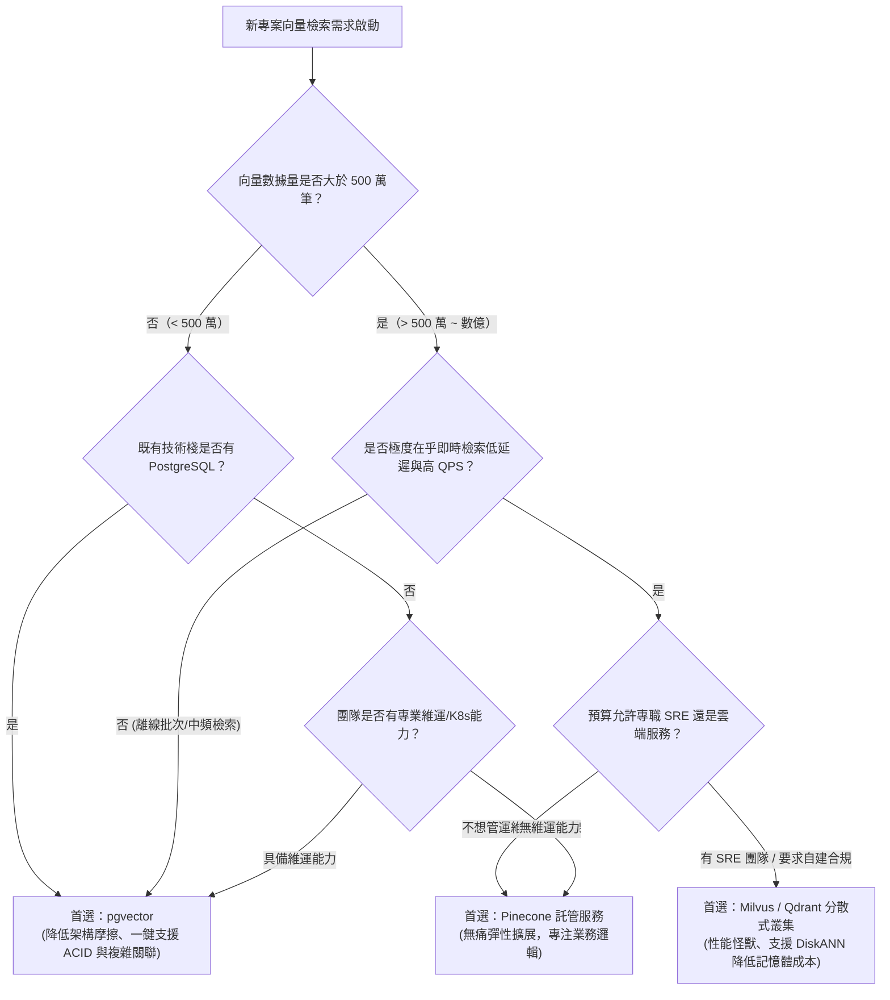

# 向量資料庫選型指南：pgvector、Pinecone、Milvus 到底怎麼挑？

> **迷因導讀**：做 AI 應用的團隊開會，剛從矽谷吸完仙氣回來的架構師推了推無框眼鏡，嚴肅表示：「我們必須採購年費幾萬美金的專用分散式向量資料庫，這樣才能迎戰 AGI 時代十億級特徵維度的狂潮！」角落裡頂著地中海髮型的後端老炮冷笑一聲，猛吸了一口保溫杯裡的枸杞水：「給我們現有的 PostgreSQL 裝個 `pgvector` 延伸套件不用五分鐘，連新機器都不用申請。你一天到底有幾個 Token、幾個向量要算，在裝什麼高級？」
>
> 兩人相視一笑，空氣中瞬間充滿了「你懂不懂架構」與「你懂不懂省錢」的火藥味。究竟向量檢索是必須開跑車上高速，還是腳踏車加個馬達就能飆？這篇指南帶你拆穿向量資料庫選型的所有粉飾與玄學。

---

## 一、 向量檢索的底層挑戰：高維空間維度災難與近似最近鄰（ANN）算法

當大語言模型（LLM）透過 Embedding 模型把非結構化的文本、圖片、語音轉化為一長串浮點數向量（比如 OpenAI `text-embedding-3-small` 的 1536 維，或是開源 `bge-large-en-v1.5` 的 1024 維）時，軟體工程師的世界觀徹底崩塌了。

過去三十年，關聯式資料庫（RDBMS）的立身之本是 **B+ 樹（B-Tree）**。數值有大小、字串有字典序，只要建好索引，二分搜尋的時間複雜度就是優雅的 $O(\log N)$。但在高維度向量空間裡，「大小」的概念蕩然無存，取而代之的是「相似度」——歐氏距離（Euclidean Distance）、曼哈頓距離（Manhattan Distance）、內積（Dot Product）與餘弦相似度（Cosine Similarity）：

$$\text{Cosine Similarity}(A, B) = \frac{\mathbf{A} \cdot \mathbf{B}}{\|\mathbf{A}\| \|\mathbf{B}\|} = \frac{\sum_{i=1}^n A_i B_i}{\sqrt{\sum_{i=1}^n A_i^2} \sqrt{\sum_{i=1}^n B_i^2}}$$

當你手握 100 萬個 1536 維的浮點數向量，如果來了一個新使用者的 Prompt 向量，要找出最相似的 Top-K 筆資料，最直覺、精確度 100% 的作法叫作 **KNN（K-Nearest Neighbors，K-最近鄰暴力遍歷）**。
然而，暴力遍歷代表每一次查詢都要計算 100 萬次 1536 維的點積。以單精度浮點數（float32，4 bytes）計算：
- 單一向量體積：$1536 \times 4\text{ bytes} \approx 6.14\text{ KB}$
- 100 萬筆向量原始資料：$\approx 6.14\text{ GB}$
- 單次檢索計算量：$10^6 \times 1536 \approx 15.36$ 億次浮點運算（FLOPs）。

哪怕你的伺服器 CPU 開啟了 AVX-512 指令集全速狂飆，單次暴力遍歷也得耗費幾百毫秒。如果線上並發（QPS）稍微衝到 50，CPU 瞬間就會被榨乾到 100%，伺服器散熱風扇起飛如同波音 747。這就是著名的**維度災難（Curse of Dimensionality）**——在高維空間裡，傳統的空間分割樹（如 KD-Tree）退化成全表掃描，完全失效。

為了不在每一次搜尋時把伺服器燒毀，電腦科學界妥協了：**我們不需要 100% 精確的最近鄰，我們只要 95%~99% 的「近似最近鄰」（ANN, Approximate Nearest Neighbor）就足夠應付業務了！**

目前主流的向量索引算法主要分為兩大派系：

### 1. IVFFlat（Inverted File with Flat Vectors，倒排聚類索引）
- **核心原理**：空間分塊，畫地為牢。在建立索引時，先用 K-Means 算法在向量空間中選出 $K$ 個聚類中心點（centroids）。寫入向量時，把向量分派給最近的聚類中心；檢索時，先算出查詢向量與哪幾個聚類中心最近（設定探測數量 `nprobe`），然後**只在這幾個特定聚類桶裡面做局部暴力遍歷**。
- **優缺點博弈**：
  - **優點**：建索引極快、記憶體開銷低、結構極其簡單，本質上就是標準的倒排清單（Inverted List）。
  - **缺點**：精確度（Recall）對 `nlist` 與 `nprobe` 參數極度敏感。邊界附近的向量很容易被無情漏掉；若想提高召回率調大 `nprobe`，搜尋延遲又會指數級上升。

### 2. HNSW（Hierarchical Navigable Small World，分層可導航小世界網絡圖）
- **核心原理**：六度分隔理論在高維空間的終極變現。如同跳表（Skip List）的圖結構版本：
  - 底層（Layer 0）包含所有向量節點，節點之間由高密度的短邊相連（鄰近導航）。
  - 上層（Layer 1 ~ Layer $L$）節點呈幾何級數遞減，由稀疏的長邊相連（高速跳躍）。
  - 檢索時，從最頂層的稀疏長邊開始「貪婪搜尋（Greedy Search）」，快速鎖定目標大致方位後，逐層降落到底層細細探測。
- **優缺點博弈**：
  - **優點**：查詢延遲極低（毫秒級）、召回率（Recall）喪心病狂地高（輕易達到 98% 以上），是目前業界公認 ANN 性能的天花板。
  - **缺點**：**記憶體吞噬怪獸**。每個節點都需要儲存相鄰節點的指針與圖邊資訊，建索引耗費大量 CPU，且索引必須全量塞進記憶體。一旦向量量級突破千萬，記憶體成本會讓你肉痛到懷疑人生。

---

## 二、 三大主流陣營全方位性能橫評

在搞懂了 ANN 算法之後，擺在架構師面前的就是三大流派的技術選型擂台賽：
1. **關聯式外掛派（pgvector / PostgreSQL）**：成熟 RDBMS 的華麗轉身，一個外掛解千愁。
2. **專業開源分散式派（Milvus / Qdrant）**：為向量而生的重裝裝甲車，微服務與雲原生架構的最愛。
3. **專用雲端託管派（Pinecone）**：SaaS 派的氪金法寶，除了刷信用卡什麼都不用操心。

為了徹底摒棄主觀情緒，我們從吞吐、延遲、容量、事務性到真實營運成本，拉一張刀刀見血的對比橫評表：

| 評測維度 | 關聯式外掛：pgvector (PostgreSQL) | 專業開源：Milvus | 專用雲託管：Pinecone |
| :--- | :--- | :--- | :--- |
| **底層架構設計** | 傳統 RDBMS 儲存引擎 + C 語言擴展外掛 | 儲存計算分離、分散式雲原生架構（Go/C++） | 完全閉源、Multi-tenant 雲原生託管架構 |
| **支援主要索引** | IVFFlat, HNSW, Halfvec | HNSW, IVF_FLAT, SCaNN, DiskANN | 專利私有圖索引（底層近似 HNSW 變形） |
| **QPS 吞吐能力** | 中等（幾百 ~ 2,000 QPS） | 極高（單節點數萬，可分散式水平擴展） | 高（彈性自動擴展，依方案規格計價） |
| **P99 檢索延遲** | 10ms ~ 30ms（依連線池與快取狀態） | 2ms ~ 8ms（極致 C++ 計算優化） | 15ms ~ 40ms（包含公網 HTTP/gRPC 傳輸開銷） |
| **數據量級適配** | **1 萬 ~ 500 萬** 表現最優；過億成本極高 | **1,000 萬 ~ 10 億+**，原生支持海量分片 | **10 萬 ~ 數億**（只要預算充足皆可支援） |
| **混合檢索能力** | **天花板等級**（SQL JOIN、全文檢索、JSONB 無縫揉合） | 強大（支援 Scalar Filtering，但需預先宣告 Schema） | 良好（支援 Metadata Filtering，但複雜語法受限） |
| **ACID 事務支援** | **完美支援**（標準 PostgreSQL 事務機制） | 最終一致性（Eventual Consistency） | 最終一致性（無關聯式事務概念） |
| **記憶體/硬碟卸載** | 需配置龐大 Shared Buffers，磁碟冷熱分離繁瑣 | 支援 DiskANN 與冷熱數據分離儲存（S3/MinIO） | 支援 Storage-optimized 規格（利用 NVMe 降成本） |
| **部署維運複雜度** | ⭐（極低：`CREATE EXTENSION vector;` 搞定） | ⭐⭐⭐⭐⭐（極高：需 K8s、Etcd、MinIO、Pulsar/Kafka） | ⭐（零運維：註冊帳號、拿 API Key 開工） |
| **月度綜合成本** | 極低（共用既有 RDS/自建伺服器，邊際成本接近 0） | 硬體與專業維運人力成本高（需專屬 SRE 護航） | 隨用量線性增長，量大時账單極度感人（以萬美元計） |

### 關鍵性能剖析：為什麼 pgvector 在高並發下會喘？
很多後端直覺認為：「pgvector 是 C 寫的，Postgres 又那麼穩，為什麼不能直接抗十萬 QPS？」
關鍵在於 **PostgreSQL 的多進程模型（Process-based Architecture）與連線開銷**。每個連線獨立消耗記憶體，且 HNSW 索引必須在 Shared Buffers 或 OS Page Cache 中頻繁讀取。當並發攀升，記憶體鎖競爭（Lock Contention）與快取擊穿會讓 CPU 使用率瞬間飆滿。
相較之下，Milvus 是純粹的**執行緒池（Thread Pool）與微服務分離架構**，查詢節點（QueryNode）只管在記憶體裡做矩陣乘法，寫入節點（DataNode）只管把向量切片打包進物件儲存，兩者互不搶資源。

---

## 三、 企業架構師實戰選型決策樹

別再聽各家 Vendor 的天花亂墜了。架構設計的第一鐵律是：**不要引入無法解決痛點的額外複雜度**。以下三個維度，是你選型時不可逾越的邊界界定：



### 1. 百萬級數據量：堅決選 `pgvector`，降低架構摩擦
**適用場景**：企業內部知識庫（RAG）、中小電商商品特徵搜尋、用戶 Profile 標籤推薦。
- **血淚現實**：90% 的 AI 專案，上線一整年向量總數連 50 萬筆都不到。如果你為了這幾十萬條數據，專門拉一個 Milvus 叢集，配置 3 台 Etcd、2 台 MinIO、一套 Pulsar 消息佇列，你不是架構大師，你是在用核彈打蚊子。
- **殺手鐧優勢**：**資料一致性與關聯查詢**。在真實業務中，你絕對不可能只搜向量，你一定會加上：「找出**屬於當前組織 ID**、**權限為公開**、**建立時間在近三個月**、且**標籤包含『技術』**的最相似前 5 篇文件」。
  在專用向量庫裡，你必須搞兩套同步機制（Postgres 存 Metadata，向量庫存 Embedding），一但網路抖動，資料不一致直接破防；而在 pgvector 裡，這不過就是一句平平無奇的 SQL：
  ```sql
  SELECT id, title, content, 1 - (embedding <=> $1) AS similarity
  FROM documents
  WHERE org_id = 42 
    AND is_public = true 
    AND created_at > NOW() - INTERVAL '3 months'
  ORDER BY embedding <=> $1
  LIMIT 5;
  ```
  一秒搞定 ACID 事務與快照隔離，下班回家安心睡覺。

### 2. 千萬級高頻獨立檢索：選 Milvus / Qdrant，打爆性能上限
**適用場景**：大型社群平台（千萬用戶行為 Embedding 即時推薦）、跨國巨型以圖搜圖引擎、自動駕駛感知特徵檢索。
- **邊界臨界點**：當你的向量筆數突破 1,000 萬，且每秒查詢並發（QPS）穩定超過 5,000 時，pgvector 會將資料庫主機的記憶體與 IOPS 吃乾抹淨，嚴重威脅到核心訂單業務的存活。
- **架構特點**：
  - **Milvus**：具備強悍的分散式分片（Sharding）與副本機制，支援將老舊索引卸載到平價的 S3/MinIO（使用 DiskANN 算法），大幅降低純記憶體儲存的極限成本。
  - **Qdrant**：以 Rust 打造，單機資源利用率與吞吐量極其驚人，對 Payload（Metadata）的過濾優化極致，如果團隊排斥太重的 Java/Go 分散式全家桶，Qdrant 是極度優秀的開源替代方案。

### 3. 無人維運、快速驗證：選雲端託管 Pinecone，金錢換時間
**適用場景**：初創團隊敏捷驗證 AI 產品、無專業 SRE 的出海專案、跨國高可用要求。
- **痛點解決**：Milvus 很好，但 Milvus 掛了誰來修？Etcd 腦裂了誰來救？Kafka 消息堆積了誰來清？
  如果你的團隊只有兩個全端工程師，根本沒有多餘的人力去維護複雜的雲原生分散式系統，那麼直接刷信用卡買 Pinecone（或 AWS OpenSearch Serverless）就是最理性的商業決策。
- **防坑警訊**：小心「雲端帳單背刺」。專用託管向量資料庫通常依照「向量維度」、「Index 儲存大小」與「讀寫單位（Read/Write Units）」計費。一旦某天爬蟲腳本寫錯，瘋狂寫入幾億條測試向量，下個月寄來的帳單可能直接讓初創公司進入破產清算。

---

## 四、 結語：適合業務場景的架構才是好架構，切忌拿大砲打蚊子

在 AI 概念漫天飛舞的時代，工程領域充斥著嚴重的「焦慮型過度設計（Anxiety-driven Over-engineering）」。無數團隊在產品連第一個付費使用者都還沒拿到時，就急匆匆在架構圖上畫滿了專用向量資料庫、分散式快取、多層消息匯流排。

工程的本質不是比拼誰的元件用得最前沿、誰的系統架構圖畫得最複雜，而是在**成本、穩定性、開發效率與業務需求**之間尋找最精妙的動態平衡。

> **記住這個黃金準則**：
> 1. 先用 **pgvector** 跑通業務 MVP，把時間花在優化 Prompt、改善 Chunking 切分策略、調整 Embedding 模型維度上；
> 2. 只有當業務真的爆炸成長、向量資料突破千萬大關、資料庫連線池被擠爆的那一天，你才有資格驕傲地向老闆申請預算：「報告，我們該上 **Milvus / Pinecone** 了！」

在那一天到來之前，少折騰新輪子，多給 PostgreSQL 加條索引，才是當代打工人最強大的生存智慧。

---

#科技 #AI革命 #硬核科普 #避坑指南 #當代打工人
