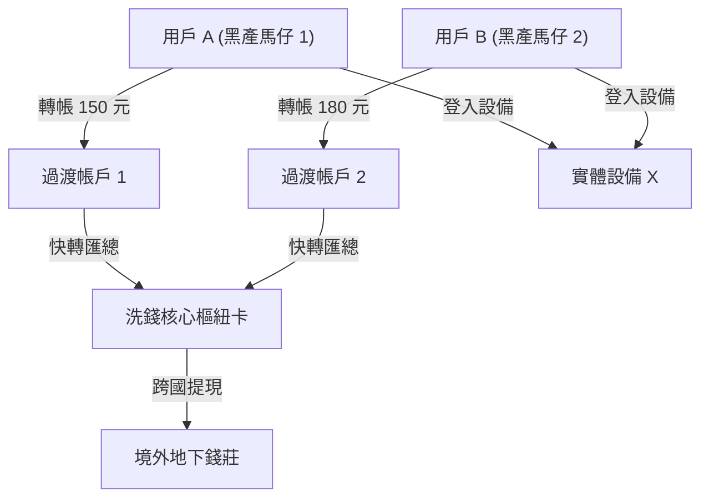

# 圖神經網絡 GNN 與知識圖譜：從社群網絡反欺詐到生物分子相互作用

> **迷因導讀**：傳統卷積神經網絡（CNN）只會盯著方方正正的圖片像素矩陣，給它一張貓咪照片它能認出毛髮紋理，但一旦遇到複雜錯綜的社群人際網絡、洗錢鏈條或手性碳立體分子結構，CNN 就當場破防抓瞎，直呼「這非歐幾里得空間我不理解」。而圖神經網絡（Graph Neural Networks, GNN）簡直就是手拿顯微鏡與通緝名單的頂級私家偵探：不管黑產團夥註冊了幾萬個虛假帳號、彼此用多麼隱蔽的網銀小額快轉來「洗乾淨」資金，只要把人、帳戶、IP、設備畫成一張圖，讓信息在節點之間傳遞三輪（Message Passing），藏在八層馬甲背後的洗錢幕後大佬就會像被點穴一樣無所遁形。今天我們就來拆解這個專治各種「錯綜複雜關係」的降維打擊神器！

---

## 一、 非歐幾里得空間的機器學習：從節點嵌入到消息傳遞（Message Passing）

在機器學習的蠻荒時代，演算法工程師最喜歡的資料長相永遠是「整整齊齊的表格」：每一列代表一個樣本，每一欄代表一個維度的特徵（如年齡、收入、點擊率）；或者像影像處理一樣，每個像素點上下左右規規矩矩排成一個 2D 矩陣。這種空間被稱為**歐幾里得空間（Euclidean Space）**，幾何平移不變性（Translation Invariance）在上面如魚得水。

然而真實世界的殘酷在於：**最值錢的數據往往長得歪七扭八，天生就是非歐幾里得幾何結構（Non-Euclidean Space）。** 比如：
- 社群平台上的關注網絡：有的人是坐擁千萬粉絲的超級樞紐節點（Hub），有的人是只有三個好友的邊緣自閉節點；
- 化學分子結構：環狀苯環、雙鍵立體異構、支鏈分子，根本不可能塞進固定大小的卷積核裡；
- 金融交易網絡：A 轉帳給 B，B 轉給 C 和 D，D 又匯回給 A 的親戚，這是一個典型的有向有環多重圖。

如果你強行把圖壓平成一維向量餵給多層感知機（MLP），圖的拓撲結構資訊（誰連著誰、關係的距離有多遠）就會瞬間灰飛煙滅。為了捕捉拓撲鄰域關係，**圖神經網絡（GNN）** 應運而生，而其核心引擎就是數學上極具美感的**消息傳遞機制（Message Passing Neural Network, MPNN）**。

### 1. 圖的數學形式化語言

一張圖定義為 $\mathcal{G} = (\mathcal{V}, \mathcal{E})$，其中 $\mathcal{V}$ 是包含 $N$ 個節點（Nodes）的集合，$\mathcal{E}$ 是連接節點的邊（Edges）集合。為了讓電腦能夠進行矩陣運算，我們定義了三大核心數學張量：

1. **特徵矩陣（Feature Matrix） $\mathbf{X} \in \mathbb{R}^{N \times F}$**：
   每個節點 $v_i \in \mathcal{V}$ 擁有一個 $F$ 維的特徵向量 $\mathbf{x}_i \in \mathbb{R}^F$（例如用戶的年齡、帳戶餘額，或分子的原子序數、雜化軌道）。
2. **鄰接矩陣（Adjacency Matrix） $\mathbf{A} \in \mathbb{R}^{N \times N}$**：
   若節點 $i$ 與節點 $j$ 之間有邊相連，則 $A_{ij} = 1$（若為加權圖則為邊權重 $w_{ij}$），否則 $A_{ij} = 0$。若圖無向且無自環，則 $\mathbf{A}$ 為對角線全為 0 的對稱矩陣。
3. **度矩陣（Degree Matrix） $\mathbf{D} \in \mathbb{R}^{N \times N}$**：
   這是一個非負對角矩陣，對角線上的元素 $D_{ii} = \sum_j A_{ij}$ 表示節點 $i$ 連接的鄰居總數（即度數 Degree），其餘元素全為 0。

### 2. 消息傳遞的三步曲：聚合（Aggregate）、更新（Update）與讀出（Readout）

在現代 GNN 框架中，每個節點 $v$ 在第 $k$ 遍信息傳遞後的隱藏狀態向量 $\mathbf{h}_v^{(k)}$（初始值 $\mathbf{h}_v^{(0)} = \mathbf{x}_v$）是透過以下嚴密的數學閉環迭代更新的：

$$
\mathbf{m}_v^{(k)} = \text{AGGREGATE}^{(k)} \left( \left\{ \mathbf{M}^{(k)}\left(\mathbf{h}_v^{(k-1)}, \mathbf{h}_u^{(k-1)}, \mathbf{e}_{uv}\right) : u \in \mathcal{N}(v) \right\} \right)
$$

$$
\mathbf{h}_v^{(k)} = \text{UPDATE}^{(k)} \left( \mathbf{h}_v^{(k-1)}, \mathbf{m}_v^{(k)} \right)
$$

其中：
- $\mathcal{N}(v) = \{u \in \mathcal{V} \mid (u, v) \in \mathcal{E}\}$ 是節點 $v$ 的一階鄰居集合。
- $\mathbf{e}_{uv}$ 是邊 $(u, v)$ 本身的屬性特徵（如轉帳金額、鍵結類型）。
- $\mathbf{M}^{(k)}(\cdot)$ 是消息生成函數，通常由小型前饋網絡或非線性線性投影實現。
- $\text{AGGREGATE}^{(k)}(\cdot)$ 必須是一個**排列不變性（Permutation Invariant）**函數（如 $\text{Sum}$、$\text{Mean}$ 或 $\text{Max}$），因為圖節點的排列順序是人為指定的，運算結果絕對不能因為你先讀取鄰居張三還是鄰居李四而改變。
- $\text{UPDATE}^{(k)}(\cdot)$ 將節點自身上一層的狀態 $\mathbf{h}_v^{(k-1)}$ 與匯總來的鄰域情報 $\mathbf{m}_v^{(k)}$ 融合成全新的節點表徵（Embedding）。

**直觀比喻**：這就像打工人打聽公司八卦。第 1 輪（$k=1$），你找周圍工位的隔壁鄰居（1-hop）閒聊，知道了鄰居的工資和心聲；第 2 輪（$k=2$），你的鄰居們已經吸收了他們鄰居的八卦，你再跟他們聊，你腦中就掌握了全組乃至隔壁部門（2-hop）的情報；當疊代進行到第 $k$ 輪時，每個節點的 Embedding 就已經浸潤了距離它 $k$ 步以內所有節點的拓撲結構與語義屬性！

---

## 二、 主流圖神經網絡架構全景橫評

雖然消息傳遞的藍圖很美好，但在工程落地時，工程師們立刻遭遇了幾大靈魂考驗：全圖矩陣太大顯存直接爆掉怎麼辦？圖裡的邊有幾十種關係怎麼辦？多層堆疊之後所有節點特徵變得一模一樣（過平滑）怎麼辦？

為此，學界與工業界在過去幾年演化出了四大流派。以下是硬核架構的全景實測與橫向對比：

### 主流圖神經網絡架構核心維度對比矩陣

| 架構名稱 | 理論發韌基石 | 核心消息更新公式 | 百萬級節點擴展性 (Scalability) | 動態圖/新節點適應度 (Inductive) | 過平滑 (Over-smoothing) 臨界深度 | 典型最佳應用場景 |
| :--- | :--- | :--- | :--- | :--- | :--- | :--- |
| **GCN (Graph Convolutional Network)** | 譜圖理論 (Spectral Graph Theory)、拉普拉斯算子一階切比雪夫截斷 | $\mathbf{H}^{(k+1)} = \sigma\left(\mathbf{\tilde{D}}^{-\frac{1}{2}} \mathbf{\tilde{A}} \mathbf{\tilde{D}}^{-\frac{1}{2}} \mathbf{H}^{(k)} \mathbf{W}^{(k)}\right)$ | 差（需全圖矩陣參與 Lap-Matrix 計算，極耗 GPU 顯存） | 差（Transductive，新增節點需重新計算拉普拉斯矩陣） | 極低（通常 2~4 層即發生節點特徵趨同收斂） | 中小型靜態引文網絡、分子屬性預測 |
| **GAT (Graph Attention Network)** | 空間注意力機制 (Self-Attention)、多頭動態權重動態分配 | $\mathbf{h}_i^{(k+1)} = \sigma\left(\sum_{j \in \mathcal{N}_i} \alpha_{ij} \mathbf{W} \mathbf{h}_j^{(k)}\right)$ | 較差（計算邊注意力權重 $\mathcal{O}(\|\mathcal{E}\|)$ 顯存開銷大） | 良好（注意力係數取決於節點特徵，易泛化） | 較低（3~5 層，注意力熵增導致權重均勻化） | 節點權重異質性強的社群網絡、論文合作網絡 |
| **GraphSAGE (Sample and Aggregate)** | 局部空間採樣 (Neighborhood Sampling)、歸納式表徵生成 | $\mathbf{h}_v^{(k)} = \sigma\left(\mathbf{W} \cdot [\mathbf{h}_v^{(k-1)} \parallel \text{AGG}(\{\mathbf{h}_u^{(k-1)}, \forall u \in \mathcal{N}_S(v)\})]\right)$ | **極高**（固定鄰居採樣數量 $S_k$，支援 Mini-batch 訓練） | **極佳**（完全基於局部特徵聚合函數，直接預測未見節點） | 中等（4~6 層，依賴 Skip-connection 或殘差可略增） | 工業級推薦系統、大規模電商用戶風控系統 |
| **RGCN (Relational GCN)** | 多關係知識圖譜嵌入、關係特定轉換矩陣與基底分解 (Basis/Block Sharing) | $\mathbf{h}_i^{(k+1)} = \sigma\left(\mathbf{W}_0^{(k)}\mathbf{h}_i^{(k)} + \sum_{r \in \mathcal{R}} \sum_{j \in \mathcal{N}_i^r} \frac{1}{c_{i,r}} \mathbf{W}_r^{(k)} \mathbf{h}_j^{(k)}\right)$ | 中等（引入 Block-diagonal 分解後參數量可控） | 良好（可推理知識圖譜中未見的實體關係） | 低（2~3 層，實體關係稀釋極快） | 企業級知識圖譜實體對齊、醫藥知識庫鏈路預測 |

### 深度解析四大流派的技術妥協與破局：

1. **GCN 的頻譜妥協**：
   Kipf & Welling 在 2017 年提出的 GCN 本質上是將譜圖卷積（Spectral Convolution）在傅立葉頻域展開，利用切比雪夫多項式進行一階局部化逼近。公式中的對稱歸一化鄰接矩陣 $\mathbf{\tilde{D}}^{-\frac{1}{2}} \mathbf{\tilde{A}} \mathbf{\tilde{D}}^{-\frac{1}{2}}$（其中 $\mathbf{\tilde{A}} = \mathbf{A} + \mathbf{I}_N$ 是加上自環後的鄰接矩陣）巧妙地解決了「度數大的節點數值爆炸、度數小的節點數值消失」的梯度問題。然而，因為其更新依賴全圖矩陣乘法，一旦節點數破百萬，哪怕是 A100 80G 顯卡也會瞬間 OOM（Out Of Memory）。

2. **GAT 的精細化偏愛**：
   Veličković 等人引入了注意力機制，認為「鄰居並不平等」。兩節點之間的注意力係數定義為：
   $$
   \alpha_{ij} = \frac{\exp\left(\text{LeakyReLU}\left(\mathbf{a}^T [\mathbf{W}\mathbf{h}_i \parallel \mathbf{W}\mathbf{h}_j]\right)\right)}{\sum_{k \in \mathcal{N}_i} \exp\left(\text{LeakyReLU}\left(\mathbf{a}^T [\mathbf{W}\mathbf{h}_i \parallel \mathbf{W}\mathbf{h}_k]\right)\right)}
   $$
   這讓模型擁有了「選擇性忽視噪音鄰居」的能力，例如在欺詐檢測中，正常帳號即便無意間與一個黑產帳號有單次交互，GAT 也可以給予極低的 $\alpha$ 權重，避免誤殺。

3. **GraphSAGE 的工程救贖**：
   史丹佛大學 Jure Leskovec 團隊提出的 GraphSAGE 是 GNN 真正走向千億級工業界的轉捩點。它拋棄了「拉上全圖一起算」的執念，在每一層消息傳遞時，只隨機採樣固定數量（例如第 1 層採樣 25 個鄰居，第 2 層採樣 10 個鄰居）的鄰域子集 $\mathcal{N}_S(v)$。這意味著每個 Batch 的計算子圖大小被嚴格鎖定在常數上限，使得神經網絡可以用標準的 Mini-batch SGD 進行分散式橫向擴展。

4. **過平滑（Over-smoothing）的物理極限**：
   許多初學者以為「GNN 只要像 ResNet 那樣疊 50 層，效果肯定能飛天」。然而實驗往往給出無情耳光：超過 4 層後，準確率直接暴跌。這是因為重複的消息傳遞在數學本質上相當於在圖上進行隨機遊走（Random Walk）與馬可夫擴散。當 $k \to \infty$ 時，所有連通分量內的節點 Embedding 都會收斂到一個與特徵無關、僅與節點度數平方根成正比的靜態向量，圖上所有節點的表徵變得完全一致，分類器徹底失效。當前解決此問題的工程利器包括 **PairNorm**、**DropEdge** 以及從殘差網絡借鑒的 **Initial Residual Connection（如 GCNII）**。

---

## 三、 產業殺手級實戰場景

### 1. 金融黑產「羊毛黨」與洗錢團夥鏈路挖掘

在銀行金融科技與行動支付領域，黑產詐欺早就告別了「單兵作戰」的蠻荒時代，進入高度工業化、分工極其縝密的「團夥犯罪」。

**黑產狡兔三窟的對抗現場**：
傳統規則引擎與單點風控機器學習（如 XGBoost、LightGBM）通常只關注「單一行為維度」：這台手機的 IMEI 碼是否異常？這筆轉帳金額是不是 9999 元？用戶年齡是不是大於 60 歲？黑客團夥輕易就能繞過這些檢查：他們購買成千上萬張真實身份白名單電話卡（貓池設備），每台手機只登入一個帳號，每筆轉帳都偽裝成正常的咖啡點單、點心費或親友紅包（單筆 50~200 元），並在數十個帳戶之間輾轉倒手 7~10 次，最後匯入地下錢莊帳號。在傳統表格數據上看，每一個帳號的行為都無辜乾淨得像個小白兔。

**GNN 降維打擊**：
風控團隊構建了一張**異質交易圖（Heterogeneous Information Network, HIN）**：
- **節點類型**：用戶（User）、銀行卡（Card）、手機設備（Device）、WiFi 路由器（BSSID）、收款二維碼（Merchant）。
- **邊的類型**：轉帳（Transfer）、綁定（Bind）、同設備登入（Login_At）、共享 IP（Share_IP）。

在這種異質圖中，黑產團夥哪怕把轉帳金額偽裝得再逼真，**拓撲結構上的異常聚集度（Graph Homophily）** 根本掩蓋不住：
1. **社群發現與局部聚集**：利用動態異質圖神經網絡（如 **HGT, Heterogeneous Graph Transformer**），模型能自主學會「設備共用邊」與「資金快速流轉邊」的隱式權重。
2. **反洗錢鏈路穿透**：透過多層消息傳遞，即使某個詐騙核心控制卡從不直接接觸被害人，但經過 3~4 步邊特徵聚合，它與成百上千個詐騙源頭帳號的高密度子圖結構特徵會被完全編碼進其 Embedding 中。
3. **實戰威力**：某國有大行導入 GraphSAGE + RGCN 後，原本需要 15 名資深反洗錢分析師耗時一週人工調取報表才能拼湊出的洗錢黑產網絡，GNN 在串流推論（Streaming Inference）下只需 **300 毫秒** 即可完成子圖挖掘，團夥識別準確率從 64% 飆升至 92%，追回數億元資金。

### 2. 生物計算革命：AlphaFold 與分子相互作用預測

在分子生物學與現代製藥領域，傳統物理化學家常常陷入薛丁格方程式的數值逼近泥潭，或者耗費數百萬美元與幾個月時間用冷凍電鏡（Cryo-EM）解析一個蛋白質晶體。

**分子天然就是一張圖**：
一個小分子藥物本質上就是由原子（節點 $\mathcal{V}$）與共價鍵（邊 $\mathcal{E}$）構成的拓撲圖。原子的特徵包括元素符號、形式電荷、芳香性、雜化類型；邊的特徵包括單鍵、雙鍵、芳香鍵以及立體化學構型。更複雜的蛋白質則是由 20 種胺基酸縮合而成的長鏈胜肽，在立體空間中扭曲、折疊形成複雜的三維囊袋。

**從 AlphaFold 到幾何深度學習（Geometric Deep Learning）**：
DeepMind 在震撼科學界的 **AlphaFold2 / AlphaFold3** 中，核心支柱就是幾何圖神經網絡架構（Evoformer 與 Pairformer）：
1. **多序列比對（MSA）與殘基對錶徵**：AlphaFold 將蛋白質的一級胺基酸序列轉換為圖節點，將殘基之間的空間相對距離、方向與二面角作為邊。
2. **等變圖神經網絡（Equivariant Graph Neural Networks, EGNN）**：在三維歐式空間中，分子無論在空間中旋轉多少度、平移多少公尺，其物理性質（如結合能、毒性、穩定性）絕不會改變。普通 GNN 缺乏幾何對稱性感知，而 EGNN 嚴格滿足 **SE(3)-等變性與不變性（Special Euclidean Group）**，保證節點空間座標在旋轉平移算子變換下，模型輸出的幾何構象也同步嚴格旋轉平移。
3. **高通量虛擬篩選（Virtual Screening）**：在靶點藥物開發中，研究員利用 **圖卷積與分子對接（Molecular Docking）預測模型**，輸入百億級虛擬化合物小分子庫與病毒刺突蛋白受體口袋。GNN 模型在幾分鐘內完成分子間范德華力、氫鍵與靜電互作的結合自由能預測，將傳統需要 5 年的先導化合物發現週期硬生生壓縮到幾週！

### 3. 超大規模社交與電商：千億級興趣圖譜推薦

在淘寶、亞馬遜、抖音等全球頂級內容與電商平台中，推薦系統早已從傳統的協同過濾（Collaborative Filtering）進化到知識圖譜引導的 GNN 架構（如阿里巴巴的 **AliGraph / Euler**，Pinterest 的 **PinSage**）。

**冷啟動與長尾挖掘的破局點**：
傳統雙塔模型（DSSM）把用戶當成一個向量，商品當成一個向量，計算餘弦相似度。這面臨兩個致命弱點：
- **嚴重依賴歷史點擊行為**：對於新註冊的用戶或剛上架的新品（冷啟動），沒有交互日誌，模型就成了睜眼瞎；
- **無法進行多跳可解釋性推導**：用戶買了「相機」，系統通常只會無腦推薦更多「相機」，陷入資訊繭房。

**知識圖譜 + 圖神經網絡的降維協同**：
在電商場景下，後台將用戶、商品、品牌、品類、設計風格編織成一張百億實體、千億關係邊的超級知識圖譜：
- 用戶 $A \xrightarrow{\text{購買}} \text{Fujifilm X-T5}$
- $\text{Fujifilm X-T5} \xrightarrow{\text{擁有卡口}} \text{X-Mount}$
- $\text{X-Mount} \xleftarrow{\text{相容接口}} \text{銘匠 35mm F1.4 鏡頭}$
- $\text{Fujifilm X-T5} \xrightarrow{\text{標籤}} \text{復古旁軸街拍風格}$
- $\text{復古旁軸街拍風格} \xleftarrow{\text{風格匹配}} \text{白金漢手工單肩攝影包}$

當用戶 $A$ 剛買下相機的那一秒，PinSage 算法在圖上進行高效率的隨機遊走與局部重要度採樣，將相鄰多跳實體的結構語義無縫擴散至用戶 Embedding 中。推薦系統不再只是單純給他再推一台相機，而是極具智慧與驚喜感地在資訊流頂部為他奉上「35mm 鏡頭」與「復古攝影包」。不僅大幅拉升了成交轉化率（GMV 提升超 8%~15%），更徹底破解了冷啟動問題！

---

## 四、 結語：世界不是孤立的特徵列表，而是由關係與相互作用編織的浩瀚之網

長期以來，傳統機器學習的「還原論思維」試圖把世間萬物拆解成獨立且不相關的一列列數值，卻忽略了物理世界最根本的真理：**萬事萬物的意義，不在於實體本身，而在於它們與其他實體之間的關係與相互作用。**

一顆孤立的碳原子毫無意義，但它與其他碳原子以四面體共價鍵連接，就成了堅不可摧的金剛石；若以六角平面網格堆疊，就成了導電柔韌的石墨烯。一個孤立的轉帳金額毫無可疑之處，但當它與數十個空殼帳戶在特定的時序環路中急速奔湧，就構成了金融犯罪的鐵證。

圖神經網絡（GNN）與知識圖譜的崛起，正是人工智慧從「感知邊界」跨越到「關係推理與認知結構」的壯麗征程。從微觀世界的蛋白質空間折疊，到宏觀世界的人類社會關係網，這場以「圖」為語言的智慧革命才剛剛拉開帷幕。世界從來不是一張平鋪直敘的試算表，而是一張無邊無際、繁複動人、由相互作用編織而成的浩瀚之網。

---

#科技 #AI革命 #硬核科普 #冷知識 #避坑指南
