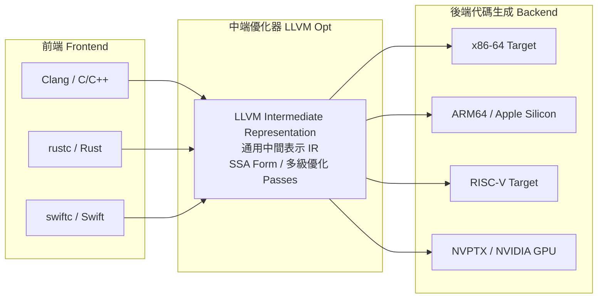
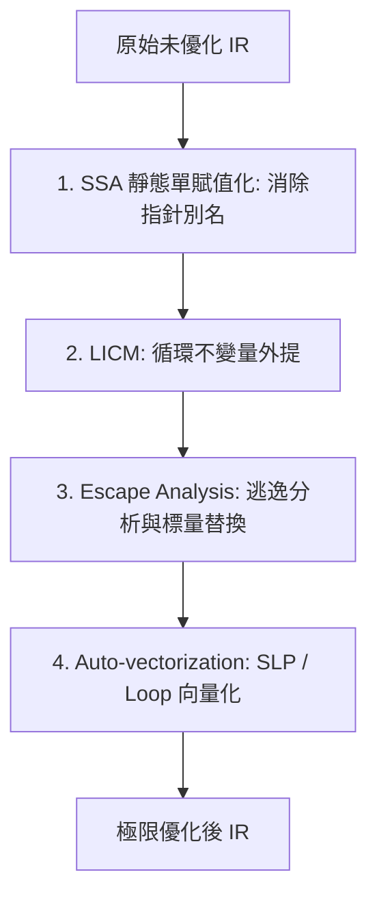

# 現代編譯器黑魔法：LLVM 架構、中間表示 IR、JIT 即時編譯與多級優化

> **迷因導讀**：你隨手寫了一段巢狀三重 `for` 循環，裡面塞滿了一堆自以為很帥但毫無意義的臨時變數賦值，換成三十年前的原始編譯器，CPU 當場被你折磨到風扇狂轉、直接慢到卡死；但在現代 LLVM 編譯器眼裡，它只是冷冷一笑，抿了一口電子機油，在編譯階段手起刀落——直接把你的整個循環全面展開、常量折疊成單一數值、塞進 AVX-512 做向量化 SIMD 並行計算；最後它甚至往下一瞄，發現你這段代碼後面根本沒有任何 `print` 或 I/O 輸出，於是面無表情地把這整整幾百行邏輯連根拔起直接刪掉（Dead Code Elimination）！編譯耗時 0.02 秒，產出的可執行檔執行時間 0.000 奈秒。看著比手寫組合語言還快十倍的執行檔，程式員當場破防跪在螢幕前直呼：「編譯器比我自己更懂我在寫什麼！我寫的是垃圾代碼，它吐出來的是神之詩篇！」

---

## 一、 三段式設計的勝利：LLVM 架構如何一統江湖

在軟體工程的混沌蠻荒時代，寫編譯器是一項堪比「女媧補天」的苦行僧修煉。如果你發明了一門新語言（比如叫 `CoolLang`），想要讓它在 x86、ARM、MIPS 和 PowerPC 等架構上飛馳，你必須為每一個硬體架構從頭手寫一套代碼生成器。反過來，如果 Intel 推出了一款新的晶片微架構，所有現存語言（C、C++、Fortran）的編譯器作者都必須加班重寫底層代碼生成邏輯。

這就是計算機科學史上著名的 **$M \times N$ 組合爆炸惡夢**：$M$ 種程式語言要跑在 $N$ 種硬體架構上，整個工業界需要維護 $M \times N$ 個獨立的編譯模組。代碼重複率高到令人髮指，優化邏輯破碎不堪，任何一家小公司想推新語言或新晶片，都會被這道工程高牆硬生生逼到破產。

直到 2000 年代初，當時還在伊利諾大學厄巴納-香檳分校（UIUC）的年輕小夥子 Chris Lattner（後來 Swift 之父、Modular 創始人）和他的導師 Vikram Adve 提出了 **LLVM（Low Level Virtual Machine，現已成為獨立品牌名，不再只是虛擬機）** 的三段式架構，徹底掀翻了這張舊時代的牌桌。



LLVM 的核心哲學只有四個字：**徹底解耦**。它將傳統編譯器切分成井水不犯河水的三個獨立階段：

1. **前端（Frontend，如 Clang、rustc、swiftc）**：
   負責處理人類寫出來的奇形怪狀的源代碼。進行詞法分析（Lexing）、語法分析（Parsing）、語意分析（Semantic Analysis），處理語言特有的語法糖和型別系統，然後——**只做一件事**：將 AST（抽象語法樹）翻譯成統一的 **LLVM 中間表示（Intermediate Representation，簡稱 IR）**。
2. **中端（Optimizer）**：
   這是一座巨大的「代碼加工廠」。中端**完全不需要知道**這段 IR 當初是用 Rust 寫的、C 寫的還是 Swift 寫的，它只認標准 LLVM IR。無數個獨立的「優化通行證（Pass）」在這裡輪番上陣，進行死代碼消除、常量折疊、循環展開、記憶體別名分析與內聯優化。
3. **後端（Backend / CodeGen）**：
   負責將被中端優化到極致的 IR 翻譯成特定目標機器的機器指令（Machine Code）。後端**完全不需要在乎**原代碼的語法是什麼，它只需要專注研究硬體：暫存器分配（Register Allocation）、指令調度（Instruction Scheduling）、管線停頓消除，然後噴出閃閃發光的 x86、ARM64 或 RISC-V 機器碼。

這個架構奇蹟般地把複雜度從 **$M \times N$ 驟降為 $M + N$**！  
今天你想發明一門新的程式語言？你只需要寫一個前端把代碼轉成 LLVM IR，瞬間就能白嫖整個 LLVM 社群積累了二十年、價值數十億美元的世界頂級優化器，並且當天下午就能無縫編譯到 iPhone 的 A17、伺服器的 EPYC 乃至任天堂 Switch 的 ARM 晶片上！這就是現代系統軟體世界的降維打擊。

---

## 二、 主流編譯與執行模式全景橫評

在現代程式語言的執行生態中，光是「代碼怎麼變成機器指令」這一件事，就分化出了截然不同的哲學流派。有的追求極致吞吐與零啟動延遲，有的追求即開即用的動態靈活性，還有的在虛擬化與跨平台之間左右逢源。

為了客觀釐清各流派的技術邊界，我們對主流的四種編譯與執行模式進行全方位硬核橫評：

| 評估維度 | 純靜態 AOT 編譯 (如 C/C++/Rust via LLVM) | 純字節碼解釋器 (如 CPython 3.10 前 / 原生 Ruby) | 現代動態 JIT 編譯 (如 V8 / JVM HotSpot C2) | WebAssembly / Wasm (如 Wasmtime / 瀏覽器內核) |
| :--- | :--- | :--- | :--- | :--- |
| **底層核心機制** | 離線將源碼一次性編譯為目標平台原生機器指令 | 逐行讀取 AST 或虛擬機 Bytecode，由 C 語言大循環解釋執行 | 解釋執行啟動 + 運行時 Profiling 探測熱點代碼 + 動態編譯為機器碼 | 堆疊式虛擬機二進制格式，沙盒內 AOT/JIT 雙模編譯至原生碼 |
| **冷啟動延遲 (Cold Start)** | **極低（接近 0 ms）**<br>直接由 OS 加載二進制段入記憶體 | **極低（< 10 ms）**<br>無繁重編譯開銷，立即開始解釋 | **高至極高（100 ms ~ 數秒）**<br>需要預熱（Warm-up）、JIT 編譯與去優化重試 | **低至中等（10 ~ 50 ms）**<br>模組驗證與 Baseline 編譯耗時極短 |
| **熱點峰值性能 (Peak Throughput)** | **極致（基準 100%）**<br>擁有全局視角、PGO 深度優化與整程式優化 (LTO) | **極差（僅原生的 1% ~ 5%）**<br>虛擬機分發開銷 (Opcode Dispatch) 巨大 | **極高（原生的 80% ~ 110%）**<br>可利用運行時真實數據做「投機優化」，偶爾反超 AOT | **接近原生（原生的 75% ~ 95%）**<br>受限於沙盒記憶體邊界檢查 (Bounds Checking) |
| **記憶體運行時開銷** | **極致精簡**<br>僅包含程序碼段與必要依賴，無執行時編譯負擔 | **低**<br>僅需維護解釋器狀態機與直譯環境物件結構 | **龐大（吃記憶體怪獸）**<br>需常駐 JIT 編譯器、代碼緩存 (Code Cache)、Profiling 元數據 | **極低至輕量**<br>沙盒記憶體線性受限，虛擬機輕巧（數 MB） |
| **動態投機優化能力** | **無（需仰賴 PGO 採樣重編）**<br>無法感知未來的真實使用者輸入分支分佈 | **無**<br>佛系執行，完全不做任何代碼特化假設 | **極強（Speculative Optimization）**<br>可假設型別不變、方法不被多型覆蓋；猜錯則去優化 (Deopt) | **受限**<br>強調靜態型別安全與沙盒隔離，動態投機空間小 |
| **跨平台二進制移植性** | **極低**<br>每個 OS/ISA 必須單獨交叉編譯分發二進制檔 | **極高**<br>一段 `.py` 或 `.rb` 腳本全平台到處跑 | **高**<br>分發字節碼（`.class` 或 JS 源碼），運行時適配硬體 | **天花板級別**<br>真正實現「一次編譯，在瀏覽器、邊緣節點、伺服器任意狂奔」 |

### 關鍵技術洞察：JIT 憑什麼有時能打敗 AOT？
很多寫 C/C++ 的老兵無法接受「Java 或 JavaScript 在特定熱點循環裡居然能跑贏 C」的都市傳說。但從編譯原理來看，這是完全符合資訊論的：
* **靜態 AOT 編譯器**是「保守派」。它在編譯時必須考慮最壞情況。如果一個虛擬函數指針可能有三個子類實現，LLVM 必須老老實實生成間接尋址呼叫（`call *%rax`），引發 CPU 分支預測器和指令緩存（i-Cache）的負擔。
* **動態 JIT 編譯器（如 V8 TurboFan 或 JVM C2）**是「賭徒派」。它在代碼跑了 10,000 次後發現：**「靠，這個指針 99.999% 的情況下都是指向類別 A！」** 於是 JIT 直接大膽做出**投機內聯（Speculative Inlining）**，把間接呼叫直接砍掉，換成硬編碼的平鋪直敘指令，外加一個微小的守衛條件（Guard）。如果哪天真的來了類別 B，JIT 立刻觸發 **去優化（Deoptimization / OSR 棧上替換）**，優雅地跌回解釋器。在純粹的熱點單型別（Monomorphic）呼叫上，JIT 握有的「現場情報」遠比死板的離線 AOT 編譯器更加性感。

---

## 三、 編譯器優化通行證（Pass）核心大招

現代編譯器之所以能把你寫的「老頭樂」代碼爆改成「超跑」，靠的是其內部一連串精心排布的 **Pass（優化通行證）**。在 LLVM 裡，代碼在 IR 形態下會像流水線上的晶圓一樣，被數十個甚至上百個 Pass 依次清洗、打磨、重構。以下四大核心大招，是支撐起現代高性能計算的底層骨架：



### 1. SSA 形式（Static Single Assignment，靜態單賦值）
如果沒有 SSA，所有的代碼優化都是鏡花水月。  
在傳統代碼中，同一個變數名 `x` 會被反覆賦值：
```c
x = 1;
// ... 一大堆複雜運算
x = x + 2;
// ... 又一大堆分支
x = 10;
```
對於編譯器來說，要追蹤此時此刻的 `x` 到底是哪個值，需要建立極其複雜的「定義-使用鏈（Def-Use Chain）」，一旦牽扯到指針，分析複雜度直接指數級爆炸。

SSA 的核心思想極度暴力美學：**任何變數只能被賦值一次！** 每次賦值，都生成一個全新的版本號：
```text
x1 = 1
x2 = x1 + 2
x3 = 10
```
而在代碼分支匯合的地方（例如 `if-else` 後），SSA 引入了一個神秘的數學符號——**$\phi$ 節點（Phi Node）**：
$$x_4 = \phi(x_2, x_3)$$
意思是：如果程式是從 `then` 分支走過來的，$x_4$ 就取值 $x_2$；如果是從 `else` 分支過來的，$x_4$ 就取值 $x_3$。  
**SSA 的威力何在？** 它將數據流與控制流徹底解耦，使得暫存器分配、死代碼檢測與常量傳播的演算法從原本的非確定性多項式時間難題，瞬間降維成近似線性時間的優雅操作！

### 2. 逃逸分析（Escape Analysis）與標量替換
在很多物件導向或現代高階語言中，打工人最喜歡隨手 `new Object()` 或寫一個小型封裝 Struct。這些物件如果都去堆記憶體（Heap）上申請空間，會引發龐大的 `malloc` 開銷以及隨後的垃圾回收（GC）壓力。

編譯器的逃逸分析 Pass 會緊盯著這個物件的生命週期指針：
* **它有沒有被返回給調用者？**（沒有）
* **它有沒有被賦值給全局變數或靜態欄位？**（沒有）
* **它有沒有被另一個線程摸過？**（沒有）

既然這個物件自始至終都只在這個函數作用域裡閉門造車，編譯器就會施展一記絕學——**標量替換（Scalar Replacement of Aggregates, SRA）**：**「別建什麼物件了，散裝處理吧！」**  
編譯器直接將這個物件的成員變數拆解成幾個獨立的暫存器變數，原本的堆分配開銷直接縮減為 0，連棧（Stack）分配都省了，CPU 暫存器直接接管一切。

### 3. 循環不變量外提（Loop-Invariant Code Motion, LICM）
看看打工人日常寫出的「經典循環」：
```c
for (int i = 0; i < n; i++) {
    int factor = calculate_constant_tax(base_rate) * 42; // 這個計算跟 i 半毛錢關係都沒有！
    arr[i] = arr[i] * factor;
}
```
凡人程式員可能因為代碼可讀性或抽風，把一個完全靜態的運算塞進了迭代一千萬次的循環內部。  
LICM Pass 的工作就是化身巡邏特警，用數學嚴謹證明 `calculate_constant_tax(base_rate) * 42` 裡面沒有任何內部副作用（Side Effect），其輸入也不受循環變數 $i$ 的影響。編譯器直接將這段邏輯**連根拔起到循環前置頭（Preheader）**：
```c
int factor = calculate_constant_tax(base_rate) * 42; // 提拔到外層，只算一次！
for (int i = 0; i < n; i++) {
    arr[i] = arr[i] * factor;
}
```
原本要被計算一千萬次的乘除法，瞬間縮減為單次運算。打工人的粗心大意，由編譯器在暗中為你負重前行。

### 4. 自動向量化（Auto-vectorization）
這是現代編譯器壓榨硬體極限的代表作，主要分為兩大殺招：
* **Loop Vectorizer（循環向量化）**：當你的循環在處理陣列加法時，編譯器如果確認相鄰迭代之間沒有數據依賴（Data Dependency / Aliasing），它就不會生成笨拙的單次加法 `addss`，而是直接祭出 CPU 的 SIMD 指令集（如 Intel AVX2/AVX-512，或 ARM NEON）。一條指令將 512 位元暫存器灌滿（一口氣塞 16 個 32-bit 浮點數），一個時鐘週期直接吞吐 16 個陣列元素！
* **SLP Vectorizer（超字級並行，Superword-Level Parallelism）**：即使你沒寫循環，只是平鋪直敘地寫了四行純變數賦值：`a = x + y; b = z + w; ...`，SLP 也能在基本塊（Basic Block）內自動把這四個獨立運算揉合成一個向量指令一次性解決。

---

## 四、 結語：現代編譯器不是簡單的翻譯官，而是在代碼的抽象維度上重新重塑現實的神級雕刻家

過去很多初學者對編譯器的理解，往往停留在「詞典翻譯員」的刻板印象：把人類看的 C/Rust/Swift 句子，一句一句照本宣科翻譯成 CPU 能讀的 0 和 1。

但只要你真正凝視過 LLVM 經過幾十輪 Pass 沖刷前後的 IR 差異，你就會意識到：**現代編譯器本質上是一個代碼物理世界的重構引擎。**

你在高階語言裡維持你的架構整潔、設計模式、封裝抽象與高階函數；而編譯器在你看不到的地下深處，像一位冷酷優雅的神級雕刻家，大刀闊斧地敲碎一切無謂的對象包裝、拉平函數調用棧、抹去變數指針別名、甚至將整個控制流圖（CFG）重新倒裝與超線程並行化。

它允許人類用最高級、最優雅、最不容易出錯的抽象去思考業務邏輯；同時替我們以最殘暴、最精確、最逼近物理半導體極限的方式在晶片上狂飆。理解編譯器黑魔法，不是為了去跟它較勁手寫組合語言，而是學會信任這座人類計算機工程史上最偉大的智力結晶——當你寫下每一行代碼時，知道深淵之下，有一群無形的高等智慧正在為你的代碼賦予真正的生命。

---
#科技 #硬核科普 #當代打工人 #避坑指南 #AI革命
