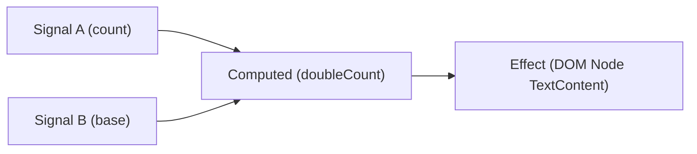

# 現代前端框架響應式原理：從 Object.defineProperty、Proxy 到 Signals 細粒度更新革命

> **迷因導讀**：早期前端工程師為了修改網頁上的一個計數器數字，在代碼裡狂寫 `document.getElementById('counter').innerText = count`，手動 DOM 操作搞得心力交瘁、頭皮發麻；後來 Vue 和 React 帶著救世主光環降臨，高舉「數據驅動視圖（UI = f(state)）」的現代化大旗，聲稱解放了全人類打工人的雙手。結果你興高采烈進了團隊，在 React 組件裡隨手寫個 `setState`，整棵虛擬 DOM 樹立馬從頂層向下一路遞歸、瘋狂重跑，卡得像是在用二十年前的賽揚處理器放幻燈片！打工人只得被迫在 `useMemo`、`useCallback`、`shouldComponentUpdate` 的死鎖迷宮裡通宵改 Bug。直到 Solid.js、Svelte 5、Vue Vapor 和 Angular 帶著 Signals 揮舞大砍刀衝進戰場，當場拍桌怒吼：「別再把時間浪費在 Diff 虛擬 DOM 那坨肥大的內存垃圾上了！老子直接在底層把響應式數據和真實 DOM 節點一對一死鎖綁定，變更直達文字節點，更新只要一納秒！」這場前端三十年的血淚輪迴，究竟是技術演進的終極收斂，還是框架發明家們為了 KPI 製造的又一輪玄學降維打擊？

---

## 一、 視圖同步的心智負擔：從手動操縱 DOM 到聲明式數據綁定

要理解前端工程師這十幾年來被反覆折磨的「血壓飆升史」，我們必須把時光機倒撥回那個由 jQuery 和原生 JavaScript 統治的洪荒年代。

在網頁還被稱為「動態頁面」的石器時代，瀏覽器底層的 DOM（Document Object Model）是一套由 C++ 編寫的宿主環境對象。JavaScript 引擎（比如 V8）與渲染引擎（Blink / WebKit）之間的通信本質上是一場沉重的「跨界外交談判」。當你執行一句簡單的 `div.appendChild(newElem)`，底層需要跨越 JS 堆棧與 C++ 原生 DOM 結構的邊界，觸發佈局樣式重算（Recalculate Style）、佈局流重新計算（Layout / Reflow），最後再進行圖層合成與重繪（Paint & Composite）。

當時的打工人如果要在畫面上維護一個即時購車清單，代碼通常充斥著這樣的災難：
```javascript
// 石器時代打工人的日常精神崩潰現場
function updateCart(item, count) {
  const row = document.querySelector(`#item-${item.id}`);
  if (row) {
    const qtySpan = row.querySelector('.quantity');
    qtySpan.innerText = count;
    const subtotalSpan = row.querySelector('.subtotal');
    subtotalSpan.innerText = `$${count * item.price}`;
  }
  const totalElem = document.getElementById('cart-total');
  totalElem.innerText = `$${calculateTotal()}`;
}
```
這種**命令式編程（Imperative Programming）**的痛點在於：**狀態（State）與視圖（DOM）沒有任何客觀因果拘束**。狀態散落在全局變量、閉包甚至直接硬編碼在 DOM 節點的 `data-*` 屬性裡。當業務邏輯複雜到一定程度，頁面只要多彈出兩個 Modal、來三個異步輪詢接口，工程師就根本無法確定當前畫面上顯示的金額究竟是哪一行代碼改掉的，狀態撕裂（State Inconsistency）直接引爆生產事故。

### 1. 救世主登場：宣告式編程（Declarative UI）與虛擬 DOM 的誕生

2013 年前後，React 攜帶著虛擬 DOM（Virtual DOM, 簡稱 VDOM）橫空出世，丟出了一個足以載入前端史冊的數學公式：
$$UI = f(state)$$

宣告式編程的核心承諾是：**工程師只需要關心狀態數據長什麼樣，視圖該怎麼畫由框架底層全權承包。**
為了避免每次狀態變動都粗暴地 `container.innerHTML = render(state)` 導致畫面瘋狂白屏閃爍，虛擬 DOM 採用了一套精巧的緩存妥協機制：
1. **內存鏡像**：在 JS 內存堆中構建一個純 JavaScript 對象樹，每個節點稱為一個 VNode，用來鏡像真實 DOM 的標籤名、屬性、事件監聽與子節點。
2. **前後 Diff**：當狀態改變觸發重新渲染時，重新執行一次渲染函數，生成一棵「新的 VDOM 樹」。
3. **樹比對與打補丁（Patching）**：透過啟發式 Diff 算法比對新舊兩棵 VDOM 樹，算出真正的最小差異集合（Patches），最後批量一次性投遞給真實 DOM 進行修改。

理論上，比對兩棵樹結構的最小編輯距離在通用計算機科學中的時間複雜度是：
$$O(n^3)$$
若頁面有一千個節點，傳統樹比對需要跑 $10^9$ 次計算，瀏覽器當場宕機。React 與 Vue 採用了兩項強大的啟發式假設（Heuristic Assumptions），將時間複雜度直接壓到了線性：
$$O(n)$$
- **同層比對**：跨層級移動節點的操作極罕見，因此只做同層（Level-by-Level）節點比對，發現節點類型改變直接整棵銷毀重蓋。
- **Key 值唯一性**：開發者為列表項賦予唯一的 `key` 標識，框架透過 HashMap 或雙端指針直接復用節點。

### 2. 虛擬 DOM 的代價：被掩蓋的內存黑洞與協程調度代償

然而，天下從沒有免費的午餐。宣告式編程讓打工人擺脫了手動操作 DOM 的泥潭，卻在瀏覽器內存與 CPU 堆棧深處埋下了一枚定時炸彈。

首先是**內存駐留開銷**。真實 DOM 本身在 C++ 層面就極其厚重，而虛擬 DOM 樹在 JS 堆中又完整鏡像了一遍。在稍微複雜的中後台 ERP 系統或即時金融監控看板中，一萬個 DOM 節點意味著一萬個 VNode 對象，每次狀態更新隨之產生新的對象分配，垃圾回收機制（Garbage Collection, GC）頻繁觸發「Stop-The-World」，網頁肉眼可見地產生掉幀卡頓。

其次是**粗粒度無效重跑**。在 React 的設計哲學中，組件本質就是一個渲染函數。當你在最頂層組件調用一個局部狀態修改時，如果沒有極端嚴格的手動優化，整條組件樹都會遞歸往下重新執行一輪函數調用！即使下層組件的 Props 根本沒變，框架也必須完整生成一遍子樹 VNode，再進行深層 Diff 比對，最終發現「噢，原來什麼都沒變」。

這就是著名的「虛擬 DOM 稅（Virtual DOM Overhead）」。React 為了拯救這種粗粒度架構導致的長任務阻塞掉幀，不惜重構整個底層，推出了舉世聞名的 **Fiber 纖程架構**——把組件樹打碎成鏈表結構的協程單元，利用 `requestIdleCallback` 進行時間分片（Time Slicing），在空閒幀斷續計算 Diff。這無疑是工程奇蹟，但從本質上看，這就像是房間漏水了，設計者沒有去補水管，而是造了一套極其精密、由 AI 控制的自動抽水機器人！

---

## 二、 現代前端響應式範式全景橫評

為了解決「狀態改變如何精確通知視圖」這個靈魂拷問，前端各大門派在過去十餘年間演化出了四種截然不同的哲學流派。我們將其整理成如下的全景客觀工程對照表格：

### 現代前端響應式核心架構指標橫向評測

| 技術維度 | 早期 Vue 2.x | 現代 Vue 3.x | React (Fiber 架構) | 新一代 Signals (SolidJS / Angular) |
| :--- | :--- | :--- | :--- | :--- |
| **底層響應式載體** | `Object.defineProperty` (Getter/Setter 劫持) | ES6 `Proxy` + `Reflect` (元編程代理) | 不可變數據 (Immutable) + `setState` / Hook | 閉包上下文 + 響應式圖節點 (`createSignal`) |
| **更新依賴收集機制** | 運行時遍歷對象屬性，綁定 `Dep` 與 `Watcher` | 運行時 WeakMap 拓撲依賴桶 (`track` / `trigger`) | 無運行時依賴收集，靠調度器被動觸發整樹重評估 | 純編譯與首屏執行時 Getter 自動訂閱，完全去中心化 |
| **更新粒度精確度** | **組件級**（Watcher 綁定到單個組件 render 函數） | **組件級**（輔以編譯期 PatchFlags 靜態提升標記） | **組件級 / 子樹級**（預設整棵子樹向下遞歸重跑） | **文字節點 / 屬性級**（精確鎖定單個 DOM 節點） |
| **虛擬 DOM 依賴性** | **強依賴**（基於 Snabbdom 改寫的雙端 Diff） | **強依賴**（優化版 Fast-Diff + 動態靶向綁定） | **絕對依賴**（Fiber 鏈表雙緩衝比對 Reconciler） | **零依賴**（無 VDOM，編譯直譯為原生 DOM API） |
| **記憶體基準開銷 (Baseline Memory)** | 中等偏高（為每個對象屬性閉包注入 Dep 實例） | 中等（原生 Proxy 代理，無需遍歷遞歸改寫對象） | 較低（純對象無代理，但頻繁 GC 產生瞬時內存浪費） | **極低**（僅需少量的 Signal 依賴圖鏈表節點） |
| **拓撲依賴更新時間複雜度** | $O(N)$（受限於組件內 Watcher 數量） | $O(N)$（受限於組件內 Dynamic VNodes 數量） | $O(K \log K)$ 至 $O(K)$（受 Fiber 樹深度與節點數影響） | **$O(1)$**（局部精確傳播，只重算有向無環圖受影響分支） |
| **特殊數據結構支援缺陷** | 無法監聽對象新增/刪除屬性；無法直接監聽數組下標賦值 | 完整支援對象動態擴展、數組變異及 Map/Set 集合 | 依賴嚴格淺比較（Shallow Compare），物件引用不可變 | 完美支援各類原語，數組/集合通常封裝為專屬 Signals |
| **工程師心流心智負擔** | 經常被 `Vue.set()`、數組變異方法破防 | 心智負擔適中，但需適應 `.value` 拆包玄學 | **心智負擔極重**（`useEffect` 閉包陷阱、依賴項死鎖） | **心智負擔極輕**（直接調用函數讀取，無 Hook 規則限制） |

---

### 1. 早期 Vue 2：`Object.defineProperty` 的輝煌與硬傷

Vue 2 的核心思想是「侵入式數據劫持（Data Hijacking）」。在組件初始化時，Vue 遍歷傳入的 `data` 對象的所有屬性，利用 `Object.defineProperty` 將其全部重寫為 Getter 和 Setter：

```javascript
function defineReactive(obj, key, val) {
  const dep = new Dep(); // 依賴收集容器
  Object.defineProperty(obj, key, {
    enumerable: true,
    configurable: true,
    get() {
      if (Dep.target) {
        dep.depend(); // 收集當前正在執行的 Watcher
      }
      return val;
    },
    set(newVal) {
      if (newVal === val) return;
      val = newVal;
      dep.notify(); // 通知所有訂閱的 Watcher 更新
    }
  });
}
```

這套架構讓無數從 jQuery 轉型的前端直呼「爽快」，你只要寫 `this.count++`，畫面自己就動了。
但它的底層缺陷也讓老一代打工人流乾了眼淚：
1. **深層對象遞歸初始化的性能地獄**：如果你的狀態對象嵌套了 5 層，Vue 2 必須在啟動時無腦遞歸遍歷所有屬性，為每個 key 都綁上 getter/setter。當列表數據龐大時，頁面加載直接卡死。
2. **屬性新增與刪除的感知盲區**：`Object.defineProperty` 只能劫持「已有」的屬性。如果代碼執行 `this.user.age = 18`，而初始對象只有 `name`，Vue 2 根本無法感知！迫使官方打補丁推出反人類的 `Vue.set(this.user, 'age', 18)`。
3. **數組下標修改的背叛**：直接通過索引賦值 `this.list[0] = 'new'`，Vue 2 為了避免攔截 10000 個數組下標帶來的崩潰級內存開銷，主動放棄了下標劫持，轉而猴子補丁（Monkey Patch）重寫了數組的 `push`、`pop` 等 7 個原型方法。

### 2. 現代 Vue 3：ES6 `Proxy` 的全面降維打擊

Vue 3 徹底拋棄了老舊的 `defineProperty`，轉投 ES6 `Proxy` 的懷抱：
```javascript
const reactiveMap = new WeakMap();

function reactive(target) {
  if (typeof target !== 'object' || target === null) return target;
  
  const handler = {
    get(target, key, receiver) {
      const res = Reflect.get(target, key, receiver);
      track(target, key); // 依賴收集：放入全局 WeakMap 依賴池
      return typeof res === 'object' ? reactive(res) : res; // 惰性深層代理！
    },
    set(target, key, value, receiver) {
      const oldValue = target[key];
      const result = Reflect.set(target, key, value, receiver);
      if (hasChanged(value, oldValue)) {
        trigger(target, key); // 觸發派發：精確找到依賴 effect 重新執行
      }
      return result;
    }
  };
  return new Proxy(target, handler);
}
```
`Proxy` 的勝利在於：它攔截的是**整個對象的元操作（Meta Operations）**，而不是某個具體的靜態屬性。
- 新增屬性？`set` 陷阱直接抓包！
- 刪除屬性？`deleteProperty` 陷阱直接攔截！
- 對象深層嵌套？不用在啟動時預先遞歸，而是在用戶訪問該屬性的瞬間（Getter 運行時）進行**惰性代理（Lazy Proxying）**，初始化速度呈現數量級提升！
但即使強如 Vue 3，其更新粒度仍然停留在「組件級」。當狀態變更觸發時，重新執行的依然是組件的 `render` 函數，只不過 Vue 3 依靠編譯期靜態分析（PatchFlags、Block Tree）把 Diff 範圍死死框在少數動態節點內。

### 3. React：不可變哲學與 Fiber 調度的苦行僧之路

與 Vue 的「精確追蹤、自動攔截」截然相反，React 選擇了極端純粹的**不可變數據（Immutable Data）**路徑。
在 React 眼裡：**追蹤數據修改是徒勞且脆弱的，我根本不關心你是哪個屬性變了，我只關心你是否給了我一個「全新的對象引用」！**

```jsx
// React 的心靈枷鎖：組件是純函數，每一次渲染都是獨立的閉包快照
function Counter() {
  const [count, setCount] = useState(0);

  // 每次 count 改變，整座 Counter 函數自頂向下從頭再跑一次！
  // 函數內所有的局部變量、事件回調全部銷毀重新生成！
  const handleClick = useCallback(() => {
    console.log(count);
  }, [count]); // 稍有不慎漏掉依賴項，閉包陷阱教你做人

  return <button onClick={() => setCount(c => c + 1)}>Count: {count}</button>;
}
```
因為每次更新都是整樹/組件級重算，React 無法預測用戶何時會引發一場耗時超過 16.6ms（60fps 幀預算）的 Diff 大風暴。於是 React 團隊耗時數年，把傳統瀏覽器的調用棧改寫成了雙向鏈表結構的 **Fiber 架構**：
- **Reconciliation Phase（協調階段）**：可中斷的異步計算。Fiber 節點在內存中一個個比對，如果瀏覽器即將掉幀，調度器（Scheduler）立刻暫停 JS，把主線程還給瀏覽器繪製輸入事件，下一幀空閒再回來繼續算。
- **Commit Phase（提交階段）**：同步不可中斷。把算好的 DOM 補丁一次性刷入畫面。

這種架構在理論上無比宏偉，但把沉重的心智負擔全部轉嫁給了終端打工人。`useEffect` 的依賴項數組、無限循環渲染、過期閉包（Stale Closure）成為了當代前端工程師每天上班最想砸鍵盤的源頭。

---

## 三、 Signals 革命：為什麼說它是虛擬 DOM 的掘墓人？

正當 React 打工人在 `useCallback` 與 `useMemo` 的苦海中掙扎、Vue 打工人還在思索為什麼 `.value` 不能自動拆包的時候，以 **Solid.js** 為先驅，Angular、Preact、Vue（Vapor Mode）、Svelte 5 全面跟進的 **Signals（信號）** 席捲了整個業界。

很多前端新人看到 Signals 的語法，第一反應往往是嗤之以鼻：「這不就是把 React 的 `useState` 換了個名字嗎？」
```javascript
// Solid.js / Signals 語法
const [count, setCount] = createSignal(0);
```
大錯特錯！這兩者在計算機底層運行時上的本質差異，猶如「熱氣球」與「高鐵」的代際代溝。

### 1. 核心機制：響應式有向無環圖（Reactive DAG）

Signals 的架構由三個核心基語構成：
1. **Signal**：保存可變數據的可讀寫原語（Getter / Setter）。
2. **Effect（或 Computed）**：派生計算或副作用節點。
3. **Reactive Context（響應式上下文堆疊）**：當前正在運行的訂閱者指針。

其核心運作本質是一個**自動構建的有向無環圖（Directed Acyclic Graph, DAG）**。



當一個 Signal 被讀取時，底層發生了什麼？請看這段純手工打造的極簡 Signals 內核實現：

```javascript
// 全局當前正在執行的副作用訂閱者
let currentSubscriber = null;

class Signal {
  constructor(initialValue) {
    this._value = initialValue;
    this.subscribers = new Set(); // 訂閱者清單
  }

  get() {
    // 關鍵所在：Getter 觸發依賴收集
    if (currentSubscriber) {
      this.subscribers.add(currentSubscriber);
    }
    return this._value;
  }

  set(newValue) {
    if (this._value !== newValue) {
      this._value = newValue;
      // 關鍵所在：Setter 精確派發，無任何 Diff 算法！
      // 複製一份以防止在執行過程中訂閱者變更死循環
      const subsToRun = [...this.subscribers];
      for (const sub of subsToRun) {
        sub();
      }
    }
  }
}

function createEffect(fn) {
  const effect = () => {
    const prevSubscriber = currentSubscriber;
    currentSubscriber = effect; // 入棧：把自己設為當前訂閱者
    try {
      fn(); // 執行回調，回調內觸發 Signal.get()，自動完成死鎖綁定！
    } finally {
      currentSubscriber = prevSubscriber; // 出棧
    }
  };
  effect(); // 初始化時立即執行一次，建立依賴拓撲
}
```

### 2. 為什麼它跳過了組件的重新執行？

在 React 中，組件是一段**每次狀態改變都要重新調用**的函數：
```javascript
// React: 每次 count 改變，Console 狂噴，整個函數重跑
function ReactComponent() {
  const [count, setCount] = useState(0);
  console.log("組件函數被重新調用了！");
  return <div>{count}</div>;
}
```

但在 Solid.js（純粹的 Signals 實現）中，組件函數**在整個應用生命週期中，只會執行一次！**
```javascript
// SolidJS: 組件函數只在掛載時跑且僅跑一次！
function SolidComponent() {
  const [count, setCount] = createSignal(0);
  console.log("組件函數只跑了一次，之後永遠不再執行！");

  // 編譯器將 JSX 直接編譯為真實原生 DOM 創建，並將 textContent 綁入 Effect
  return <div>{count()}</div>;
}
```
編譯後的底層等價代碼如下：
```javascript
function SolidComponentCompiled() {
  const [count, setCount] = createSignal(0);
  
  // 1. 直接調用原生的 document.createElement
  const div = document.createElement("div");
  const textNode = document.createTextNode("");
  div.appendChild(textNode);

  // 2. 將文本更新精確鎖死在單個 textNode 節點上
  createEffect(() => {
    // 當 count() 改變時，唯一被執行的只有這行原生的 DOM 賦值！
    // 整個 SolidComponentCompiled 函數本體永遠不會再次執行！
    textNode.data = count();
  });

  return div;
}
```
**看懂這一步，你就看懂了前端現代革命的終局密碼！**

當狀態改變時：
- **React**：執行組件函數 $\rightarrow$ 建立全新 VNode 樹 $\rightarrow$ 跑 Fiber 協調調度 $\rightarrow$ Diff 比對新舊樹 $\rightarrow$ 找出差異 $\rightarrow$ 改動 DOM。
- **Signals**：調用 Setter $\rightarrow$ 遍歷 Set 集合 $\rightarrow$ 直接命中 `textNode.data = newValue`！

它沒有虛擬 DOM，沒有 Diff 算法，沒有對象樹內存分配，更沒有 Fiber 的時間分片。它的更新開銷直接退化到了原生的極限：**直接操作對應的真實 DOM 節點，時間複雜度恆定為 $O(1)$！**

---

## 四、 結語：前端技術三十年輪迴，我們繞過高聳的抽象迷宮，最終重新找回了最純粹的極簡直連

回望從 1995 年 JavaScript 誕生至今的前端發展史，簡直就是一部充滿黑色幽默的哲學輪迴史詩：

1. **第一幕（極簡的蠻荒）**：我們手寫 `document.getElementById`，代碼直接操作真實 DOM，性能極高，但心智崩潰於散亂的狀態管理。
2. **第二幕（宏偉的迷宮）**：為了獲得「宣告式數據驅動」的優雅心流，業界發明了虛擬 DOM。我們把真實 DOM 裝進厚重的內存抽象層，發明了複雜精妙的線性 Diff 算法；當這層抽象卡頓時，我們沒有拆除它，而是造出了 Fiber 纖程、時間分片、併發渲染（Concurrent Mode）這些令人歎為觀止的工程巨獸。前端工程師們被迫在各類依賴項追蹤與優化 Hook 裡獻祭自己的青春。
3. **第三幕（返璞歸真的覺醒）**：Signals 的崛起，用最犀利的姿態刺破了這層持續近十年的抽象泡沫。它告訴所有人：宣告式編程（Declarative）完全不需要以虛擬 DOM（Virtual DOM）為人質！通過靜態編譯與細粒度運行時拓撲圖的結合，我們既擁有了極致優雅的數據驅動語法，又重新奪回了直達真實原生節點的極致性能。

這不是倒退，而是在經歷過無數次技術試錯與工程沈澱之後的**螺旋式上升**。
對於當代前端打工人而言，技術浪潮永遠在翻滾，框架明星永遠在交替。但當你不再把精力消耗在死記某個框架生造出來的黑話 API，而是真正沉下心來，看穿內存中的對象指針、閉包引用、瀏覽器事件循環與底層 DOM 的真實流向時——你會發現，任憑浪潮洶湧，這座由代碼構築的底層世界，始終邏輯嚴密、璀璨而迷人。

---

#科技 #硬核科普 #當代打工人 #避坑指南 #AI革命
