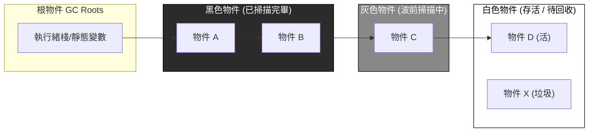
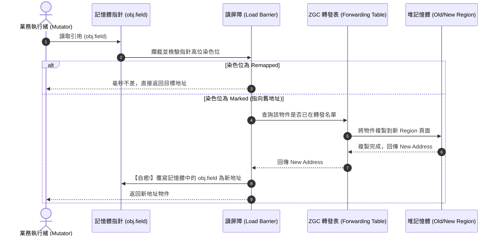

# 垃圾回收器 GC 底層演進：從 Stop-the-World、三色標記法到 ZGC 毫秒級暫停黑魔法

> **迷因導讀**：十年前寫 Java 或者 Go，最害怕的就是伺服器突然抽風——系統每隔幾分鐘就陷入長達幾秒鐘的死寂，所有用戶請求全部超時熔斷，維運大吼「GC 又在執行 Stop-the-World（STW）了，全宇宙時間都為它暫停了！」現在的 Java 21 帶著 Generational ZGC 和 Go 現代 GC 宣稱「管理幾 TB 堆內存，暫停時間不超過 1 毫秒！」後端工程師揉了揉眼睛：「一毫秒？我眨一下眼睛都要兩百毫秒，GC 到底是怎麼做到邊跑邊打掃的？！這哪裡是記憶體清理，這根本是在時空維度上對物理法則實施降維打擊！」

---

## 一、 內存管理的十字路口：手動釋放 vs 自動回收

在電腦科學的拓荒時代，軟體工程師享有對記憶體字節最原始、最純粹的「神之生殺大權」。在 C/C++ 的世界裡，`malloc()`、`free()` 與 `new`、`delete` 就是程序員的雙刃劍——你親手向作業系統劃界圈地，也必須在生命週期終結時親手將每一寸虛擬地址歸還給核心。

```
[ 手動釋放的修羅場 ]
malloc() ──► 物件生存期 ──► free() ──► 完美釋放！
                   │
                   ├─ 忘記 free() ──► 記憶體洩漏 (Memory Leak) ──► OOM 宕機半夜被叫醒
                   ├─ 提早 free() ──► 懸空指針 (Dangling Pointer) ──► 野指針亂竄 / 踩踏崩潰
                   └─ 重複 free() ──► 雙重釋放 (Double Free) ──► 安全漏洞 / 駭客提權
```

然而，人類大腦的併發控制機制本質上充滿了單點故障。只要程式碼邏輯稍微經過三層以上的非同步回調、事件驅動架構或跨執行緒通訊，手動記憶體管理就會瞬間演化為人間煉獄：
1. **懸空指針（Dangling Pointer）與野指針（Wild Pointer）**：一個執行緒將記憶體釋放掉了，另一個執行緒的指標變數卻還頑固地指向那塊廢墟。下一次當這個指標被解引用寫入時，輕則直接引發作業系統核心的 `SIGSEGV` 段錯誤，重則神不知鬼不覺地篡改了相鄰業務物件的關鍵數據，造成玄學級別的財務數據跑偏。
2. **記憶體洩漏（Memory Leak）**：忘記釋放或指標覆蓋導致某塊記憶體永遠失去存取路徑，但作業系統判定其依然在用。伺服器上線第一天神清氣爽，第七天記憶體使用率慢牛爬升到 99%，最終被 Linux OOM Killer 無情一槍爆頭。
3. **雙重釋放（Double Free）**：對同一個指針呼叫兩次 `free()`，導致 glibc 的 ptmalloc 內部堆積 metadata 被破壞，成為駭客利用任意內存覆蓋執行惡意代碼的經典溫床。

正是為了解救廣大打工人的髮際線與週末睡眠，John McCarthy 早在 1959 年為 Lisp 語言發明了垃圾收集（Garbage Collection, 簡稱 GC）。自動垃圾收集器的核心哲學非常暴力而優雅：**「工程師只管 `new` 爽，剩下的髒活累活交給執行時 Runtime。」**

然而，天下沒有免費的午餐。自動記憶體管理直接解放了工程師的心智負擔，卻把代價全部轉嫁給了硬體架構與執行時延遲。垃圾回收器面臨的第一個哲學悖論就是——**「你如何在一列時速 300 公里的高速鐵路（業務執行緒）行駛的同時，將車廂內散落的垃圾（死物件）精準分類收走，甚至重新粉刷車廂走道（記憶體整理壓縮），而且絕對不能把正在座位上喝咖啡的乘客當成垃圾扔出窗外？」**

早期的解答極其粗暴：把高鐵緊急煞停！拉下手煞車，全體乘客立正站好不准動，等列車長打掃完畢再重新通電啟動。這，就是讓數代後端開發者聞風喪膽的 **Stop-the-World (STW)**。當幾十 GB 的堆內存堆滿百萬級物件時，一次 Full GC 的 STW 往往長達數秒乃至數十秒，在此期間，資料庫連線池全面超時熔斷、分散式集群的心跳探測機制直接判定該節點「暴斃」並觸發雪崩式的分區重平衡（Rebalance）。這段技術苦難史，直接逼出了垃圾回收器長達四十年的血淚進化史。

---

## 二、 經典垃圾回收架構代際全景橫評

為了終結長達數秒的業務停擺，JVM、Go Runtime、.NET 與 V8 的底層核心架構經歷了從「粗暴全量凍結」到「精細分代併發」，再到「虛擬內存黑魔法」的史詩級躍遷。以下為近代五大標誌性 GC 架構的工程參數與核心架構硬核全景對比：

| 指標 / 維度 | 經典 Serial / Parallel GC | CMS (Concurrent Mark Sweep) | G1 GC (Garbage-First) | ZGC (Generational ZGC) | Go 現代 GC (Runtime GC) |
| :--- | :--- | :--- | :--- | :--- | :--- |
| **誕生年代 / 典型版本** | Java 1.3 / Java 8 預設 | Java 5 / 廢棄於 Java 9 | Java 7u4 / Java 9 預設 | Java 11 實驗 / 21 分代穩定 | Go 1.5 引入 / 1.18+ 成熟 |
| **核心架構設計** | 連續分代、單執行緒 / 多執行緒全量 STW | 老年代併發標記 + 併發清除（非移動） | 棋盤式分區（Region）、混合收集（Mixed GC） | 染色指針（Colored Pointers）+ 讀屏障 | 非分代、併發三色標記 + 寫屏障 |
| **最大停頓時延 (STW)** | **數秒至數十秒級**（隨堆容量線性暴增） | **數百毫秒至數秒**（重新標記階段） | **10ms ~ 200ms**（可由參數軟性預期） | **< 1ms**（且與堆大小毫無關聯） | **< 1ms**（通常 100μs ~ 500μs） |
| **記憶體碎片處理方式** | 複製演算法（新生代）/ 標記-整理（老年代） | 標記-清除（不整理，碎片累積後觸發 Serial STW） | 疏散機制（Evacuation，跨 Region 複製整理） | 併發疏散（Concurrent Evacuation，邊跑邊搬遷） | 標記-清除 + TCMalloc 多級 Size-Class 預分配 |
| **記憶體屏障開銷** | 無（純靠全量 STW 執行期凍結） | 寫屏障（Write Barrier，記錄老年代引用變化） | 雙向寫屏障（SATB 寫屏障 + 跨區 Card Table 屏障） | **讀屏障（Load Barrier）**（解引用指針時觸發自癒） | 混合寫屏障（Hybrid Write Barrier） |
| **支援最大堆記憶體容量** | 4GB ~ 32GB（再大 STW 即不可忍受） | 16GB ~ 32GB | 4GB ~ 64GB+ | **16TB**（JDK 13+） | 幾十 GB ~ 幾百 GB（受限於 CPU 標記消耗） |
| **吞吐量損耗 (CPU 負擔)** | **損耗最低（< 3%）**，極致批次計算最高效能 | 損耗中等（~10%），佔用部分 CPU 核心標記 | 損耗中高（10% ~ 15%），寫屏障卡表維護沉重 | 損耗偏高（15% ~ 20%），讀屏障高頻觸發 | 損耗中等（~10% 專用 CPU 輔助標記） |
| **代表性死穴 / 痛點** | 巨型堆積下 STW 導致業務熔斷被客訴 | 併發失敗（Concurrent Mode Failure）退化單執行緒 | 大物件（Humongous Region）打散連續空間 | 記憶體分配速率極端超越回收速率時分配停頓 | 缺乏物件分代，短命物件標記 CPU 負擔過重 |

從上述表格可以看出清晰的架構演進代價交換（Trade-off）：**世界沒有魔法，只有能量守恆。** 當你想要把停頓時延從 5 秒生生壓進 1 毫秒之內，你必然要交出 CPU 的吞吐量算力，並在處理器執行每一行指標讀取或寫入組合語言時，硬生生插上一段前置指令（屏障機制）！

---

## 三、 三色標記法與染色指針的微觀魔術

要理解 GC 如何在業務執行緒（稱為 **Mutator**）高速竄改記憶體的同時邊跑邊清理，就必須深入當代垃圾回收的核心演算法心臟：**三色標記法（Tri-color Marking）** 與現代 JVM 的終極大殺器 **染色指針（Colored Pointers）**。

### 1. 三色標記法的微觀世界與「漏標死亡之吻」

1978 年由 Dijkstra 等人提出的三色標記法，本質上是將整個記憶體空間的所有物件抽象成圖論（Graph）上的有向節點，並塗抹上三種虛擬邏輯顏色：

- **白色（White）**：未訪問物件。在標記剛開始時，所有物件均為白色；在標記徹底結束後，依然保持白色的節點就是不可達的「垃圾」，會被無情就地銷毀。
- **灰色（Grey）**：波前節點（Frontier）。表示該物件已被 GC 探訪過，但其內部所引用的子物件（成員變數）還尚未被完全掃描探測。
- **黑色（Black）**：安全活體節點。表示該物件已被探訪過，且其直接引用的所有子物件也已經全部探訪完畢。黑色節點不可能直接指向白色節點（除非被 Mutator 偷天換日）。



如果是在全量 STW 的世界裡，演算法只需順著根節點往下做廣度優先搜尋（BFS），灰色的浪潮一路推進，直到灰色節點池歸零，剩下的白色一刀切死即可。然而，在**併發標記（Concurrent Marking）**的修羅場中，業務執行緒從未停歇，這就會引發災難性的「物件被錯殺」翻車：

#### 併發漏標的致命兩大充分必要條件（Wilson 定理）
當且僅當以下兩個條件同時成立，黑色物件的活子節點會被判定為白色垃圾而遭致命誤殺：
1. **條件一（私相授受）**：業務執行緒將一個白色物件的指標，偷偷賦值給了一個**黑色物件**（`Black.field = WhiteObject`）。
2. **條件二（拋棄前任）**：業務執行緒徹底斬斷了所有灰色物件通往該白色物件的存取鏈條（`Grey.field = null`）。

```
[ 併發漏標翻車現場：Dijkstra 遺憾現場 ]

第 1 步 (私相授受)：
[黑色 A] ─── (偷偷新增引用) ───► [白色 C (關鍵業務資料)]
   ▲
   │
[灰色 B] ─── (斬斷原有引用) ───X [白色 C]
第 2 步 (拋棄前任)

結果：GC 掃描完灰色 B，判定 B 的子節點已經全空，將 B 標為黑色。
黑色 A 已經被標記為黑色，GC 永遠不會回頭重新掃描 A 的子節點！
於是白色 C 永遠沒有機會變灰，最終被判定為垃圾，無情釋放！
業務執行緒下一次存取 A.c 時 ──► 記憶體踩踏爆裂 / 空指標異常！
```

為了打破這兩個致命條件，近代垃圾回收器發展出了兩大流派：
- **增量更新（Incremental Update，打破條件一）**：採用寫屏障（Write Barrier），只要黑色物件試圖指向白色物件，寫屏障立馬在底層把黑色物件重新踹回灰色狀態，逼 GC 之後必須重新掃描（CMS 採用的核心方案）。
- **原始快照（Snapshot At The Beginning, SATB，打破條件二）**：同樣採用寫屏障，只要灰色物件試圖斬斷對白色物件的引用，寫屏障立即強制將這條即將斷掉的白色指標推入專門的標記棧，宣告「就算你把它拋棄了，本輪 GC 也一律把它當活人看待，等下一輪再收」（G1 GC 採用的核心方案）。

---

### 2. ZGC 的終極躍遷：染色指針與讀屏障自癒魔術

CMS 和 G1 雖然解決了併發標記，但在**物件搬遷壓縮（Evacuation / Compaction）**階段依然會面臨殘酷的 STW。因為物件在記憶體裡被移動了，全堆內存成千上萬個指向該物件舊地址的指針必須被全部更新！如果邊跑邊改，業務執行緒讀到一半搬遷中的髒數據怎麼辦？

Oracle JVM 團隊在 JDK 11 推出的 **ZGC（Z Garbage Collector）** 徹底顛覆了微機架構的記憶體認知。ZGC 大膽宣布：**「物件移動完全併發！不用暫停！指針更新完全非同步！」** 這項黑魔法依賴三大微架構級別的硬核技術：

#### (1) 64 位虛擬地址的元數據染色（Colored Pointers）
在 x86-64 架構下，現代 CPU 雖然具備 64 位暫存器，但實際虛擬地址空間通常只使用低 48 位（支援 256TB 尋址空間）。ZGC 打起這 48 位中閒置的高位元主意，將它們直接改造成 GC 狀態的標記位：

```
+-------------------+-+----+-----------------------------------------------+
| 16 bits (未使用)  |4|Mark|              44 bits (實際物件虛擬內存物理地址)  |
| 00000000 00000000 |1|ed0 |              可直接尋址高達 16 TB 的物理記憶體  |
+-------------------+-+----+-----------------------------------------------+
                       │  │
                       │  └─► Marked1 / Remapped (標記與重映射狀態元數據位)
                       └────► Finalizable 位
```

- **Marked0 / Marked1**：雙標記位，用以交替代表兩輪不同 GC 週期中的存活標記狀態。
- **Remapped**：表示該指針是否已經更新指向了物件搬遷後的新地址。
- **優雅代價**：由於指針本身被染了顏色，底層透過 Linux 的虛擬內存映射（`mmap` 多個虛擬地址別名映射到同一物理頁，即 Multi-mapping），保證無論 Marked0 還是 Remapped 為 1，CPU 都能直接訪問同一塊物理內存，完全零解碼開銷！

#### (2) 讀屏障（Load Barrier）與「自癒（Self-Healing）」機制
既然物件搬遷是與業務執行緒併發進行的，當業務執行緒嘗試讀取一個指標變數時：
`Object x = obj.field;`

底層 JIT 編譯器會在此處插入短短兩三行極度精簡的組合語言——**讀屏障（Load Barrier）**：
1. CPU 檢視指針的高位元染色位。如果標記為 `Remapped`，說明該指針指向的地址乾淨無虞，**讀屏障耗時接近 0 奈秒，直接通過！**
2. 如果檢測到該指針處於 `Marked0` 或尚未完成更新狀態，讀屏障瞬間介入（Slow Path）：
   - 查詢 ZGC 核心轉發表（Forwarding Table）。
   - 如果物件還沒被搬遷，GC 當場在後台協助搬遷並將新地址寫入轉發表。
   - **自癒（Self-Healing）**：讀屏障立刻將 `obj.field` 這個指針本身在記憶體裡的值更新為新地址，並將染色位翻轉為 `Remapped`！
3. **下一次訪問此指針，或者任何其他執行緒再次訪問此指針，染色位已經是 Remapped，瞬間放行！**



這套機制被業界尊稱為「指針自癒」。GC 根本不需要在搬遷物件時把整個世界的業務執行緒叫停去刷指針，而是把指針修復的責任分散給無數個在微秒層面解引用物件的業務執行緒。哪怕某個物件被移動後，有幾百萬個指針指向它，GC 也可以氣定神閒地在背景併發慢慢修復，而業務執行緒完全感受不到哪怕超過 1 毫秒的延遲！

---

## 四、 結語：在無窮生滅的內存字節之間，垃圾回收器是工程師寫給時間與空間的最浪漫詩篇

回望半個世紀的軟體工程演進，我們從手動操作每一塊暫存器位元組、為了野指標抓狂落淚的石器時代，一路跋涉到了今天能夠在數十 TB 堆內存上實現「1 毫秒無感併發清掃」的超現代文明。

垃圾回收器從來不只是一套清掃廢棄記憶體的底層工具，它本質上是電腦科學家與物理極限、硬體架構及人類心智缺陷之間長達數十年的極限博弈。在這一場關於**空間（記憶體佔用）、時間（延遲中斷）與吞吐量（CPU 運算率）**的不可能三角博弈中，一代代底層核心架構師以三色標記為經、以染色指針與記憶體屏障為緯，編織出了一套能夠在高速運轉的代碼列車上安然重構整個宇宙的黑魔法。

在無窮生滅的二進制字節之間，垃圾回收器是後端工程師寫給時間與空間的最浪漫詩篇——它悄無聲息地穿梭在虛擬記憶體的溝壑之中，替我們承受了全宇宙最混亂的熵增，只為了讓每一次業務請求的抵達，都能如呼吸般平靜而優雅。

---

#科技 #硬核科普 #當代打工人 #避坑指南 #AI革命
