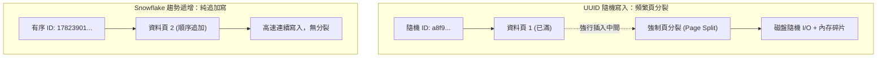
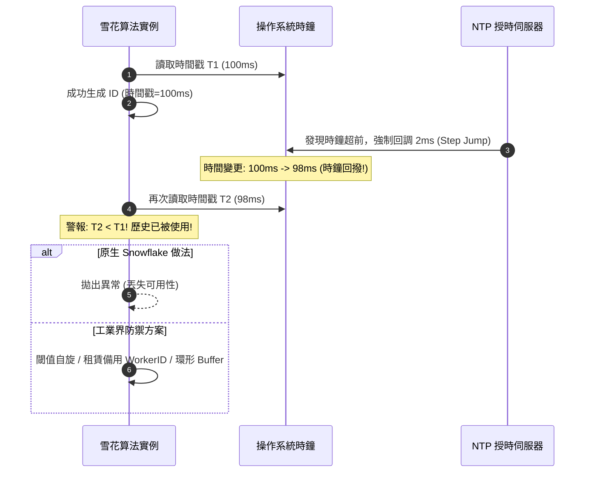

# 分散式雪花算法（Snowflake）與唯一 ID 幾何學：時鐘回撥（Clock Moving Backwards）、位運算佈局與高並發唯一性

> **迷因導讀**：單機數據庫搞個自增主鍵 `AUTO_INCREMENT` 輕鬆寫意，歲月靜好；一旦業務起飛、分庫分表搞了幾千台微服務伺服器，如果兩台機器在同一個微秒生成了同一個訂單號，用戶課金的錢直接充到了別人的帳戶上，維運和架構師當場要被提上去祭天！當年 Twitter 工程師拿著 64 位二進制整數淡定一笑：「別慌，看我用時間戳、機器節點 ID 和序列號在 64 位空間裡切出一個永不重複的數位雪花！」各家大廠紛紛跟進直呼真香。結果某天運維伺服器的 NTP 網絡校時突然回撥了兩毫秒，整個集群的雪花算法當場集體破防爆死，日誌噴出幾十萬條異常...今天我們就來聊聊這個在微觀二進制位元裡雕刻幾何宇宙、卻被時間倒流追著砍的傳奇算法。

---

## 一、 數字世界的身份證：為什麼分庫分表需要 64 位 Snowflake？

在互聯網架構的遠古時代，後端工程師最幸福的時刻，莫過於在 MySQL 的建表語句裡寫下一行 `id BIGINT NOT NULL AUTO_INCREMENT PRIMARY KEY`。這個主鍵乾淨純粹，嚴格單調遞增，天然貼合 InnoDB 存儲引擎的底層生理結構。然而，當你的電商平台迎來了雙十一，或者社交平台每天湧入數億條動態，單台 MySQL 的磁盤 I/O 與 CPU 瞬間被捶爆。架構師眉頭一皺，大筆一揮：**分庫分表（Sharding）**！

一旦單體數據庫被拆成了 16 個庫、1024 張分表，原本歲月靜好的全局自增主鍵直接癱瘓。因為庫 A 正在生成 ID=1001，庫 B 也在生成 ID=1001，兩筆完全不同的訂單撞車，下游的大數據分析與金流對帳系統當場陷入虛無主義。

這時候，新手工程師通常會掏出兩大「自以為聰明」的傳家寶方案，然後迅速在生產環境翻車：

### 1. 暴力美學 UUID：B+ 樹的「碎紙機」慘案
「既然要全局唯一，那我直接用 `UUID.randomUUID()` 不香嗎？128 位長度，地球爆炸都不會碰撞！」
少年，你對 MySQL InnoDB 存儲引擎的殘酷一無所知。
UUID v4 是完全隨機的 36 字符字符串（含連字符）。當你把它拿來當作聚簇索引（Clustered Index）時，InnoDB 底層的 B+ 樹直接被逼入絕境。因為 B+ 樹要求索引葉子節點必須按照主鍵順序物理存儲：
- **頻繁的「頁分裂」（Page Split）**：連續插入隨機 UUID，意味著新數據會隨機插入到已有數據頁的中間，導致數據頁頻繁填滿、分裂、重組，磁盤寫入放大（Write Amplification）飆升 5 到 10 倍。
- **內存命中率雪崩與空間浪費**：一個 UUID 字符串佔用 36 字節（即使存二進制也要 16 字節），相比 8 字節的 `BIGINT` 體積翻倍。更致命的是，每個二級索引（Secondary Index）的葉子節點都要存儲一份主鍵。原本幾十 GB 的內存可以把熱點索引全部快取，換成 UUID 後直接被撐爆，查詢變成頻繁的磁盤隨機 I/O，數據庫 TPS 直接斷崖式下跌。



### 2. 數據庫自增主鍵步長方案：看似巧妙的水平擴展死穴
有人說：「那我保留自增，給每台 MySQL 設置不同的步長（Step）總行了吧？」
例如部署 3 台 MySQL：
- Node 1: 起始值 1，步長 3 (1, 4, 7, 10...)
- Node 2: 起始值 2，步長 3 (2, 5, 8, 11...)
- Node 3: 起始值 3，步長 3 (3, 6, 9, 12...)

這招在初期確實能用，但它的本質是把運維往火坑裡推。當業務規模從 3 台暴增到 10 台時，你必須停機重新調整所有節點的步長與當前遊標，擴容難度堪比在行駛中的高鐵上換輪胎。而且如果某一節點流量偏斜，生成的 ID 會嚴重不均勻，且無法擺脫對單點數據庫網絡 I/O 的強烈依賴。

就在這時，Twitter 於 2010 年開源了代號為 **Snowflake（雪花算法）** 的全局唯一 ID 生成機制。它徹底拋棄了中央協調節點，只憑一把精巧的「二進制刻刀」，在內存中以微秒級速度切出一個 64 位長度、趨勢遞增且永不重複的純數字整數。

---

## 二、 主流分散式唯一 ID 生成架構全景橫評

在深入 Snowflake 的內部齒輪前，我們必須站在架構全景視角，橫向對比工業界幾大主流唯一 ID 解決方案。沒有完美的架構，只有在「吞吐量」、「有序性」、「可用性」與「實現複雜度」之間的權衡博弈。

### 1. 工業界主流唯一 ID 技術全景對比表

| 方案維度 / 評估指標 | Twitter 原生 Snowflake | 美團 Leaf-Segment (號段模式) | 百度 UidGenerator (默認模式) | 索尼 Sonyflake | 暴力 UUID (v4) |
| :--- | :--- | :--- | :--- | :--- | :--- |
| **數據長度 / 類型** | 64 位（Long 整數） | 64 位（Long 整數） | 64 位（Long 整數） | 64 位（Long 整數） | 128 位（字符串 / 16B 二進制） |
| **生成單調性** | 時間趨勢遞增（同毫秒內嚴格單調） | 號段內嚴格單調遞增 | 趨勢遞增 / 環形緩存有序 | 時間趨勢遞增 | 完全隨機無序 |
| **單機理論峰值 QPS** | **4,096,000 / 秒** (409.6 萬) | 數萬 ~ 數十萬 / 秒 (受限 DB 步長) | 約 **6,000,000 / 秒** (RingBuffer) | 256,000 / 秒 (25.6 萬) | 數百萬 / 秒 (純內存偽隨機) |
| **時間單位維度** | 1 毫秒（1 ms） | 不依賴系統時間 | 1 秒（1 s） | 10 毫秒（10 ms） | 不依賴系統時間 |
| **機器節點規模** | 最大 1,024 節點 (10 bit) | 無特定節點上限限制 | 最大 65,536 節點 (16 bit) | 最大 65,536 節點 (16 bit) | 無節點概念 |
| **中央存儲依賴度** | **完全零依賴** (本地內存位運算) | 強依賴 MySQL (雙 Buffer 異步加載) | 依賴 DB 登記 WorkerNode | 依賴協調服務分配機器 ID | **完全零依賴** (本地偽隨機) |
| **時鐘回撥容忍性** | **極低**（原生直接拋異常熔斷） | **完全免疫**（基於 DB 步長推進） | **高**（依賴未來時間預分配補償） | **中**（自旋等待回撥時間流逝） | **完全免疫** |
| **數據庫索引友好度** | **極高**（緊湊、追加寫、防頁分裂）| **極高**（連續遞增、磁盤局部性最佳）| **極高**（高密度連續） | **極高**（緊湊遞增） | **災難級**（B+ 樹嚴重離散分裂）|
| **典型應用場景** | Twitter, 微博, 絕大多數分散式訂單 | 美團外賣訂單, 大眾點評, 金融交易 | 百度內部大並發業務, 容器化集群 | 容器化部署、節點數較多中型微服務 | 本地臨時無主鍵日誌 traceId |

### 2. 核心架構流派深度剖析

#### 流派 A：數據庫號段模式（以美團 Leaf-Segment 為代表）
Leaf-Segment 不在每次請求時都去敲數據庫，而是一次性向 MySQL 批發一段 ID（例如 `[100000, 200000)`），載入到本地內存中，通過原子指針 `AtomicLong` 本地遞增派發。
為了避免每次號段耗盡時請求線程阻塞等待數據庫網絡 I/O，美團引入了極具巧思的 **「雙 Buffer（雙緩衝區）異步預加載機制」**：
當第一個 Buffer 的號段消耗超過 10%（或者配置的閥值）時，系統啟動後台守護線程，提前向數據庫請求下一個號段並加載到第二個 Buffer 中。當 Buffer 1 消耗至 100% 時，請求指針瞬間無鎖切換（CAS）到 Buffer 2，實現了毫秒級零阻塞的平滑過渡。該方案完全不依賴機器時鐘，天然免疫時鐘回撥，但代價是需要維護 MySQL 高可用集群。

#### 流派 B：純位運算時間戳派（以 Snowflake 及變種為代表）
追求極限性能的架構師最討厭中央組件的網絡 RTT。Snowflake 直接把時間、空間與計數器壓縮進 64 位二進制整數中。各節點各自為政，零網絡開銷，是分散式世界裡極致簡約的數學暴力美學。

---

## 三、 深入 Snowflake 的二進制幾何骨架

很多人只知道 Snowflake 是個 64 位的 Long 整數，但從未拿起放大鏡仔細審視過這 64 個 Bit 的空間幾何排列：

```
+---+------------------------------------------+-----------------------+----------------------+
| 1 | 41 Bits: Timestamp (毫秒級時間戳，約69年)   | 10 Bits: Machine ID   | 12 Bits: Sequence ID |
+---+------------------------------------------+-----------------------+----------------------+
| 0 | 00000000 00000000 00000000 00000000 00000000 | 00000 00000           | 00000000 0000        |
```

### 1. 每一位的神聖職責
- **第 1 位（符號位，Sign Bit）**：固定為 `0`。在 Java、C++ 等多數編程語言中，最高位為符號位，`0` 代表正數，`1` 代表負數。為了保證生成的主鍵全是乾淨的正整數，最高位鎖死為 `0`。
- **第 2~42 位（時間戳，41 Bits）**：記錄的是 **當前時間戳減去自定義起點時間戳（Epoch）的差值**，單位為毫秒。
  - 41 位二進制最大可表示數為：$2^{41} - 1 = 2199023255551 \text{ ms}$。
  - 換算成年限：$\frac{2199023255551}{1000 \times 3600 \times 24 \times 365} \approx 69.73 \text{ 年}$。
  - 這意味著如果你的系統從上線這一天（比如 2026 年）開始計時，這個算法能穩如泰山地運轉到 2095 年，足夠熬退休三代程序員。
- **第 43~52 位（工作節點 ID，10 Bits）**：通常劃分為 5 位 DataCenter ID（數據中心）與 5 位 Worker ID（機器節點）。
  - 最大可容納：$2^{10} = 1024$ 個獨立物理機或 Pod 節點。
- **第 53~64 位（序列號計數器，12 Bits）**：記錄同一個節點在同一毫秒內生成的自增序號。
  - 12 位二進制最大值：$2^{12} - 1 = 4095$。
  - 意味著單一節點在 **1 毫秒之內** 可以生成 4096 個絕對唯一的 ID。單機理論峰值吞吐量即為 $4096 \times 1000 = 4,096,000 \text{ QPS}$！

### 2. 極速位運算公式推演
雪花算法之所以能達到每秒幾百萬的恐怖生成速度，是因為它在 CPU 寄存器內部純靠 **左移（`<<`）** 與 **按位或（`|`）** 完成組裝，沒有任何字符串拼接或對象分配開銷：

$$\text{ID} = ((\text{timestamp} - \text{epoch}) \ll 22) \ | \ (\text{datacenterId} \ll 17) \ | \ (\text{workerId} \ll 12) \ | \ \text{sequence}$$

當同一毫秒內並發量超過 4096 時，序列號溢出（`sequence = 0`），算法會進入一個輕量級自旋（Spin Lock），等待下一個毫秒的到來。

---

## 四、 致命的阿基里斯之踵：時鐘回撥（Clock Moving Backwards）防禦體系

如果物理世界的時間永遠像愛因斯坦的理想時鐘一樣勻速向前，Snowflake 就是無懈可擊的神。然而，工程世界的現實是：**伺服器上的時鐘是不可靠的玄學**。

### 1. 災難現場：為什麼時鐘會倒流？
在分散式集群中，為了保證各節點日誌對齊，通常會運行 **NTP（Network Time Protocol）** 網絡校時守護進程。
然而，廉價伺服器的石英晶振存在溫度漂移，時鐘走快或走慢是常態。當 NTP 服務端發現某台機器的本地時鐘比標準原子鐘「快了幾十毫秒」時，如果配置不當（例如觸發了硬性時間步進跳變 `step` 而非平滑微調 `slew`），NTP 會瞬間將本地操作系統的時間 **向前拉回** 幾毫秒甚至幾秒！

**這時候雪花算法會發生什麼？**
1. 09:00:00.100 時，節點生成了一批訂單 ID，時間戳為 100。
2. NTP 暴擊，時鐘被強制回調到 09:00:00.098。
3. 此時新的用戶下單，節點讀取當前時間戳，發現居然是 98！
4. 算法懵了：在 98 毫秒時，如果序列號重新從 0 開始計數，它生成的 ID 可能跟兩毫秒前生成的一模一樣！
5. **主鍵衝突，唯一性破防，訂單覆蓋，數據庫拋出主鍵重複異常，線上交易鏈路大面積崩潰！**



---

## 五、 當代打工人/實戰者的三大避坑指南

如果你不想在深夜三點被 P0 級故障警報叫醒回滾數據庫，請將以下三條工程血淚經驗焊死在代碼架構中：

### 避坑指南一：嚴格控制 NTP 授時模式，禁用硬性 Step 跳變
最底層的防禦是在操作系統基礎設施層面消滅大尺度時鐘回撥：
- **拒絕 `ntpdate` 粗暴定時腳本**：千萬不要在 crontab 裡每隔幾分鐘跑一次 `ntpdate server`，這種暴力強制校時是引發微服務 Snowflake 集群集體跳崖的第一大殺手。
- **全面擁抱平滑校時（Slewing）**：將 NTP 守護進程配置為 平滑漸進模式（`slewing mode`，使用 `chrony` 或 `ntpd -x`）。在平滑模式下，即使系統時間快了，它不會倒撥指針，而是讓 CPU 時鐘慢速行進（故意走慢 0.5 秒/秒），直到與標準時間慢慢同步。從而保證系統時間在任何微觀瞬間都是**嚴格單調不減**的。

### 避坑指南二：多級時鐘回撥防禦算法設計
在代碼層面，不能只盲目依賴運維環境，必須具備多道防波堤：
1. **微幅回撥（$\Delta t \le 5\text{ms}$）：內存自旋等待（Spin Wait）**
   如果發現 `currentMillis < lastTimestamp`，且差值小於等於閥值（如 5 毫秒），不要拋異常，讓線程調用 `Thread.sleep(difference)` 或循環自旋，等待物理時間追上歷史時間戳。
2. **較大回撥（$5\text{ms} < \Delta t \le 1000\text{ms}$）：切換備用 Worker ID（Worker Slot Shift）**
   美團 Leaf 給出了一個教科書級的思路：通常 10 位 Worker ID 中，我們可以把最高位或高幾位作為「備用槽（Backup Slot）」。當檢測到時鐘回撥且無法自旋時，自動切換到備用 Worker ID 繼續生成。由於 Worker ID 變了，即便時間戳重複，二進制位組合依然全局唯一！
3. **超大回撥（$\Delta t > 1\text{s}$）：主動摘除節點，觸發熔斷告警**
   這種情況通常意味著物理機硬件故障或重大配置失誤，立即上報監控、停止該節點的 ID 生成服務並報警，讓流量切換至其他健康節點。

### 避坑指南三：容器化（K8s/Docker）動態節點註冊的死穴
傳統 Snowflake 假設機器是固定靜態的物理機，每個機器手動配置一個 `workerId`（0~1023）。但在現代雲原生環境中，K8s 的 Pod 隨時在漂移、自動擴縮容：
- **嚴禁使用 IP 末位直接當 Worker ID**：很多程序員圖省事，拿容器內網 IP 的最後一段（如 172.20.5.88 取 88）做 Worker ID。但容器 IP 的段位極易衝突，且超出 1024 上限（10 bit）。
- **必須引入註冊中心持久化租約（ZooKeeper / Etcd / Redis）**：
  Pod 啟動時向 ZooKeeper 註冊一個臨時順序節點，獲取全局遞增的序號（取模 1024 作為 Worker ID）。同時，在本地磁盤或遠程節點定時上報心跳並記錄當前最大的本地時間戳。如果新重啟的 Pod 發現自己分配到的 Worker ID 在中央存儲中的上次心跳時間戳比當前物理機時間還要大，說明這台機器時鐘大踏步回撥，拒絕提供服務，防患於未然。

---

## 六、 結語：在毫秒與位運算的微觀齒輪中，工程師以極簡的 64 位代碼，雕刻出浩瀚系統的秩序之美

人類對宇宙的探索，常常著眼於光年與宏觀天體；而工程師對數字秩序的構築，卻往往沉澱於微秒與二進制位元之間。

Snowflake 算法的美，在於它在有限的 64 位空間裡，用最純粹的二進制幾何學劃分出時間、空間與當下。它不需要沉重的 Paxos 或 Raft 共識協議，不需要跨越千山萬水的網絡握手，僅憑 CPU 內部的一組位移指令，便讓成千上萬台獨立無依的伺服器，在紛繁混亂的高並發洪流中，奏出精準有序的交響樂。

當我們面對時鐘回撥的無情挑戰，工程師又通過自旋、備用槽位與平滑降速，構建出一道道優雅的緩衝防禦。這正是軟體架構中最動人的浪漫：**世界或許混亂、時鐘或許倒流，但代碼終將在混沌的虛無中，刻下堅不可摧的秩序之美。**

---
#科技 #硬核科普 #當代打工人 #避坑指南 #AI革命
