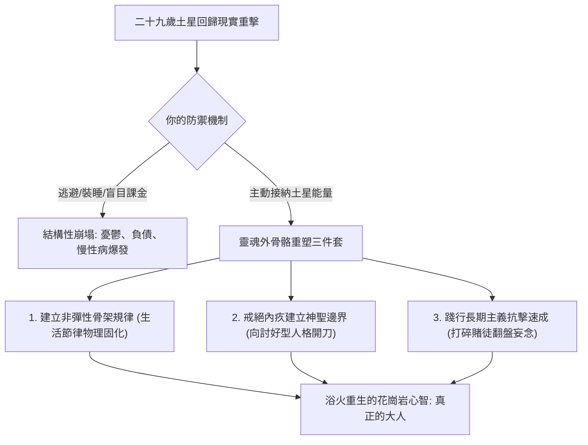

# 土星回歸（Saturn Return）的大人的成人禮：二十九歲的現實重擊、骨骼硬化與邊界建立

> **迷因導讀**：二十八歲前你覺得自己永遠十八歲，熬夜蹦迪、通宵加班都不在話下，手握兩張信用卡就敢號稱「未來可期」；一過二十九歲生日，人生彷彿高速撞上一堵實心的水泥承重牆：失戀、被裁員、背負沉重房貸、腰椎間盤突出集體敲門，連喝杯冰美式都開始心悸加胃痙攣！你癱在人體工學椅上懷疑自己是不是中了邪，占星師卻端著一杯滾燙的熱枸杞茶走過來，扶了扶金絲眼鏡冷冷地說：「別慌，天體督察長老爺子土星轉了整整二十九年半，帶著教鞭回來抽查你的人生作業了！過去三十年借的業力高利貸，今天本金加利息一次結清！」

---

## 一、 業力之王的考卷：土星 29.5 年公轉週期與骨骼心理學

在現代流行占星與心靈雞湯的溫床裡，人們習慣追逐木星帶來的暴富奇蹟、金星點綴的浪漫邂逅，或者海王星編織的粉紅濾鏡。然而，宇宙的物理法則從來不是建立在「正能量」的虛浮泡泡之上，而是由那位冷酷、嚴苛、手握鐮刀與沙漏的時間之神——**克洛諾斯（Cronus / Saturn，土星）**親自丈量。

### 1. 29.5 年的天體物理節奏：為什麼偏偏是二十九歲？
土星繞行太陽公轉一週的軌道週期約為 **29.46 個地球年**（約 10,759 個地球日）。這意味著，當你呱呱墜地的那一瞬間，天空中土星所座落的黃道精確度數，必須歷經將近三個十年的風霜雨雪，才會在人類二十八歲半到三十歲之際，重新精準合相於本命盤的原始位置。在占星學中，這個現象被稱為**「第一次土星回歸（The First Saturn Return）」**。

如果說二十歲以前的青春期叛逆是由天王星的對衝或木星的過動所驅動的賀爾蒙煙火，那麼二十九歲的土星回歸，則是靈魂層面不可逆轉的「物理相變」。

在二十八歲之前，世界對你依然抱有寬容。你可以任性地換工作、談沒有明天的戀愛、在出租屋堆滿未拆封的快遞盒、用「我還年輕、我還在尋找自我」來粉飾所有的拖延與脆弱。你以為生活是一場無止境的開放世界 RPG，隨時可以存檔重來。

然而，當土星這尊宇宙教導主任重返本位時，它會毫無預兆地直接抽走你腳底下的充氣軟墊。它冷眼看著你，把一張寫滿現實帳單的考卷拍在你臉上：
* 「你口口聲聲說的夢想，現在能變現成每個月的房租和五險一金嗎？」
* 「你那個分分合合耗了五年的靈魂伴侶，到底能不能一起把日子過進柴米油鹽？」
* 「你每天熬夜刷短影音、吃外送油炸物，這具肉身還能扛得住幾次體檢紅字？」

這不是水逆那種「手機摔裂螢幕、郵件寄錯主管」的皮肉痛，而是深及地基的**結構性震盪**。

### 2. 骨骼心理學：牙齒、脊椎與「現實原則」的物理具象
在傳統醫療占星學（Medical Astrology）與古典對應體系中，土星主宰著人體最堅硬、鈣化程度最高、生長最緩慢且不可逆的組織結構：**骨骼（Skeletal System）、牙齒（Teeth）、關節、指甲與皮膚屏障**。

這絕非玄學巧合，而是深刻的心理生理學同構：
1. **牙齒的磨耗與咀嚼現實**：嬰兒剛出生時是無牙的，依靠流質母乳維生，象徵著海王星與月亮的無邊界母嬰共生與本能吞嚥；隨後乳齒萌生，到了二十八至三十歲前後，人類最後的恆齒——**智齒（Wisdom Teeth）**往往在此時劇烈發炎、阻生、迫使你不得不走進牙醫診所動刀拔除。這象徵著心智徹底告別軟質童年，學會「咬碎」現實中粗糙堅硬的苦難纖維。
2. **脊椎與骨質鈣化**：人體的骨骼密度通常在二十五歲到三十歲之間達到峰值，隨後成骨細胞的活躍度開始落後於破骨細胞。許多打工人第一次感受到「彎腰撿筆突然閃到腰」、「久坐辦公室導致 L4-L5 椎間盤突出」，正是集中在土星回歸期。脊椎是人體直立行走的支柱，象徵一個人在社會結構中能否**「自立支撐（Self-Supporting）」**。如果你在心智上依然依賴父母、伴侶或虛幻的僥倖心理，你的身體骨骼就會以急性發炎和僵硬疼痛，替你承擔這份未能具象化的「重擔」。
3. **弗洛伊德「現實原則」對抗「快樂原則」**：精神分析創始人弗洛伊德曾提出，嬰兒期受制於「快樂原則（Pleasure Principle）」，追求即時滿足與逃避痛苦；而心智成熟的標誌，是建立起強大的「現實原則（Reality Principle）」，懂得延遲滿足、接納客觀限制、在規則約束下實現有效創造。土星，就是現實原則的宇宙總督。它冷酷地沒收你的奶嘴，逼迫你在現實的重力場中長出自己的外骨骼。

---

## 二、 土星回歸三大人生維度大考全景橫評

人的一生如果能活到九十歲，大約會經歷三次土星回歸。每一次回歸，都是靈魂骨架進行「除鏽、校準與承重測試」的審判日。為了讓當代實戰者看清這場跨越近一個世紀的週期性考驗，以下整理出客觀心理占星維度的橫向對比大數據：

| 評估維度 / 生命階段 | 第一次土星回歸（28.5 - 30 歲） **「成年人實體邊界的鑄造」** | 第二次土星回歸（57 - 59.5 歲） **「衰老接納與精神權威的移交」** | 第三次土星回歸（86 - 88 歲） **「生死超越與肉身維度的解脫」** |
| :--- | :--- | :--- | :--- |
| **核心心理衝突** | **幻滅 vs. 立界** 「我究竟是誰？我該如何獨立立足於世？」 | **整合 vs. 僵化** 「我這一生的世俗成就，能否經得起時間的洗刷？」 | **圓滿 vs. 執念** 「當肉體容器即將歸還，我留下了什麼精神遺產？」 |
| **職場與社會身分幻滅度** | **95%（極高峰值）** 徹底擊碎「三十歲名利雙收」的中產幻想，直面打工螺絲釘本質與行業殘酷天花板。 | **70%（結構轉型）** 面臨強制退休、權力下放、空降年輕主管的降維打擊，經歷世俗影響力邊際效應遞減。 | **10%（徹底超脫）** 社會身分完全剝離，回到最純粹的「生命存在者」原始身分。 |
| **人際關係斷捨離比例** | **60% - 80%** 無效社交圈毀滅性坍塌。告別酒肉朋友、清算消耗型伴侶、與原生家庭劃定心理邊界。 | **40% - 50%** 面對同齡人離世、子女成家獨立造成的空巢期，重組深層生命知己網絡。 | **80%（自然凋零）** 同儕相繼謝幕，學會在深刻的孤獨中與自我靈魂達成終極和解。 |
| **身體骨骼健康警報** | **功能性勞損初顯** 腰肌勞損、頸椎生理曲度變直、智齒冠周炎、顳顎關節紊亂、初老代謝斷崖。 | **器質性退行硬化** 退化性關節炎、骨質疏鬆、血管鈣化、慢性骨刺、牙齒鬆動脫落補植。 | **骨質脆性與平衡臨界** 股骨頸骨折高危期、關節重度僵化、活動能力受限、全身鈣平衡微弱維繫。 |
| **心靈成熟度蛻變指標** | **斷奶成己** 停止怪罪原生家庭與社會不公，全面為自己的每筆財務、情感與健康負百分之百責任。 | **樹立內在宗師權威** 不再需要外界的職銜與掌聲證明價值，轉化為後輩的智慧容器與資源擺渡人。 | **向死而生之大平靜** 視肉身為借用近一個世紀的皮囊，笑對時間與死神的收割，展現超然睿智。 |
| **最典型的生活翻車劇本** | 剛買房就被裁員、籌備婚禮前夕抓到對方出軌、連續加班三年體檢查出甲狀腺結節。 | 剛辦完風光退休宴，回家面對整天吵架的老伴、不懂感恩的啃老子女與關節痛。 | 躺在病床上看著存摺上的數字，發現帶不走一分一毫，唯有未解的家族執念在心頭翻滾。 |

從上表中可以清晰看出：**第一次土星回歸是痛苦烈度最高、震盪最劇烈的一次**。因為第二與第三次面對的是「修剪與放下」，而二十九歲面對的是「從無到有的地基澆灌」。你必須在水泥凝固之前，親手把自己的軟弱、天真與矯情從骨架裡剔除出去。

---

## 三、 當代打工人平穩度過土星回歸三件套

既然土星的重擊避無可避，當代在工位、房租與焦慮中浮沉的打工人，究竟該如何拆解這顆三十歲的業力定時炸彈？請收下這套「有血有淚的土星回歸求生操作手冊」：

### 1. 第一套：主動為生活建立「不可妥協的骨架規律」
土星最厭惡混沌、散漫與無節制的能量浪費。如果你不主動給自己的生活搭建鋼筋混泥土的框架，土星就會用一場大病或突發失業，強行逼你躺平在醫院或家中建立「被動規律」。

* **操作準則**：別再搞什麼「心情好就早起做瑜珈，心情差就暴飲暴食熬夜到凌晨四點」的文青情緒化循環。在二十八到三十歲之間，你必須確立**「生活底線清單」**：
  * **財務骨架**：嚴格執行強制儲蓄，砍掉所有溢價的「虛榮性消費」與「情緒性課金」。手頭必須隨時保留能夠支撐你空窗 6 到 12 個月的剛性生存現金流。這筆錢不是用來發財的，是用來在被老闆侮辱時，能有底氣冷靜遞交辭呈的「尊嚴隔離金」。
  * **生理骨架**：不管專案再趕、老闆催得再急，每週必須固定三次阻力訓練（負重深蹲、硬舉、核心強化）。阻力訓練在物理層面就是給骨骼施加縱向壓力以刺激成骨細胞增加骨密度，在心理層面則是**身體對土星重力場的主動臣服與共振**。

### 2. 第二套：向內疚感說「不」，對討好型人格動大手術
二十多歲的打工人最容易得的致命傳染病叫「好人病（People Pleaser Syndrome）」。害怕讓同事失望、害怕拒絕主管不合理的假日加班需求、害怕打破原生家庭「吸血鬼式」的情感勒索。

土星回歸的本質，就是一場**「心理邊界（Psychological Boundaries）的強制割禮」**：
* **割捨無效共情**：分清楚「別人的課題」與「自己的責任」。主管因專案進度焦慮向你發飆，那是他的情緒管理無能，不是你的罪過；父母因為你三十歲沒結婚而覺得在親戚面前抬不起頭，那是他們的虛榮心匱乏，不是你的人生缺陷。
* **戒斷「內疚感」**：每一次當你想要拒絕無理要求時，胸口湧上的那股窒息般的內疚，正是土星在檢測你邊界硬度的警報器。**把「讓別人失望」當作你的成人必修課**。如果一個關係需要靠你不斷割地賠款才能維繫，土星回歸期它一定會爛透發臭。果斷轉身，把精力收縮回自己的核心防禦圈。

### 3. 第三套：用「慢火煨燉」的極致耐心，打碎對「暴富速成」的貪婪妄想
當代互聯網充斥著「二十二歲靠短影音月入百萬」、「二十五歲實現財富自由環遊世界」的癲狂敘事。這些敘事把二十八九歲的年輕人逼成了熱鍋上的螞蟻，總想著加十倍槓桿去買虛擬貨幣、盲目合夥創業開店，試圖一戰翻盤。

記住：**土星是時間的主人，它只獎勵耐力，最喜歡活埋賭徒。**
* 任何標榜「三個月速成精通」、「一年資產翻倍」的商業模式，在土星眼裡都是徹頭徹尾的紙牌屋。在土星回歸期間，請戒除所有想走捷徑的投機心態。
* 盤點你手頭最堅硬的底牌：你的不可替代專業技能是什麼？哪怕這個技能現在看起來很枯燥、回報週期很慢，比如扎實的程式碼架構能力、嚴謹的法律合規專業、深度的產業供應鏈理解。**耐住性子，深挖護城河**。土星給予的獎賞往往延遲得令人抓狂，但只要它給了，那就是任憑經濟週期狂風暴雨也沖不走的「不動產」。

---

## 四、 結語：土星帶來的不是懲罰，而是把軟弱的泥土在高壓熔爐中鍛造成花崗岩

當你坐在二十九歲的風暴中心，看著周遭的人際關係分崩離析、戶頭餘額捉襟見肘、身體各個關節隱隱作痛時，請深吸一口氣，望向窗外幽暗深邃的夜空。

土星從來不是前來索命的惡魔，也不是專門與你作對的煞星。它是一尊宇宙中最公正、最慈悲、同時也最冷峻的**神聖雕塑家**。

在三十歲以前，你的生命是一塊由父母期望、社會規訓、浪漫幻想與自我安慰隨意捏合的濕軟泥土。這樣的泥土看似塑形自由、充滿各種無限可能，但只要現實的第一場暴雨傾盆而下，它就會在瞬間化為一灘爛泥。

因此，土星在二十九歲那年降臨。它用現實的重鎚砸碎你虛胖的自尊，用時間的刻刀削去你浮誇的枝葉，把你塞進充滿壓力的地下熔爐。它讓你在孤獨中熬過漫長的地質年代，逼你排乾骨子裡所有的矯情與依賴。

這很痛，痛到你可能無數次在深夜的被窩裡咬著牙痛哭流涕。

但請熬過去。因為當土星在三十歲初緩緩移出你的本命宮位時，你會驚訝地發現：那些曾經能輕易刺穿你的流言蜚語，再也傷不到你分毫；那些曾經讓你夜不能寐的情感糾葛，如今看來不過是一笑置之的微風。

**你不再是那塊任人揉捏的濕泥，你已經把自己親手淬煉成了一座頂天立地、堅不可摧的花崗岩。**

歡迎來到真實的世界，大人。

---

#命理 #玄學 #心態管理 #當代打工人 #避坑指南 #健康
