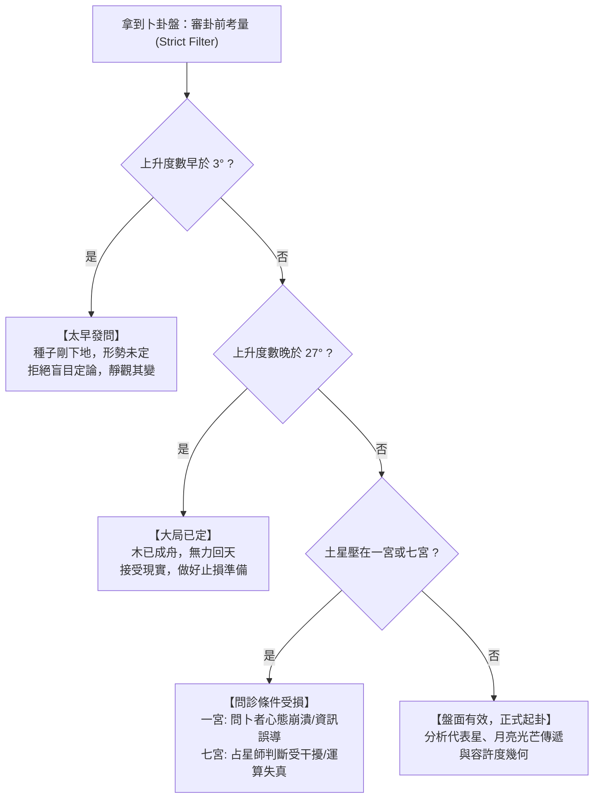

# 卜卦占星學（Horary Astrology）的即時決策幾何：一念發心排盤、月亮光芒傳遞與失落問答

> **迷因導讀**：丟了錢包急得團團轉？糾結「這個面試該不該去」？猶豫「他到底喜不喜歡我」？當代年輕人求神問卜，往往帶著戶口名簿般的生辰八字去敲占星師的門，結果古典占星師連你的生辰八字都不要，只要你打來電話的一瞬間看一眼手錶時鐘，立刻排出一張盤：「錢包掉在客廳沙發底下了，面試這家公司是個坑千萬別去，那個人身邊早就有人了！」問卜者當場破防，驚呼「這是讀心術還是神仙算命？！」老練的占星師喝了口茶，淡淡一笑：「格局小了。這叫卜卦占星（Horary Astrology）——在提問者起心動念的這一秒，宇宙的即時幾何投影早就寫好了答案！」不用查出生證明，不廢話心靈雞湯，它是一套專治選擇困難症與當代焦慮的硬核宇宙計算器。

---

## 一、 一念動乾坤：卜卦占星的宇宙同頻原理

在現代心理占星學橫行社群媒體的時代，大家習慣了聽占星師用溫柔的語調說：「你的月亮落在天蠍座，代表你內心深處渴望被理解但又害怕受傷……」這種話聽著很像頂級「心靈按摩」或精緻的「電子榨菜」，但如果你下一秒就要決定是否要簽下一份價值五百萬的合約，或者你的貓在半小時前從陽台跳出去失蹤了，你根本不想聽童年創傷，你只想知道：**「這份合約會不會爆雷？」、「我的貓現在人在哪裡、能不能找回來？」**

這時候，現代本命盤（Natal Chart）就顯得遠水救不了近火。而這正是「卜卦占星學（Horary Astrology）」統治中世紀與文藝復興歐洲數百年的核心領域。

### 1. 榮格共時性與天人感應的物理切片
卜卦占星學的哲學基石並非「行星發射神秘射線控制人類腦波」，而是古典赫密斯哲學的「如其在上，如其在下（As above, so below）」，以及心理學巨擘榮格（Carl Jung）所提出的**共時性（Synchronicity，非因果性關聯原則）**。

當代打工人每天在腦海裡閃過幾萬個念頭：
- 「要不要喝這杯奶茶？」
- 「主管剛剛那句話是在陰我嗎？」
- 「這週股票會不會解套？」

绝大多數念頭只是大腦神經元的背景雜訊，隨生隨滅。但是，當某個情境把你的心理張力推向極致——比如房東突然要收回房子、相處三年的伴侶突然失聯三天、即將簽字賣房換現金——在那個焦慮、執念、渴望凝結成一個「極度清晰、無法迴避的靈魂發問」的瞬間，主觀意識與客觀宇宙完成了奇蹟般的**量子同頻**。

在古典卜卦學家（如 17 世紀英國占星教父威廉·里利 William Lilly）眼中，宇宙不是一個死寂的鐘錶發條，而是一個巨型的全息投影（Hologram）。**當問題在提問者心中「受孕（Conception）」並在占星師面前「誕生（Birth）」的一剎那，那個時間點的星空幾何分佈，就是這個事件因果鏈條的超高解析度斷層掃描圖。**

### 2. 占星師的時鐘：排盤時間點的歷史大官司
在卜卦占星的操作中，最讓外行人困惑的點在於：**排盤的時間究竟取哪一個？**
- 是問卜者（Querent）心裡萌生想法的時間？
- 是問卜者把文字訊息按「發送」的瞬間？
- 還是占星師親眼讀懂這個問題、並在心中完全理解的時刻？

在長達千年的古典爭論中，以威廉·里利為代表的正統派確立了黃金法則：**以占星師「完全理解問題（Understood the Question）」並著手排盤的「當下時間與占星師所在地點」為準。**

這背後的邏輯既殘酷又精準：如果一個問題沒有被有效傳遞並被另一個具備解構能力的意識體接收，這場宇宙共時性就尚未完成閉環。問卜者可能是半夜三點醉酒隨手發了個問號，只有當占星師清晨端著咖啡、神智清明地讀到並確認「這是一個具備實體指向的嚴肅問答」時，這顆受精卵才正式在時空中著床。

### 3. 什麼是「有效問題」？拒絕賽博調戲
卜卦占星不是無聊打工人的真心話大冒險，更不是「投幣式自動販賣機」。宇宙極度吝嗇於浪費算力在垃圾請求上。一個能排盤的有效問題必須滿足三大先決條件：
1. **問題具備清晰二元性或實體落點**：
   - ❌ 無效：「我這輩子會幸福嗎？」（這是本命盤與心靈哲學的範疇，太過空泛）
   - ✅ 有效：「如果我跳槽去 B 公司，未來的薪資與發展會比留在 A 公司更好嗎？」
2. **提問者具備真實利害關係（Skin in the Game）**：
   - ❌ 無效：「馬斯克明天會不會把推特賣掉？」（除非你是馬斯克的財務顧問或推特大股東，否則關你屁事）
   - ✅ 有效：「我借給表哥的三十萬，年底前能不能要得回來？」
3. **拒絕反覆測謊與重測攻擊**：
   如果你問完「他愛不愛我」，得到了否定的答案，心有不甘在半小時後換個措辭「他心裡到底有沒有我」又排一張盤，這在古典體系中被視為「對宇宙神性的褻瀆與侮辱」。後面的星盤會立刻呈現「完全無意義的混沌態」，甚至用各種凶兆直接把占星師轟出局。

---

## 二、 卜卦占星核心判斷法則全景橫評

卜卦占星之所以被譽為「占星界的立體幾何」，是因為它完全揚棄了現代占星那種「憑直覺自由心證」的玄學廢話。它擁有一套冷酷、嚴格、邏輯嚴絲合縫的演繹推理系統。

### 1. 角色分配：誰是誰？
排出一張卜卦盤，第一件事是做角色綁定：
- **問卜者代表星（Significator of Querent）**：通常由第一宮上升點（Ascendant）的守護星擔任。
- **所問事項代表星（Significator of Quesited）**：由問題所屬宮位的宮主星擔任。例如問升遷看第十宮（官祿），問失物看第二宮（動產），問官司看第七宮（對手），問合夥買房看第四宮（不動產）。
- **月亮（The Moon）**：全盤的「最高巡視員」與事件普遍推動者。月亮永遠是問卜者的共同代表星（Co-significator），代表事情的具體物理進程與提問者的心智情緒流向。

### 2. 行星的動態語言：入相位、出相位與光芒傳遞
古典卜卦的核心在於看**主要代表星之間是否能形成有效吉相，或者月亮能否在其中穿針引線**。這不是看兩顆星是否在星盤上挨在一起，而是看它們未來的**軌道行進速度與夾角幾何**。

為了讓大家徹底看懂這套宇宙運算機制，以下整理出最硬核的「卜卦核心相位與動力學規則對照表」：

| 占星術語 / 動力結構 | 拉丁/古典名詞 | 核心幾何原理與運行機制 | 實戰象徵意義（人話翻譯） | 事件成卦機率與判定精準度 | 現實生活典型翻車 / 成功場景 |
| :--- | :--- | :--- | :--- | :--- | :--- |
| **入相位** | Applying Aspect | 運行速度較快的行星（輕星）正朝向速度較慢的行星（重星）發起特定角度（0°, 60°, 120° 或 90°, 180°），夾角正在逐漸縮小。 | **「事情即將發生」**。命運的齒輪正在咬合，未來有明確的交集點。 | **95% 成卦率**（若無凶星阻攔，事情必見分曉） | 問「能否拿到 Offer」：第一宮主星正入相位吉照第十宮主星，面試官下週二就會發錄取通知。 |
| **出相位** | Separating Aspect | 輕星已經越過了與重星的精準交角點，兩者的幾何距離正在拉大，光芒正在分離。 | **「事情已經過去/木已成舟」**。問卜者來晚了，這扇門已經關閉，只剩回憶與遺憾。 | **< 5% 成卦率**（只具備歷史復盤價值，無未來推進力） | 問「我和前任還能復合嗎」：兩人代表星剛剛分離出相位 3 度，代表對方早已徹底下頭，各自安好。 |
| **光芒傳遞** | Translation of Light | 代表星 A 與 B 之間沒有形成直接相位，但有一顆速度更快的第三星（通常是月亮），先與 A 形成出相位，隨後緊接著與 B 形成入相位。 | **「中間人/貴人牽線」**。雙方原本王不見王，全靠獵頭、媒人、房仲或律師從中斡旋撮合成功。 | **85% - 90% 成卦率**（強烈依賴第三方的靠譜程度與吉凶尊貴） | 問「卡了半年的專案能否過審」：月亮剛剛離開老闆星，正走向主管機關代表星，全靠老長官私下打招呼搞定。 |
| **光芒收集** | Collection of Light | 代表星 A 與 B 互不相見，但兩者同時分別向一顆速度極慢、位置極高的大重星（如木星或土星）發起入相位交角。 | **「共同權威一錘定音」**。兩造互不退讓，最終由法官、董事長、主管機關或家族長輩統一裁決收網。 | **80% - 85% 成卦率**（取決於該大重星的廟旺陷弱與接納程度） | 問「遺產爭奪戰誰能拿錢」：原告與被告代表星同時投向第十宮的強勢木星，法院下月宣判按比例分配。 |
| **禁止與截斷** | Prohibition / Frustration | 輕星 A 本來正歡天喜地走向重星 B（即將成事），結果半路殺出一個程咬金 C，搶先在 A 碰到 B 之前與 A 或 B 產生相位。 | **「被人截胡/半路殺出程咬金」**。本來十拿九穩的事，突然空降關係戶，或者政策突變導致項目直接流產。 | **成卦反轉率 > 90%**（極度精準預警現實中的被背叛或不可抗力） | 問「房產交易能否順利交割」：買賣雙方代表星即將成相，但火星突然插進來搶先刑克，房東反悔轉賣給出價更高的神秘買家。 |
| **空亡月亮** | Void of Course (VOC) | 月亮在離開當前星座之前，不再與任何傳統七大行星形成任何主要的托勒密相位（合、六合、刑、拱、沖）。 | **「無事發生/白忙一場/虛驚一場」**。宇宙伺服器離線，任憑你急得跳腳，最終結局就是「維持現狀」。 | **實體結果發生率 < 10%**（但對於「避災」而言是 100% 絕世大吉） | 問「主管今天找我談話會不會開除我」：月亮空亡，進去辦公室結果只是主管隨口問你下午茶要訂哪家飲料。 |

### 3. 空亡月亮（Void of Course）：現代打工人的免死金牌
在卜卦盤中，「月亮空亡」是一個極度迷人的狀態。在中世紀，如果國王問占星師：「鄰國要打過來了，我該不該先發制人？」占星師一看月亮空亡，會直接回宮睡覺，告訴國王：「放心，洗洗睡吧，對方的軍隊在半路上就會因為缺糧或內部嘩變自己撤兵。」

在當代職場，如果你聽說公司即將大裁員，或者某個討人厭的稽核小組要來查你們部門的帳，你嚇得排了一張卜卦盤，發現月亮大空亡——**恭喜你，這不是凶兆，這是天大的好消息！** 
因為「空亡」的核心定義就是：**「沒有任何實質性的重大變化會落地。」** 
政策會雷聲大雨點小，稽核會走個過場就去吃火鍋，主管揚言要嚴懲的專案最後不了了之。
**但是，反過來，如果你正滿心期待要推動某個融資案、要向暗戀三年的人表白、或者想在今天提出加薪——看見月亮空亡，請立刻把嘴閉上！** 因為你在這段時間做的一切努力，在宇宙層面都叫「無效傳球」，除了感動自己，沒有任何實體世界的回音。

---

## 二、 當代打工人/實戰者的三大避坑指南

很多人接觸卜卦占星後，誤以為自己拿到了人生的「金手指」或「未來作弊碼」，天天排盤、事事排盤。然而，古典占星之所以能在千年中維持其神聖性，恰恰在於它擁有一套極度嚴酷的自我防禦與糾錯邊界——古典占星家稱之為**「審卦前的考量（Considerations before Judgement）」**。

如果不守規矩，這套幾何計算器不但會失靈，甚至會反噬問卜者的心理健康。以下是實戰中最核心的三大避坑指南：

### 1. 避坑指南一：撞上「極早/極晚度數」，請立刻收手，學會敬畏時間的發酵
當你排出一張盤，第一眼永遠不要看行星在哪裡，而是先看**第一宮上升點（Ascendant）的精確度數**：
- **上升點小於 3 度（Early Degrees）**：
  這叫「為時過早」。就像受精卵才剛著床，你非要拿超音波看他未來能不能考上台大醫學院一樣荒謬。此時當事人掌握的資訊極度有限，市場或局勢根本還沒開始洗牌。
  - *實戰場景*：你今天剛去面試了一家公司，自我感覺良好，出門立刻排盤問「我能不能拿到高薪 Offer」。此時上升點常常落在白羊座 1 度或金牛座 2 度。這張盤在警告你：**連面試官都還沒看完其他候選人的履歷，人事部門甚至連薪資預算都還沒審批完，你現在問這個問題，純屬神經質的過度焦慮。** 正確做法是：停止佔卜，等待事情自然展開至少三到五天。
- **上升點大於 27 度（Late Degrees）**：
  這叫「大局已定、回天乏術」。事情的因果鏈條已經走到了終點站，列車已經出軌或者已經靠站，任何外力介入都已經無濟於事。
  - *實戰場景*：公司已經發布了全員組織調整郵件，你的名字沒在名單上，你還不死心排盤問「我找老長官求情能不能保住這個位子」。此時上升點往往落在巨蟹座 28 度或天蠍座 29 度。星盤冷冷地告訴你：**棺材板已經釘死了，求神拜佛毫無意義，立刻去更新你的履歷、找律師算遣散費才是成年人該幹的事。**

### 2. 避坑指南二：土星壓境（一宮/七宮），當心「賽博資訊汙染」與占星師當機
在古典卜卦體系中，土星（Saturn）代表著阻礙、腐爛、盲目、冰冷與限制。它的位置直接揭示了問診環境是否遭到毒化：
- **土星落入第一宮（甚至合相上升點）**：
  第一宮代表問卜者自己。土星在這裡，意味著問卜者此時處於極度的抑鬱、恐慌、偏執或資訊嚴重失真狀態。問卜者提供的背景前提往往是錯的（例如隱瞞了關鍵財務漏洞，或者誤信了小道消息）。**此時做出的任何判斷，都會被問卜者自身的病態認知帶進溝裡。**
- **土星落入第七宮（甚至合相下降點）**：
  在傳統卜卦中，第七宮代表「占星師本人（因為占星師是問卜者的諮詢對象/合作方）」。土星坐在第七宮，古典書上赤裸裸地寫著：**「占星師將在此盤中名譽掃地、判斷失準、頭暈眼花。」**
  這不是恐嚇，而是極其玄妙的心理防禦機制——此時占星師往往因為自身疲勞、或者該問題牽扯到過多複雜的業力因果，星盤的訊息會呈現極度混亂的雜訊。優秀的占星師看到土星壓七宮，通常會主動退款並合上電腦：「抱歉，今天這盤我不看了，你另請高請或過陣子再來。」這不是不專業，而是極高職業操守的體現。

### 3. 避坑指南三：斬斷「病態重複問占」，卜卦不是你的情緒止痛藥
當代年輕人最容易犯的禁忌，就是把占星軟體當成「心理角子老虎機」。
- 早上排一盤：「他愛我嗎？」——盤象不好，心情跌落谷底；
- 中午換個問題：「他今天有沒有想我？」——盤象普通，繼續焦慮；
- 晚上換個城市定位再排一盤：「我們未來三個月會在一起嗎？」——終於刷出一個吉相，滿意地去睡覺。

這種行為在古典占星學中被稱為**「褻瀆（Corrupting the Chart）」**。當你開始重複提問的瞬間，星盤的共時性幾何就已經崩塌成了純粹的隨機數字。你不是在尋求宇宙的啟示，你只是在索取多巴胺的安慰劑。

**永遠記住：同一個事件、同一條因果鏈，在沒有發生「根本性實體外部變數」之前，三個月內絕不可重複卜卦！** 如果第一次占星師告訴你這段感情無疾而終，那麼除非對方主動寄來了結婚請帖或法院傳票，否則你每天排十次盤，除了加速自己精神內耗與錢包失血，沒有任何意義。

---

## 四、 結語：星盤不是替你承擔命運的拐杖，而是在人生的十字路口為你照亮盲區的一盞提燈

當代打工人活在一個資訊爆炸卻極度缺乏確定性的時代。我們用大數據演算法算外賣送達時間，用 KPI 儀表板衡量工作產出，但在面對最深層的命運抉擇時——這段感情要不要放手？這家公司要不要跳槽？這個合約敢不敢簽？——我們依然像三千年前站在愛琴海邊的希臘人一樣迷茫無助。

卜卦占星學（Horary Astrology）歷經千年淘洗，保留至今的並非什麼「操縱命運的魔法」，而是一門無比優美的**「時間幾何學」**。它告訴我們：在這個看似混沌冰冷的宇宙裡，你的每一個極度專注、真誠、撕心裂肺的起心動念，都不是孤立無援的布朗運動。天體在頭頂運轉，光芒在星軌間傳遞，宇宙在以它的方式，將當下的客觀因果鏡像投影給願意冷靜凝視它的人。

但我們必須始終保持清醒：**星盤永遠不能替你過人生，更不是替你承擔選擇後果的拐杖。**

如果卜卦盤顯示那家公司的管理混亂、月亮走向陷落的土星，它的意義不是讓你癱坐在沙發上抱怨命運不公，而是讓你在面試時能敏銳地看穿主管畫的大餅，保護自己的勞動權益；如果星盤顯示那個失聯的人早已另結新歡、出相位已達數度，它的意義不是讓你沈溺於受害者情節，而是給你一個斬斷執念、大步走向未來的清醒巴掌。

**宇宙借你一雙眼，是為了讓你看清路面上的深坑，而不是為了讓你看完深坑後，直接閉上眼睛躺平跳進去。**

在人生的漫長夜路上，卜卦占星只是一盞懸在十字路口、照亮你腳下盲區的防風提燈。至於提燈之後，是決定冒雨狂奔、繞道而行，還是拔劍出鞘劈開荊棘——那份名為「勇氣」與「自由意志」的實體籌碼，自始至終，都牢牢握在你自己的手裡。

---

#命理 #玄學 #心態管理 #當代打工人 #避坑指南 #冷知識
