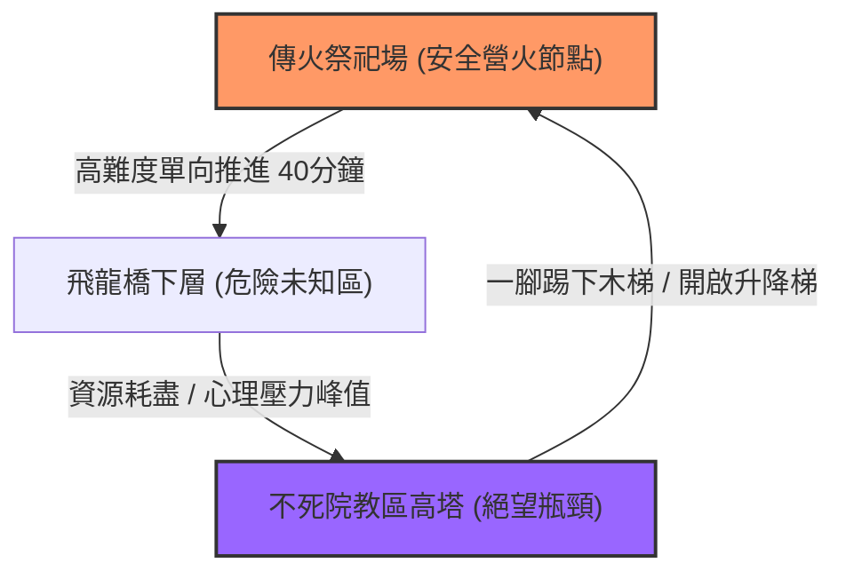
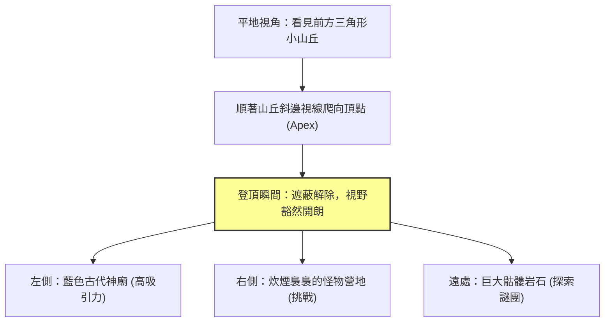

# 遊戲地圖關卡引導學：視覺路標（Landmark）、光影動線、Affordance 示能性與心理地圖

> **迷因導讀**：路癡玩家打開放世界或者線性箱庭遊戲，哪怕地圖右上角開了個金光閃閃的巨大導航箭頭、甚至地上鋪了一條像春節年貨大街般的雷射引導線，他依然能在兩個封閉走廊裡原地打轉半小時，最後對著一堵設計師隨手貼的不可攀爬假牆瘋狂按跳躍鍵，直到破防怒吼「這破遊戲根本沒做導航！」；此時關卡設計大師走過來微微一笑，推了推眼鏡：「孩子，好的關卡設計，從來不需要像幼兒園阿姨一樣給玩家餵飯式的小地圖導航。你眼睛看到的每一束破窗而入的晨曦微光、每一處看似隨意潑灑的黃色油漆、遠處地平線上每一座若隱若現的巍峨高塔，都是我們在你的大腦神經元裡為你鋪設的無形紅地毯。你以為你是憑藉自由意志走向神廟，實際上，你只是在一場極其精密優雅的環境心理催眠裡，按照老賊畫好的動線載歌載舞。」

---

## 一、 視覺注意力的本能牽引：從格式塔心理學到格式塔示能性

當你戴上耳機、握緊手把，踏入一個全 3D 的虛擬世界時，你的視網膜每秒都在承受數百萬像素的視覺轟炸。但在大腦深處，人類進化了數百萬年的原始狩獵腦，本質上只做兩件事：**尋找獵物/庇護所**，以及**躲避天敵/墜落致死**。這意味著，人類在空間中的視線移動從來都不是隨機的布朗運動，而是嚴格遵循認知心理學與格式塔學派（Gestalt Psychology）的視覺本能法則。

### 1. 黑暗中的趨光本能與燈塔效應（Phototaxis & The Lighthouse Effect）
在關卡設計（Level Design）界有一句被無數資深總監奉為圭臬的名言：「人類本質上就是一隻圍著螢光燈亂撞的飛蛾。」

在《最後生還者》（The Last of Us）或《惡靈古堡》（Resident Evil）等充滿生存壓迫感與陰暗廢墟的場景中，關卡美術師如果想讓玩家在被感染者狂追的生死關頭，毫不遲疑地向右側的小暗門轉向，他們絕對不會在畫面上彈出一個醒目的黃色文字提示「請按 E 破門」——這會直接將好不容易營造出的腎上腺素拉爆感粉碎得一乾二淨。

設計師真正採取的黑科技是**光影層次分級（Luminance Hierarchy）**：
* **背景基底**：將死胡同與無效探索區域的環境光（Ambient Light）壓低至 5–10 Lux，並使用低飽和度的冷灰色與深藍色貼圖；
* **引導視線**：在正確逃生通道的門檻下方，配置一盞忽明忽暗的昏黃應急壁燈，或者讓月光穿過通風管的天窗，在地板上投射出一道銳利的高對比度光斑（Light Patch）。

這種做法直接觸發了格式塔心理學中的**圖底原則（Figure-Ground Organization）**。高明度、高對比度的亮部區域會在毫秒級別內被視神經識別為「圖（Figure）」，而周圍陰暗複雜的廢墟殘骸則被大腦自動降級為無關緊要的「底（Ground）」。玩家在極度驚慌的應激狀態下，大腦皮層甚至來不及進行理性的邏輯判斷，古老的邊緣系統就已經指揮手指推動類比搖桿，朝著光源狂奔而去。這就是現代恐怖與冒險遊戲中最經典的「無聲燈塔效應」。

### 2. 黃色油漆大爭議（Yellow Paint Controversy）：示能性（Affordance）的降維打擊與審美撕裂
近年來在主機玩家社群掀起腥風血雨的熱門迷因，莫過於**「黃色油漆爭議」**（Yellow Paint Controversy）。

無論是《惡靈古堡 4 重製版》裡的木桶與梯子扶手、《地平線：西域禁地》中的岩石突起，還是《Final Fantasy VII 重生》裡的攀爬懸崖，設計師為了防止現代玩家在 4K 超擬真材質的亂石堆裡找不著北，紛紛在所有可互動的邊緣厚厚塗上一層醒目至極的「銘黃色油漆」。一部分核心玩家對此破防狂噴：「這是在把玩家當弱智餵飯嗎？末日廢土裡誰有閒情逸致隨身帶兩桶得利立邦漆，把每條爬山路線精確粉刷一遍？」

但在認知工程學中，這恰恰涉及了一個極度嚴肅的核心概念——**示能性（Affordance）**。

認知心理學巨擘唐納德·諾曼（Don Norman）在《設計的心理學》中明確指出：**物件的物理屬性本身，就應該向使用者暗示其操作方法。** 例如，門上的扁平金屬板「暗示推（Push）」，直立把手「暗示拉（Pull）」。
* **低保真時代的天然優勢**：在 PS1、PS2 時代，由於多邊形數量極低，可互動物件（如一扇可以打開的門）往往因為使用獨立動態貼圖與缺少烘焙陰影，自然而然地從粗糙的靜態低模背景中「浮」出來，玩家一眼就能認出「這塊多邊形能摸」。
* **次世代擬真圖形的「視覺噪聲（Visual Noise）災難」**：到了虛幻引擎 5（UE5）與高動態範圍成像（HDR）時代，場景中每一塊磚石都具備千萬面 Nanite 微幾何體與 4K PBR 材質，背景的真實度與細節豐富度被拉到了極限。此時，現實生活中「一塊真正能抓握的岩壁」和「一塊爬上去就會碎裂摔死的風化岩壁」，在視覺上是毫無區別的。如果遊戲不提供額外的**感官符號標記（Signifiers）**，玩家唯一的選擇就是把臉貼在整張地圖的每塊石頭上狂按空格鍵進行「地毯式窮舉碰壁」。

黃色油漆本質上是現代 AAA 遊戲在「次世代極致視覺擬真」與「交互流暢度（Pacing）」之間妥協的產物。黃色（波長約 570–590 nm）在可見光譜中對人眼視網膜桿狀與錐狀細胞具有極高的神經刺激效率，即使在動態模糊或周邊視野中也能瞬間喚起注意力。它雖然粗暴地打破了第四面牆，卻以最低的認知負荷（Cognitive Load）拯救了打工人瀕臨崩潰的耐心。

---

## 二、 主流遊戲關卡空間引導技術全景橫評

在關卡設計的演進史中，引導手段經歷了從「機械式 UI 強制命令」到「沉浸式生態符號學」的深刻變革。設計師手中的引導工具箱從未像今天這般豐富，但每一種技術手段背後，都是玩家「沉浸感」與「迷路挫敗感」之間的劇烈博弈。

為了客觀量化不同引導範式對玩家心理認知與空間記憶的影響，我們梳理了當前主流遊戲關卡空間引導技術的核心維度：

### 關卡空間引導技術多維客觀對比矩陣

| 引導技術範式 | 代表作品 / 經典案例 | 引導成功率（新人首趟通過） | 沉浸感損耗度（第四面牆破壞） | 迷路挫敗感抑制率 | 心理地圖空間記憶形成度 | 底層運作心理學原理 |
| :--- | :--- | :--- | :--- | :--- | :--- | :--- |
| **顯性 UI 箭頭 / 地面金線導航** | 《死亡空間》（死靈導航線） 《魔獸世界》（任務小箭頭） 《天外世界》（漂浮路標） | **99.2%**（幾乎不可能走錯） | **極高（85%~95%）** 玩家全程盯著 2D 圖標，完全忽略 3D 場景美術 | **98%** 無腦跟隨，徹底杜絕迷向焦慮 | **極低（12%）** 通關後玩家對關卡幾何形狀大腦一片空白 | **外部認知卸載（Cognitive Offloading）**：大腦完全停止自主空間建模，退化為機械刺激反射 |
| **宏觀視覺路標（Macro-Landmark）** | 《艾爾登法環》（黃金樹） 《薩爾達傳說：曠野之息》（雙子山、海拉魯城堡） 《風之旅人》（發光雪山頂） | **84.5%**（提供總體朝向，細節路徑自主摸索） | **極低（5%~10%）** 世界自然構成要素，壯闊感拉滿 | **72%** 在局部地形可能兜圈，但永不迷失全球大方向 | **極高（94%）** 玩家能在腦海中手繪出世界骨架地圖 | **錨定效應（Anchoring Effect）與三點定位法（Triangulation）**：利用超巨型結構建立絕對坐標系 |
| **光影動線引導（Chiaroscuro Flow）** | 《最後生還者 2》（廢墟破窗採光） 《惡靈古堡 2 重製版》（手電筒高對比聚光） 《Alan Wake 2》（安全屋暖光） | **88.0%**（自然流暢，極少發生逆向折返） | **極低（8%~15%）** 符合物理大氣光學，氛圍極致沉浸 | **81%** 玩家下意識順著光源推進，鮮少感知被引導 | **中等（58%）** 記住局部節點光影氛圍，但對全局拓撲較模糊 | **趨光本能（Phototaxis）與格式塔圖底對比**：大腦自動忽略低對比暗區，直奔亮部核心節點 |
| **微觀邊緣示能性（Micro-Affordance）** | 《秘境探險》（黃/白色攀爬邊緣） 《鏡之邊緣》（鮮紅跑酷物件 Runner Vision） 《刺客教條》（白色鳥屎與凸起木梁） | **93.5%**（跑酷與攀爬鏈條高度順暢） | **中高（45%~60%）** 引發審美出戲，被嘲諷為「油漆工世界」 | **91%** 精確告知「哪裡能碰」，大幅降低試錯墜亡率 | **偏低（32%）** 注意力被特定顏色捕捉，忽視周邊建築結構合理性 | **色彩突顯效應（Visual Saliency）與操作示能**：人眼對高飽和高對比原色產生瞬態無意識注意力俘獲 |
| **生態動態引導（Diegetic Environmental Flow）** | 《對馬戰鬼》（指路之風、黃金鳥、狐狸） 《薩爾達傳說》（斜向生長樹木、微風花瓣） | **81.0%**（隨意性較高，適合休閒探索者） | **極微（2%~5%）** 全無 UI 侵入，詩意與自然世界融為一體 | **65%** 在緊急任務中偶爾讓急躁型玩家抓狂 | **高（78%）** 結合自然地貌（山川、河流走勢）形成深度直覺記憶 | **情境認知理論（Situated Cognition）**：環境動態元素作為世界有機本體，引導玩家與生態共鳴 |

這份數據生動地揭示了一場殘酷的代價交換：**你給予玩家的 UI 輔助越顯性、越精確，玩家的大腦就越迅速地關閉「空間認知引擎」。** 

如果一個遊戲在地板上鋪了一條金燦燦的 GPS 導航線，玩家的眼球焦點就會有 80% 的時間死死鎖定在腳底下那條 2 像素寬的光條上，身旁耗資數億美元打造的哥德式大教堂、穹頂壁畫與光影粒子，通通變成了毫無意義的視網膜噪點。玩家在「被伺候得很舒服」的同時，也徹底喪失了建立「心理地圖（Cognitive Map）」的生物學機會。

---

## 三、 箱庭關卡的「微縮折疊術」

如果說開放世界考驗的是宏觀視覺路標的鋪設能力，那麼以宮崎英高（FromSoftware）與任天堂（Nintendo）為代表的現代箱庭大師，展現的則是令人嘆為觀止的**空間四維拓撲折疊術**。

### 1. 宮崎英高的魂系「踢落梯子」：多維拓撲折疊與心理錨點的救贖
在《黑暗靈魂 1》的傳火祭祀場與不死院教區、《血源詛咒》的亞南中心，無數玩家都經歷過同一種無可替代的靈魂震撼：

你從破敗的營火出發，在幽暗崎嶇的石梯、充滿劇毒的下水道、埋伏著無數陰險狙擊手的懸崖棧道上戰戰兢兢地推進了整整 40 分鐘。你的原素瓶（水滴）已經見底，血條殘存一絲，耳邊是未知怪物的低吼，神經緊繃到瀕臨崩潰。就在你以為自己即將命喪黃泉、必須回到遙遠起點重新跑圖時，你轉過一個拐角，看到了一具背對著你的鐵柵門，或者一架高懸在牆壁上的粗糙木梯。

你走上前去，按下了互動鍵——「喀嚓」，鐵門被拉開；或者角色飛起一腳，將木梯重重踢了下去。

下一秒，你的視線穿過門廊或順著梯子向下看去，赫然發現：**下方那堆微弱燃燒著的溫暖篝火，竟然就是你一小時前出發的那個傳火祭祀場！**

這種被關卡設計學界譽為**「環形捷徑（Loop-back Shortcut）」**的空間架構，絕非單純為了幫玩家省去跑圖時間，而是一場計算極其精準的**空間多維折疊心理學實驗**：
* **認知失調到頓悟（Aha! Moment）**：在大腦的心理地圖中，玩家原本以為自己朝著某個方向進行了極其漫長的線性位移（Linear Displacement），心理距離已經遠達數公里；但當捷徑打開的瞬間，三維空間的拓撲關係在玩家腦中劇烈收縮，原本獨立分散的空間記憶節點如拼圖般「啪」地一聲咬合在一起。
* **恐懼的解除與空間掌控感（Mastery）**：原本幽暗恐怖的迷宮，在這一腳踢下木梯的瞬間，被降維馴服成了玩家自家後花園的一條過道。這種從「極度無助的獵物」到「洞悉空間奧秘的造訪者」的心理反轉，構成了魂系遊戲最硬核的多巴胺噴發機制。

### 2. 海拉魯的「三角引導法則（Triangle Rule）」：誘導無限探索欲的視線遮蔽術
任天堂在《薩爾達傳說：曠野之息》的開發者大會（CEDEC）上，首次公開了他們統治開放世界探索體驗的核心秘籍——**「三角法則（Triangle Rule）」**。

傳統拙劣的開放世界往往是一望無際的平原，玩家站在山頭，一眼望去能看見幾十個問號圖標，這種過度暴露直接導致了「地圖審美疲勞（Map Fatigue）」；而任天堂的做法截然相反：海拉魯大陸的地形幾乎全部由大小不一的**三角形結構（山峰、斜坡、巨石、帳篷）**構成。

三角法則的底層博弈原理極其精妙：
1. **視線動態遮蔽（Occlusion）**：當玩家朝著一個三角形山丘前進時，三角形的幾何特性（底部寬、頂部窄）會將後方的景物完美遮擋。人類天生具備對「遮擋物後方隱藏著什麼」的強烈好奇心（Information Gap Theory）。
2. **頂點視線牽引（Apex Guiding）**：三角形的傾斜邊緣在視覺上會自然而然地將玩家的視線引導至山頂最高點（Apex）。而當玩家按捺不住好奇心、消耗體力爬上山頂的瞬間，原本被遮蔽的遠景豁然開朗。
3. **多目標選擇分流（Branching Choices）**：站在頂點處，設計師會在玩家的左前方安排一個冒著藍光的古代神廟，右前方安排一處裊裊升起炊煙的波克布林營地，正前方則是一座奇特造型的岩石樹冠。

這意味著，玩家永遠處於**「前進 → 被遮擋產生好奇 → 登頂豁然開朗 → 發現 2~3 個全新目標 → 奔向新目標 → 再次被新地形遮擋」**的無限正反饋循環中。這就是為什麼無數玩家在海拉魯大陸原本只想去救公主，結果中途抓青蛙、爬神廟、追呀哈哈，晃蕩了 300 個小時還沒踏進城堡大門——**不是玩家自制力太差，而是任天堂用千萬個三角形幾何體，在空間維度上對人類的大腦進行了無休止的視覺截胡。**

---

## 四、 結語：偉大的關卡設計是一場無聲的心理催眠

在電玩藝術的聖殿裡，最頂級的關卡設計師往往是最冷酷的心理催眠師，同時又是最溫柔的造夢匠人。

拙劣的引導依賴代碼與像素的暴力介入：滿螢幕閃爍的箭頭、刺耳的語音提示、按部就班的強制路徑，它們把玩家當成流水線上的組裝工人，將一段本該蕩氣迴腸的史詩冒險，降格成了按照 GPS 導航打卡的苦差事。

而真正卓越的關卡設計，是**完全隱形的**。它將千百年來的環境心理學、格式塔視覺律、光影明暗法與空間拓撲學，化作了一座巍峨的遠山、一束破開烏雲的月光、一處被歲月腐蝕的岩石邊緣，甚至是微風中隨風飄落的幾片花瓣。

當你歷經千難萬險，終於推開聖殿深處那扇沉重的石門時，你長舒一口氣，心中滿溢著征服未知世界的豪情與自豪，你忍不住對著螢幕微笑，讚嘆自己的直覺、勇氣與智慧。

而此時此刻，坐在螢幕另一端數千公里外的關卡設計師，看著後台熱力圖上與他幾年前在草稿紙上畫出的路徑分毫不差的玩家足跡，也露出了同樣的微笑。他輕輕關閉了編輯器，沒有說一句話。

因為這正是關卡設計學最極致的浪漫：**他用光影與幾何為你編織了一場長達幾十個小時的精密控制，卻把所有「自由探索」的榮耀，毫無保留地全部奉還給了你。**

---
#遊戲 #心理 #科技 #冷知識 #避坑指南 #文化
