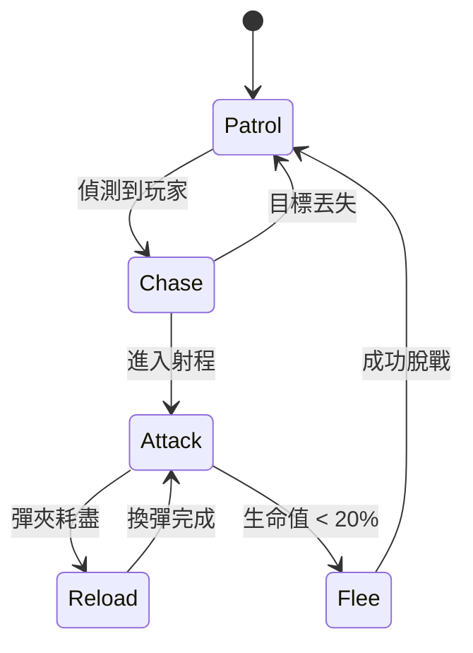
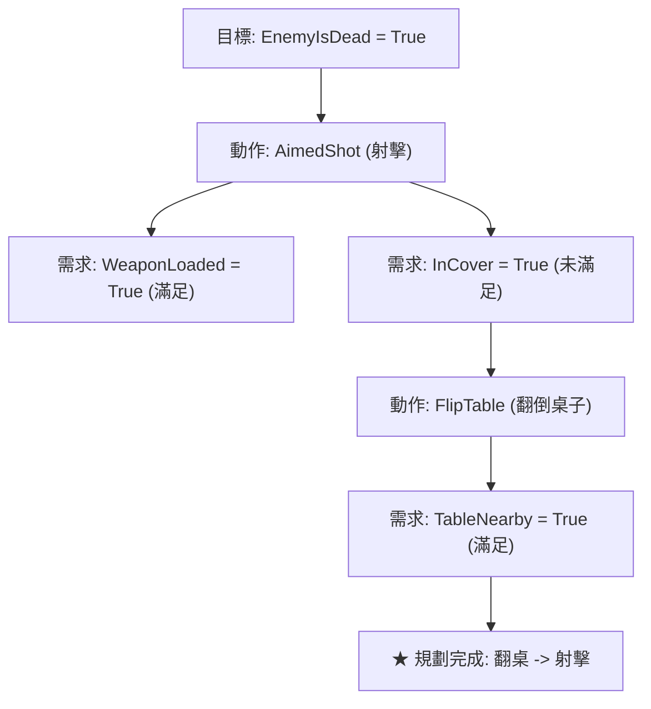

# 遊戲 AI 的心智架構演進：有限狀態機 FSM、行為樹 Behavior Tree 到 GOAP 目標導向行為規劃

> **迷因導讀**：老遊戲裡的雜兵 NPC 笨得像根木頭人：玩家站在他鼻尖前面開槍射爆隊友，NPC 只要沒踩進「警戒半徑」的判斷框，依然能一邊嚼著甜甜圈一邊吹著口哨慢悠悠地原地踏步；但在現代神作（如《極度恐慌 F.E.A.R.》、《最後生還者》、《天國：降臨》）裡，敵人不僅會交替掩護、戰術後撤、向側翼繞後包抄，看見你掏出火箭筒甚至還會嚇得集體翻桌並問候你全家祖宗十八代。玩家常常在螢幕前嚇得冷汗直流，驚呼：「這 NPC 是成精了還是官方後台抓了真人打工人即時遠端代打？！」此時，遊戲引擎工程師端著冷卻的黑咖啡冷冷一笑：「不是 NPC 覺醒了自我意識，而是我們終於把這群智障的大腦，從滿地 Bug 的死板條件跳轉，升級成了目標導向的 A* 狀態空間搜尋引擎！」

---

## 一、 人工智障的起點：有限狀態機（FSM）的「狀態爆炸」深淵

要理解現代 NPC 到底有多狡猾，我們必須先回到 90 年代甚至更早的街機時代，看看初代遊戲 AI 是如何被困在「有限狀態機」（Finite State Machine, FSM）這個看似甜美、實則致命的邏輯泥淖之中。

有限狀態機的概念極其直觀，任何寫過大一 C 語言作業的程式菜鳥都能在白板上一眼看懂。一個合格的小兵大腦，本質上就是幾何圖形上的幾個圓圈和箭頭：
- **狀態 1（Patrol，巡邏）**：沿著預設路徑直線巡遊；如果「看到玩家」且「距玩家 < 15 米」，觸發狀態躍遷跳至狀態 2。
- **狀態 2（Chase，追擊）**：以最高時速朝玩家坐標狂奔；若「進入射程（< 8 米）」，跳至狀態 3；若「失去目標視野超過 5 秒」，跳回狀態 1。
- **狀態 3（Attack，攻擊）**：播放開火動畫並扣除玩家血量；若「子彈打空」，跳至狀態 4（Reload，換彈）；若「血量 < 20%」，跳至狀態 5（Flee，逃跑）。



在《吃豆人》（Pac-Man）或者早期的《毀滅戰士》（Doom）中，這種硬編碼的 FSM 表現得無懈可擊，執行速度快如閃電——只要一個 `switch-case` 語句或函數指標陣列，NPC 就能在微秒級別做出響應。然而，當遊戲工業進入 2000 年代，玩家對沉浸感的要求開始瘋狂通膨：
> 策劃跑過來敲程式員的桌子：「我們的小兵不能只會站樁射擊！他看見手雷要會臥倒！隊友死了要會呼救！被手電筒照瞎了要會捂眼睛！下雨天要收槍！玩家掏出重機槍時他要尋找掩體！掩體被炸爛了他要翻滾逃跑！」

這時候，FSM 迎來了軟體工程界最惡名昭彰的災難——**狀態爆炸（State Explosion）**。

在數學上，如果有 $N$ 個狀態，理論上可能存在的狀態轉移連線數最多可達 $N(N - 1)$ 條，複雜度為 $O(N^2)$。當你的狀態從 5 個擴展到 50 個時，可能的轉換路徑不是線性增加，而是暴增到近 2500 條！
更致命的是邏輯死鎖與義大利麵條代碼（Spaghetti Code）。假設 NPC 處於「換彈（Reload）」狀態，此時一顆高爆手榴彈滾到了他的腳邊：
1. 換彈狀態有沒有寫「檢測手雷並跳轉逃跑」的分支？
2. 如果跳轉去逃跑，手裡的彈匣插了一半算不算裝填完成？
3. 逃跑途中又被打殘了，優先觸發「重傷倒地呻吟」還是「繼續逃跑」？

一旦某個程式員少寫了一個 `break` 或遺漏了交叉狀態的防禦性判斷，NPC 就會化身鬼畜傳奇：一邊拿著空槍對著牆壁瘋狂射擊，一邊在原地 360 度陀螺式抽搐，最後被一腳踢死。這就是為什麼老遊戲裡經常出現「明明槍口塞進敵人嘴裡，敵人還在專心對著空氣裝填彈匣」的超現實智障名場面。

---

## 二、 遊戲 NPC 心智架構世代進化全景橫評

為了把遊戲 AI 從 FSM 的義大利麵條代碼中解救出來，遊戲工業在過去二十年間歷經了多次心智架構的底層革命。從將狀態分級嵌套的分層狀態機（HFSM），到被微軟 Bungie 工作室在《最後一戰 2》（Halo 2）中發揚光大、並最終成為商業引擎霸主 Unreal Engine 標準配置的「行為樹」（Behavior Tree）；再到 Monolith 在《F.E.A.R.》中驚艷全球的「目標導向行為規劃」（GOAP），以及《模擬市民》（The Sims）系列登峰造極的「效用系統」（Utility AI）。

不同架構的哲學底層存在天壤之別。以下是跨越各世代遊戲 AI 心智架構的客觀硬核性能與工程特性橫評：

| 架構模式 | 經典代表遊戲 | 核心運作哲學 | 動態決策靈活性 | 大規模複雜行為擴展性 | 運行時 CPU 規劃開銷 | 策劃/非程式員配置友好度 | 核心崩潰致命弱點 |
| :--- | :--- | :--- | :--- | :--- | :--- | :--- | :--- |
| **有限狀態機 (FSM)** | 《吃豆人》、《毀滅戰士 1/2》 | 基於事件與條件的硬編碼跳轉 | ★☆☆☆☆ (極僵硬，只能走預設邊) | ★☆☆☆☆ (狀態>20 時極易引發轉移死鎖) | 趨近於 0 ($O(1)$ 常數跳轉) | ★★☆☆☆ (代碼級綁定，依賴硬編碼) | **狀態爆炸**：新增一個微小行為需修改幾十條舊邏輯 |
| **分層狀態機 (HFSM)** | 《雷神之錘 III 競技場》 | 引入父子狀態階層，共享通用逃逸跳轉 | ★★☆☆☆ (階層隔離改善局部響應) | ★★☆☆☆ (緩解全域連線，但層次深時仍難控) | 極低 ($O(1) \sim O(h)$，$h$ 為樹高) | ★★☆☆☆ (圖論拓撲依然複雜抽象) | **邊界模糊**：父子狀態優先級衝突與瞬態重入問題 |
| **行為樹 (Behavior Tree)** | 《最後一戰 2》、《刺客教條》、Unreal | 深度優先遍歷樹狀節點（Selector/Sequence） | ★★★☆☆ (模組化高，但反應鏈受制於樹結構) | ★★★★☆ (節點即插即用，具備極佳封裝性) | 中等 ($O(K)$，每幀自頂向下遍歷評估) | ★★★★★ (視覺化節點編輯器天花板，策劃最愛) | **大樹維護陷阱**：複雜遊戲的行為樹常膨脹至上千節點，除錯極度反直覺 |
| **目標導向規劃 (GOAP)** | 《極度恐慌 F.E.A.R.》、《駭客入侵》 | 逆向目標分解，以 A* 搜尋演算法動態拼裝 Action 鏈 | ★★★★★ (極致動態湧現，NPC 會自行發明戰術) | ★★★★★ (解耦目標與動作，動作庫任意增刪) | 偏高 ($O(b^d)$，需實施狀態空間圖搜尋) | ★★★☆☆ (需要策劃具備數學與狀態前置條件抽象思維) | **空間爆炸與算力卡頓**：動作依賴定義不清會導致 A* 搜索震盪 |
| **效用系統 (Utility AI)** | 《模擬市民》系列、《全軍破敵》 | 為各項渴望/欲望建立效用曲線，選取得分最高者 | ★★★★★ (具備擬真的人性動態權衡能力) | ★★★★☆ (曲線增補容易，但權重微調極其玄學) | 中高 ($O(M)$，需持續計算連續數學曲線分數) | ★★★☆☆ (調參需要極度精準的數值直覺) | **決策震盪（Thrashing）**：兩個行為效用值在臨界點反覆橫跳時 NPC 會中風 |

從表中可以清晰看出，**行為樹（Behavior Tree）** 是當前 AAA 商業工業化流水線上的最大公約數。它將決策拆分為「控制節點」（Selector 選擇節點：只要有一個子節點成功就算成功；Sequence 順序節點：必須所有子節點依次成功才算成功）與「執行葉節點」（Action / Condition）。這種樹狀的拓撲結構天然隔離了各個子行為，策劃可以在視覺化編輯器中像搭樂高積木一樣，把一個「掩體內探頭射擊」的子樹隨意插進任何敵人的大腦中，再也不必重寫全局的狀態轉移條件。

但如果你追求的是極致的「戰術靈性」——讓 NPC 展現出宛如人類一般的隨機應變與戰術湧現，行為樹的層級依然顯得過於死板。這時，傳奇的 **GOAP** 便登上了神壇。

---

## 三、 F.E.A.R. 神級 AI 的幕後祕密：GOAP 規劃器

2005 年，由 Monolith Productions 開發的第一人稱射擊遊戲《極度恐慌》（F.E.A.R.）橫空出世。近二十年過去了，這款老遊戲的敵人士兵 AI 依然被玩家和遊戲開發者奉為不可逾越的高山。

在《F.E.A.R.》中，玩家會遭遇一群名為「複製人士兵（Replica Soldiers）」的敵人。這些士兵展示出了近乎詭異的智慧：
當你在走廊架起散彈槍守株待兔時，他們絕不會排隊送死。一名士兵會突然一腳踢翻旁邊的辦公金屬桌，將其改造成臨時防彈掩體；另一名士兵則利用辦公桌的遮掩向你扔出一顆震撼彈；與此同時，第三名士兵已經悄無聲息地鑽進通風管道，五秒後從你背後的通風百葉窗破網而出，一梭子子彈精準打穿你的後腦勺！

這套行雲流水的特種部隊戰術配合，是策劃在腳本裡一幀一幀寫出來的嗎？
**完全不是。**

《F.E.A.R.》的首席 AI 架構師 Jeff Orkin 引入了源自麻省理工學院與美國太空總署（NASA）太空探測器的規劃理論，打造了著名的 **GOAP（Goal-Oriented Action Planning，目標導向行為規劃器）**。

```
【當前世界狀態 (Current World State)】
  - 玩家處於可見狀態 (PlayerVisible = True)
  - 己方處於無掩體狀態 (InCover = False)
  - 武器彈藥充足 (AmmoReady = True)
  - 存在可破壞/互動傢俱 (HeavyTableNearby = True)

       │
       ▼ [GOAP A* 逆向路徑搜尋規劃]
  
【目標 (Goal)】: 消滅威脅 (KillEnemy = True)
  └─ 需要前置條件: 安全射擊窗口 (HasSafeLineOfFire = True)
      └─ 需要前置條件: 壓制玩家視野 (PlayerSuppressed = True)
          ├─ 動作 A: 翻倒桌子形成物理防禦 (FlipTableToCover)
          ├─ 動作 B: 投擲手雷逼迫走位 (ThrowGrenade)
          └─ 動作 C: 側翼迂迴切入盲區 (FlankToBlindSpot)
```

### 1. 核心解耦：目標（Goal）與動作（Action）的徹底分離
在傳統架構中，NPC 的大腦必須事無巨細地掌握「在什麼環境下該執行什麼順序的動作」。
而在 GOAP 體系中，NPC 的大腦只包含兩個完全解耦的集合：
1. **目標庫（Goals）**：例如「保持存活（StayAlive）」、「擊殺玩家（KillEnemy）」、「巡查異響（InvestigateDisturbance）」。每個目標只有一個簡單的優先級權重和滿足球條件（例如：`EnemyIsDead == true`）。
2. **動作庫（Actions）**：幾十個相互獨立的原子動作，例如「開火（Attack）」、「跑向掩體（TakeCover）」、「踢翻桌子（FlipTable）」、「裝填彈藥（Reload）」。

最精妙的地方在於：**每一個動作都只定義自己的「前置條件（Preconditions）」與「執行效果（Effects）」**。

例如，動作「精準開火（AimedShot）」的定義為：
- **前置條件**：`WeaponLoaded == true` 且 `HasLineOfSight == true` 且 `TargetCovered == false`
- **執行效果**：`EnemyIsDead = true`（機率性滿足目標）

動作「踢翻桌子（FlipTable）」的定義為：
- **前置條件**：`TableNearby == true` 且 `TableFlipped == false`
- **執行效果**：`HasCover = true`

### 2. A* 逆向狀態空間搜尋（Backward State-Space Search）
GOAP 真正封神的核心算法，在於它將 AI 的行為決策轉化為一個**在符號狀態空間中的經典圖論尋路問題**。

當小兵的大腦被激活時，他會選出當前權重最高的目標（例如：`EnemyIsDead == true`）。此時，小兵的大腦並不從「我現在能做什麼」正向思考，而是**從目標狀態出發，向後逆向推導（Regressive Search）**：
1. **終點目標**：需要 `EnemyIsDead == true`。
2. **尋找能達成該目標的動作**：找到了「遠距離狙擊（AimedShot）」。
3. **檢查前置條件**：該動作需要 `HasLineOfSight == true`（有視野）且 `InCover == true`（處於安全掩體內）。
4. **比對當前真實世界狀態**：當前小兵站在空曠走廊，`InCover == false`！條件不滿足，規劃器將 `InCover == true` 設為新的臨時子目標！
5. **尋找能滿足子目標的動作**：動作庫中「跑向固定掩體（RunToCover）」可以達成，但最近的牆壁在 20 米外，耗時過長；另一個動作「踢翻桌子（FlipTable）」也可以達成 `InCover = true`，且距離只有 1 米！
6. **檢查該動作的前置條件**：需要 `TableNearby == true`。掃描周圍物理網格，旁邊正好有一張辦公桌，條件完美契合！
7. **路徑閉合**：從「踢翻桌子」到「架槍狙擊」的因果動作鏈條在狀態空間中完成了路徑閉合！



這意味著，**程式員從來沒有寫過一行「如果看見散彈槍就去翻桌子」的規則代碼**。這套戰術是 NPC 面對致命威脅時，根據自身算力與物理場景，自行用 A* 演算法在數毫秒內「發明」出來的動態生存策略！這種驚艷的「湧現性行為（Emergent Behavior）」，徹底抹平了傳統虛擬世界與真實戰場之間的認知鴻溝。

---

## 四、 當代遊戲 AI 實戰避坑指南：避免「人工智障」的三大生死線

既然 GOAP 和現代心智架構如此強悍，為什麼在 2020 年代以後發布的許多 3A 大作中，我們依然能看見 NPC 蠢出天際、甚至倒退回 20 年前水準的破防畫面？在商業遊戲的底層開發中，有三條血淋淋的架構深淵：

### 1. 避坑一：別讓 A* 搜尋引發主線程掉幀——「時間分片」與「狀態快取」
GOAP 的靈魂是狀態圖搜尋，但 A* 搜尋是有計算代價的。如果一個大場景中有 100 個武裝士兵同時在每一幀調用逆向狀態搜尋，CPU 的單核心會被瞬間拉爆，引發斷崖式的幀率暴跌。
- **血淚經驗**：嚴禁在渲染主線程（Main Thread）中同步執行 GOAP 規劃！必須引入**時間分片（Time-Slicing）**與**非同步作業系統（Job System）**。
- 將 NPC 的決策頻率與視覺感知分開：視覺偵測以 10Hz~20Hz 運行，而重量級的 GOAP 長鏈規劃扔進執行緒池，並允許分攤在 3~5 幀內逐步完成。同時，對常見戰術鏈實施「路徑快取」——如果環境狀態未發生重大劇變，直接複用上次成功的動作子圖，絕不無謂消耗運算資源。

### 2. 避坑二：小心策劃與物理引擎的「幽靈衝突」——斷言式前置條件防禦
現代遊戲的物理破壞系統（Chaos/PhysX）極其動態。在 GOAP 規劃的第 1 幀，NPC 算出了「跑向 5 米外的木箱後射擊」；然而在第 3 幀 NPC 正在奔跑途中，玩家一發火箭彈把那個木箱炸成了漫天木屑！
- 如果你的動作架構缺乏**即時前置條件持續驗證（Continuous Precondition Invalidation）**，NPC 就會奔跑到空無一物的虛空中，對著空氣做出「掩體後探頭」的智障滑稽動作。
- **架構準則**：每個 Action 必須包含雙重檢驗——「規劃時前置條件評估」與「每幀執行時的斷言監控（Runtime Assertion）」。一旦關鍵環境標誌位失效，立即中止當前 Plan，觸發中斷機制並回退至防禦性的「戰術警戒」狀態重新規劃。

### 3. 避坑三：拒絕「過度聰明」帶來的挫敗感——遊戲 AI 是來當演員的，不是來打職業電競的
這是所有初涉遊戲 AI 的工程師最容易陷入的「技術傲慢」：你費盡千辛萬苦寫出了一套毫無破綻的強化學習神經網絡或 GOAP 完美規劃器，NPC 射擊百發百中、視線穿透樹葉、交叉火力無死角，結果在內部測試時被玩家噴得體無完膚：「這遊戲體驗像坨屎，根本玩不下去！」
- 遊戲 AI 的終極本質是**舞台上的合格群眾演員**，它的核心價值是**襯托玩家英雄主義體驗的受虐受挫者**，而不是在天梯排位賽裡虐殺用戶的無情作弊者。
- 《F.E.A.R.》之所以讓人覺得神級，一大半的功勞要歸功於士兵的**語音廣播黑板機制（Blackboard Voice System）**：當士兵決定包抄你時，他必須先在通訊頻道大喊：「他躲在走廊後面，我從側翼繞過去，火力掩護我！」——這段語音不是給隊友聽的，而是特意「洩密」給玩家聽的！它將 AI 內部隱蔽的演算法決策外顯化為極具戲劇張力的戰場情報，讓玩家產生「我在與一支極具智慧的真人特種部隊博弈」的巨大成就感。

---

## 五、 結語：NPC 的虛擬靈魂，是在算力邊界內為代碼注入的生機

從《吃豆人》四個幽靈極其原始的簡單座標追逐，到 FSM 狀態轉移圖在狀態爆炸下的狼狽掙扎；從行為樹在商業流水線中的大一統，再到 GOAP 規劃器在狀態空間中如詩如畫般的動態逆向尋路——遊戲 NPC 心智架構的半世紀演進史，本質上就是一部**人類軟體工程師對抗代碼熵增與算力極限的史詩級技術博弈**。

虛擬世界裡的 NPC 從未獲得過哪怕一微克的真實生物意識。在物理層面上，他們只不過是記憶體中一堆堆按微秒跳動的布林變量、矩陣浮點數與圖論節點。

但正是那些藏在冷酷邏輯底層的優雅架構——那一個個定義精確的前置條件、那一條條在毫秒間被搜索拼接的動作鏈條、那幾句恰到好處的戰術呼應語音，讓屏幕另一端的無數孤獨靈魂，在深夜握緊手把的瞬間，真切地感受到了一個鮮活、危險而又波瀾壯闊的平行世界。

**這不是人工智慧的降維打擊，這是屬於遊戲程式員最浪漫的造物魔法。**

---

#遊戲 #科技 #AI革命 #硬核科普 #冷知識 #避坑指南
