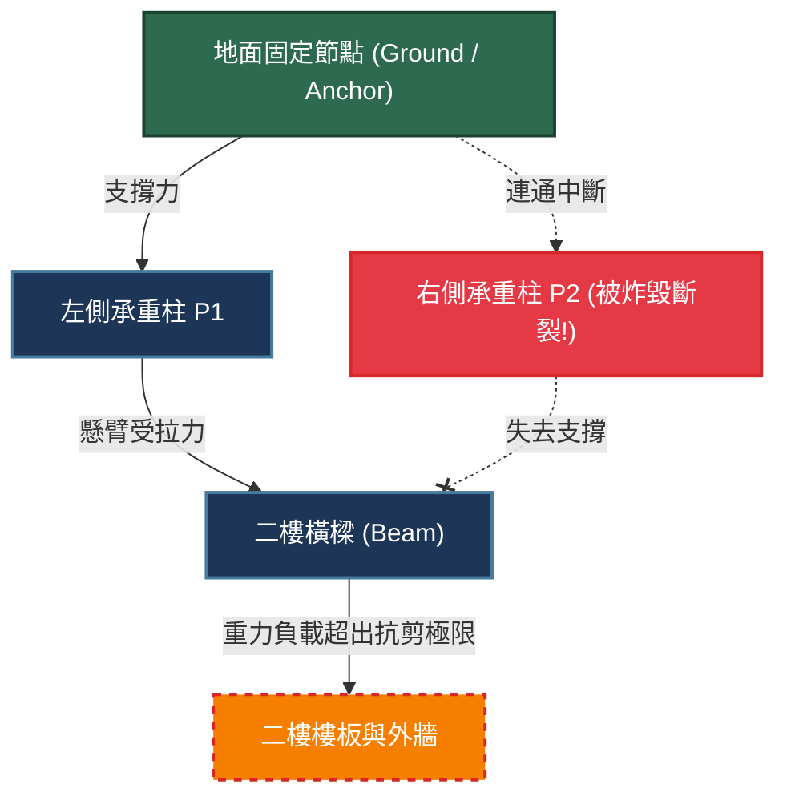

# 現代遊戲物理破壞系統（Destruction Physics）：Voronoi 晶胞分割、有限元分析與微秒級幾何網格破碎

> **迷因導讀**：很多號稱「次世代 3A 巨作」的遊戲裡，經常上演極度侮辱玩家智商的魔幻名場面：你扛起單兵反坦克火箭筒、呼叫了 155 公厘重型自走榴彈砲，朝著路邊農舍的一扇小木門正面開火！只聽得驚天動地的一聲巨響，濃煙散去後，周遭的草皮被炸得焦黑，但那扇薄如蟬翼的木板門卻神采奕奕、毫髮無損，連一片掉落的木屑、一道刮痕都看不見。玩家當場氣到血壓飆升破防：「這特麼是瓦干達振金打造的絕對防禦無敵防盜門吧？！」
>
> 然而，在真正的物理破壞神作（如《戰地風雲》系列的霜巨人引擎、《彩虹六號：圍攻》的 AnvilNext、或是獨立神作《拆遷 Teardown》）中，一發 C4 塑膠炸藥貼上去，整堵承重牆瞬間化為千百塊不規則碎磚崩塌飛濺，鋼筋裸露、天花板應聲斷裂，整座建築在重力狂暴撕扯下化為瓦礫廢墟。當玩家在螢幕前爽到腎上腺素狂飆時，後台的圖形與物理工程師正瘋狂擦冷汗：「兄弟，你這一炮炸得爽快，我的 CPU 與 GPU 在這短短 16 毫秒的一幀之內，剛剛承受了十萬次 Voronoi 晶胞空間分割、求交了數萬個非流形幾何多面體，還解了幾千條稀疏線性受力平衡方程！顯卡風扇都快轉成直升機升空了！」今天，就讓我們徹底拆開現代遊戲物理破壞系統的黑盒子，看看工程師們如何用數學與演算法，在微秒級的鋼絲上實現這場毀滅的極致美學。

---

## 一、 預烘焙碎片 vs 實時物理切割：遊戲破壞系統的演進難題

如果我們要讓遊戲世界的虛擬物體「壞掉」，最直覺的想法是什麼？很多沒親手寫過物理引擎的外行程式員往往會天真地說：「這還不簡單？拿兩塊 3D 模型做幾何布爾運算（Boolean Operation / CSG，構造實體幾何），被砲彈打到的地方直接用圓球體把牆壁的網格模型『減去（Difference）』一塊，剩下的殘渣不就自動破掉了嗎？」

這種想法，在計算幾何學家與圖形架構師眼裡，簡直就是自尋死路、當場引爆硬體的「恐怖主義演算法」。

### 1. 傳統預製碎塊（Pre-fractured Meshes）：套路化碎裂的死板「魔術雜耍」

在遊戲技術發展的早期（例如《戰慄時空 2》時代與 Unreal Engine 3 盛行的年代），即時計算多邊形碎裂是完全不可承受的算力奢侈品。因此，遊戲業廣泛採用了「偷天換日」的**預烘焙碎片（Pre-fractured Meshes）技術**。

這套機制的本質非常搞笑：
1. **美術預切**：3D 美術師在 3ds Max 或 Maya 裡，老老實實手動拿切刀工具把一根石柱切成 20 塊破碎的小石塊，然後把這 20 塊碎石緊密拼在一起，存成一個「已碎模型」。
2. **完整狀態顯示**：平常這根石柱是一個完整的單一網格（Static Mesh），物理碰撞體也是一個最省算力的簡單圓柱膠囊體（Capsule）。
3. **傷害閾值觸發**：當石柱受到的傷害累積超過 100 點生命值，引擎在下一幀立刻執行魔術偷換——把完整的石柱模型隱藏（Visible = False），瞬間在同一個坐標生成剛才那 20 塊預先切好的碎石，並給每一塊碎石掛載剛體組件（Rigid Body），賦予一個徑向向外的初始爆破衝量（Impulse）。

這種方案的優點是效能極度可控，甚至可以在 PS3/Xbox 360 這種古董主機上流暢跑滿 30 幀。但它的致命死穴是「**假得令人出戲**」：
- **重複感爆棚**：無論你拿小手槍朝石柱頂端打一槍，還是用 RPG 轟在石柱底部，這根石柱永遠碎裂成一模一樣的 20 塊碎塊，碎塊的裂紋形狀、大小甚至落點規律完全複製貼上。
- **無彈性互動**：你無法進行局部破壞。你想在牆上開一個小射擊孔？不行，只要傷害沒過閾值，牆壁堅如磐石；傷害一旦過了閾值，整面牆「砰」一聲全面粉碎。

### 2. 動態布爾運算（CSG）：從理論天堂跌入「非流形破面」的算力地獄

為了解決預烘焙的呆板，有人嘗試在實時運行中直接使用**構造實體幾何（CSG / Boolean Subtraction）**。當砲彈擊中多邊形網格（Mesh）時，即時在交點處用爆炸球體與網格三角面進行求交割切。

這在 3D CAD 建模軟體裡跑得挺好，但一放到 60 FPS 甚至 144 FPS 的即時遊戲中，立刻演變成三大工程災難：
1. **算力雪崩與掉幀**：兩個包含數萬個三角面的任意網格求交，本質上是 $O(N \log N)$ 甚至 $O(N \times M)$ 的幾何面求交計算。每一發子彈都要遍歷數千個三角形的空間八叉樹（Octree / BVH）碰撞檢測，連續打出一梭子子彈，幀率立刻從 120 幀狂跌至個位數。
2. **非流形幾何體（Non-manifold Geometry）與破面穿模**：在浮點數精度極限（IEEE 754 浮點運算微小誤差）下，頂點共面或共線的布爾切割極易產生零面積退化三角形（Degenerate Triangles）、單邊連接多個面或開孔懸空的面。一旦產生非流形網格，物理引擎的凸包分解演算法（如 V-HACD）會徹底崩潰，碰撞體瞬間失真，導致遊戲角色穿牆遁地、碎塊像爆米花一樣瘋狂抖動飛向外太空。
3. **UV 貼圖與材質斷裂**：動態切開網格後，斷裂面的內部剖面是裸露的空白多邊形，必須在微秒之內為新生成的斷裂面重新計算切線空間、生成合適的岩石/水泥紋理 UV 映射。如果這一步沒做好，露出的斷面就是一團扭曲糊爛的拉伸貼圖，視覺效果醜到令人髮指。

因此，現代遊戲破壞引擎必須另闢蹊徑，在「預先離線計算結構幾何」與「實時物理力學動態裂解」之間找到一道精準的數學平衡點。

---

## 二、 主流遊戲物理破壞架構全景橫評

為了讓破壞既擁有實時隨機的衝擊感，又具備物理上的力學真實度，業界演化出了多種技術路線。以下是當前四大核心破壞架構的客觀技術全景對比：

| 技術維度 | 預烘焙頂點動畫 (VAT) / 腳本拆遷 | Voronoi 晶胞多層次破壞 (Apex / Chaos) | 有限元分析 (FEM / MPM) | Voxel 體素連續破壞 (Teardown 引擎) |
| :--- | :--- | :--- | :--- | :--- |
| **代表遊戲作品** | 《戰地風雲 4》（上海大樓坍塌） | 《戰地風雲 2042》、《虹彩六號》、《控制 Control》 | 頂級工業模擬、次世代試驗 Demo | 《拆遷 Teardown》、《我的世界》（極度簡化） |
| **每秒破壞頂點極限** | 100,000+（純 GPU 頂點位移，零物理開銷） | 10,000 ~ 50,000 碎塊網格即時調度 | 1,000 ~ 5,000 節點（極耗 CPU/Compute Shader） | 數百萬體素（Voxel）實時微晶格爆破 |
| **結構承重力學真實度**| **零**（純播放固定動畫，無力學反饋） | **高**（藉由受力傳導圖 Stress Graph 動態評估） | **極高**（基於真實材料連續介質力學張量） | **中等至高**（基於體素連通性與離散質點彈簧） |
| **破碎隨機性與自由度**| 完全固定（腳本演出） | 高度隨機（動態受力與衝擊點 Voronoi 切割） | 無限連續（可任意斷裂、撕扯、塑性形變） | 像素級完全自由（任意形狀挖掘與炸穿） |
| **微秒級延遲開銷** | $\le 0.05 \text{ ms}$（僅觸發播放事件） | $1.5 \sim 4.0 \text{ ms}$（非同步物理線程計算） | $10.0 \sim 25.0 \text{ ms}$（極易造成主線程卡頓） | $2.0 \sim 5.0 \text{ ms}$（高度依賴專用 GPU 體素光追） |
| **顯存與記憶體頻寬開銷**| 極低（僅佔用基礎動畫紋理緩存） | 中等（幾何網格動態實例化與碰撞體記憶體池） | 極高（大矩陣求解與稀疏網格張量儲存） | 高（龐大的 3D 稀疏體素八叉樹 SVOT 頻寬壓迫） |
| **多玩家網路同步成本**| 極低（僅需同步事件觸發 Timestamp） | 中等（僅同步破碎根節點與重要剛體 Transform）| 幾何級數不可行（浮點非確定性無法幀同步） | 高（需壓縮同步體素修改位元遮罩 Bitmask） |

### 1. Voronoi 晶胞分割（Voronoi Diagram Partitioning）：幾何破碎的數學核心

目前在主流 3A 遊戲（例如 Unreal Engine 的 **Chaos Destruction** 系統）中最為成熟、應用最廣泛的，便是**基於 Voronoi 晶胞分割的層次化幾何解構**。

數學上，給定一個度量空間中的一組離散種子點 $S = \{p_1, p_2, \dots, p_n\}$，每個點 $p_i$ 所對應的 Voronoi 晶胞 $V(p_i)$ 定義為空間中所有到 $p_i$ 的距離小於或等於到其他任何種子點 $p_j$ 的點集：

$$V(p_i) = \left\{ x \in \mathbb{R}^3 \mid \|x - p_i\| \le \|x - p_j\|, \forall j \ne i \right\}$$

在三維空間中，每個 Voronoi 晶胞本質上是一個**凸多面體（Convex Polyhedron）**。這個幾何特性對物理引擎來說宛如救世主！因為物理引擎處理兩個凸多面體的碰撞檢測（利用 GJK 演算法與 EPA 演算法），其時間複雜度遠遠低於處理任意凹面幾何體。

現代引擎是如何運用它的？
- **層級破碎樹（Fracture Hierarchy Tree）**：遊戲在離線烘焙時，並非隨機亂切，而是將一棟房屋組織成一棵多層級樹狀結構。
  - **第 0 層（根節點）**：整棟房子（單一完整模型）。
  - **第 1 層（粗粒度切割）**：利用 20 個 Voronoi 種子點，將房子預先切割為客廳、臥室、承重牆、大樑等大塊組件。
  - **第 2 層（細粒度切割）**：在承重牆內部，利用 100 個局部聚集在表面和受力點的種子點進行二次晶胞分割，形成石塊與磚瓦。
  - **第 3 層（微晶碎片）**：在最容易受衝擊的邊角處，密集布設數百個微小種子點，形成小碎屑與塵土模型。
- **運行期動態解放（Dynamic Release）**：平時只有第 0 層生效；當火箭彈擊中牆壁座標 $(x, y, z)$ 時，物理引擎根據衝擊動能大小，動態遍歷樹狀結構，僅僅將受衝擊局部半徑內的第 1、2 層子節點「激活」。沒被打到的屋頂依然作為一個整體牢固存在，而被擊中的區域瞬間釋放出已經計算好凸包的 Voronoi 碎塊，並繼承衝量飛散。這兼顧了極致的運行效率與近乎實時的逼真碎裂感！

---

## 三、 結構力學的「受力傳導圖」（Stress Graph）：為什麼大樓不會反重力懸空？

只要玩過一些低成本小遊戲的人都見過這種讓人啼笑皆非的 Bug：你明明已經用炸彈把整座塔樓的第一層所有柱子和牆壁全部轟成了渣，但上面的第二層、第三層甚至整座城堡，竟然像外星反重力要塞一樣，穩穩地漂浮在半空中！

要打破「牛頓看了直搖頭」的反重力尷尬，頂級遊戲引擎在底層引入了**結構應力圖（Stress Graph / Structural Connectivity Graph）**演算法。

### 1. 幾何結構圖的拓撲構建

當一座由上千個 Voronoi 晶胞或建築模塊構成的大樓被加載時，引擎的物理系統會在內存中構建一張無向圖 $G = (V, E)$：
- **頂點（Vertices $V$）**：代表每一個可破碎的結構塊（如樑、柱、樓板、磚塊）。特殊的頂點被標記為「**錨點（Anchors）**」，代表牢牢固定在地表基岩上的不可移動地基。
- **邊（Edges $E$）**：代表兩個結構塊之間的接觸黏合面。每一條邊都儲存著材質的物理力學參數：
  - **最大抗壓強度（Compressive Strength）**
  - **最大抗拉強度（Tensile Strength）**
  - **最大抗剪切強度（Shear Strength）**

### 2. 動態弱連通分量檢測（Connected Component Analysis）

當一發迫擊砲炸毀了幾根柱子，物理引擎會立即將代表這些柱子的頂點及其關聯的邊從圖 $G$ 中直接刪除。

此時，引擎調度非同步物理線程，執行**並查集（Disjoint-Set Union / DSU）**或廣度優先搜尋（BFS）：
- **連通性檢驗**：以所有「地基錨點」為起點向外遍歷。如果某個結構塊頂點所在的連通分量（Connected Component）無法路徑回溯到任何地基錨點，說明這個結構塊在幾何上已經完全懸空！
- **瞬間剛體化（Rigid Body Conversion）**：物理引擎會毫不猶豫地解除這個孤立連通分量中所有組件的靜態凍結狀態，將它們打包成一個或多個動態物理剛體群組，開啟全域重力加速度 $g = -9.81 \, \text{m/s}^2$。整座懸空的樓層瞬間帶著巨大慣性，轟然砸向地面！

### 3. 虛擬受力傳導與力矩計算（Torque & Shear Propagation）

更進階的破壞系統（如《赤色戰線：游擊戰隊》的 Geo-Mod 2.0 或《戰地風雲》的建築物理）甚至會進行**簡化靜力學平衡求解**。

即使大樓還有柱子連著地面，但如果原本有四根柱子，其中三根被炸斷，剩下的一根柱子要承受整棟三層樓的偏心力矩：

$$\sum \vec{F} = m\vec{g} + \vec{F}_{\text{support}} = 0$$

$$\sum \vec{\tau} = \vec{r} \times (m\vec{g}) \ne 0$$

重心偏移產生的巨大力矩（Torque）會轉化為那根孤獨柱子內部邊緣的極限剪切應力。當計算出的受力數值超過該邊預設的斷裂閾值 $\tau_{\max}$ 時，這根原本沒被砲彈直接打中的柱子，會發出令人牙酸的鋼筋扭曲呻吟聲，然後自己從內部「爆開折斷」！這種由結構重力失衡引發的**多米諾骨牌式連鎖坍塌（Progressive Collapse）**，正是物理破壞系統帶給玩家頭皮發麻震撼感的靈魂所在。

---

## 四、 結語：破碎的廢墟不是混亂的垃圾，而是人類用嚴密數學對現實物理世界的最硬核致敬

在很多外行人眼裡，遊戲裡的「破壞」只不過是一堆雜亂無章的粒子特效、灰塵貼圖和隨意亂滾的模型碎屑；它代表著遊戲世界的崩潰、毀滅與無序。

但真正深入遊戲引擎底層的工程師卻深知：**要在虛擬世界中呈現最真實的混亂，背後必須依賴人類最極致的幾何秩序與最嚴密的數學定律。**

從歐幾里得幾何中的三維 Voronoi 晶胞劃分，到連續介質力學中的應力張量矩陣，再到圖論中微秒級的弱連通分量搜索，每一次令人嘆為觀止的大樓傾頹、每一面被戰術破拆的磚牆，都是 CPU 與 GPU 在 1/60 秒之內向自然界物理法則發起的精密計算衝鋒。

正是這群在程式碼背後與浮點精度誤差、記憶體頻寬壁壘死磕到底的圖形與物理工程師，才讓我們得以在方寸螢幕之間，親手撕開虛擬世界那層光鮮亮麗的死板外皮，見證鋼筋水泥在重力撕扯下那一場場充滿數學美感、震撼靈魂的毀滅交響樂。

---
#遊戲 #科技 #硬核科普 #冷知識 #避坑指南
