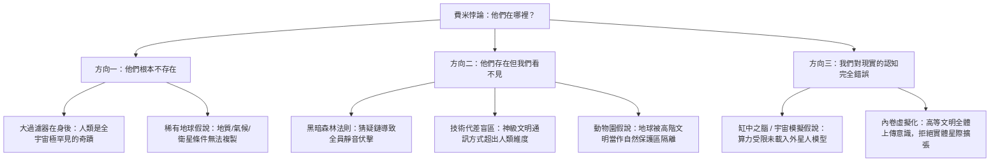

# 外星人到底在哪？費米悖論與大過濾器假說的恐怖推論

> **迷因導讀**：1950 年夏天，物理學泰斗恩里科·費米跟同事吃午飯，嘴裡嚼著三明治，腦子裡還在算原子彈爆炸當量，突然冷不防蹦出一句靈魂拷問：「Where are they?」（他們都在哪裡呢？）這句話翻譯成當代打工人的話語體系就是：明明算命的說我命中有貴人、HR 說年終保底發十個月、社群媒體上人均年薪三百萬且身家過億——但為什麼打開網銀餘額永遠只有兩位數？宇宙也是如此，數學公式算出來全銀河系應該擠滿了神級外星文明，但人類把幾億美金的射電望遠鏡架到外太空狂聽了半個世紀，耳機裡除了一片死寂的白噪音，連一句外星髒話都沒截獲到。今天我們就來聊聊這個讓全體天文學家夜不能寐、既硬核又毛骨悚然的宇宙級鬼故事：費米悖論與大過濾器假說。

---

## 一、 宇宙的冰冷沉默：德雷克方程式算出來的繁榮與現實的死寂

想像一下，你週五晚上滿心歡喜去參加號稱有「數十萬頂級名流齊聚」的世紀奢華派對。推開厚重的大理石大門，迎面而來的不是香檳塔與交響樂，而是一座空無一人、滿地灰塵、只有中央冷氣在發出微弱嘶嘶聲的廢棄體育館。

這就是人類用望遠鏡凝視夜空時體會到的巨大荒謬感。

從純機率的角度來看，人類根本不應該是孤獨的。1961 年，天文學家法蘭克·德雷克（Frank Drake）在綠岸天文台拋出了一個著名的概率乘法公式——**德雷克方程式（Drake Equation）**：

$$N = R_* \times f_p \times n_e \times f_l \times f_i \times f_c \times L$$

這個公式本質上就是一套「星際宇宙文明的漏斗轉換率模型」：
*   $R_*$：銀河系內部恆星每年誕生的速率（約 1.5 ~ 3 顆/年）；
*   $f_p$：恆星擁有行星系統的比例（克卜勒太空望遠鏡數據顯示幾近 100%）；
*   $n_e$：每個行星系統中處於「宜居帶」（能維持液態水）的行星平均數量（保守估計約 0.4 ~ 1）；
*   $f_l$：宜居行星真正孕育出生命的機率；
*   $f_i$：生命演化出高等智慧文明的機率；
*   $f_c$：智慧文明掌握星際通訊與電磁波發射技術的機率；
*   $L$：一個技術文明在毀滅之前，能夠向外界廣播通訊的存續壽命（年）。

我們把現代天文物理學已證實的數據填進去看看：光是我們所在的銀河系，就盤踞著 **1,000 億至 4,000 億顆恆星**；而在目前可觀測宇宙中，至少塞滿了 **2 萬億個星系**。光是銀河系內部處於宜居帶、溫度合適、岩石質地且有液態水的類地行星，估算就超過 **400 億顆**。

宇宙的年齡已經有 **138 億年**，而地球只有 45 億歲，人類現代科技文明甚至只有短短 200 多年。如果銀河系是一場 24 小時的馬拉松，人類文明不過是在最後 0.1 秒才匆忙穿鞋進場的實習生。

這意味著什麼？哪怕只有 0.0001% 的宜居行星孕育出了文明，且只要有一個外星種族比人類早誕生 500 萬年——在宇宙尺度下，500 萬年不過是眨個眼睛打個哈欠的時間——以 1% 光速製造自我複製的「馮諾依曼探測器（von Neumann probes）」，就足以在 **1,000 萬年之內把整個銀河系地毯式開拓殖民完畢無數次**！

按理說，抬頭看天，夜空應該像澀谷十字路口或台北捷運忠孝復興站一樣塞滿了戴森球（Dyson Sphere）的熱輻射廢熱、星際超光速航道的尾跡燈火、以及鋪天蓋地的跨星系 5G 廣播廣告。

但現實是什麼？**死一般的寂靜。**

沒有戴森球的紅外溢出特徵，沒有巨型人造巨構工程，沒有任何外星艦隊的殘骸。我們的深空探測器 Voyager 1 飛了將近半個世紀，穿過柯伊伯帶，回傳的只有刺耳空洞的宇宙射線噪聲。這種「數學期望值爆表」與「觀測結果徹底為零」之間的巨大鴻溝，就是折磨人類七十餘年的**費米悖論（Fermi Paradox）**。

---

## 二、 大過濾器（The Great Filter）假說：人類歷史最細思極恐的思想實驗

面對這份致命的沉默，喬治梅森大學的經濟學家羅賓·漢森（Robin Hanson）在 1996 年提出了一個讓人背脊發涼的理論：**大過濾器（The Great Filter）假說**。

大過濾器的核心邏輯極其冰冷殘酷：**從一片死寂的無機化學泥漿，到稱霸銀河系的神級 III 型星際文明，這條演化長征中必然存在一道（或數道）機率極端接近於零、幾乎無法逾越的「絕壁死局」。** 絕大多數潛在的文明都會在這道牆面前全軍覆沒、化作星際塵埃，這就是宇宙看起來空空如也的原因。

為了讓大家徹底看懂這場殘酷的生存篩選，我們將從非生命到星際霸主劃分為 9 個關鍵門檻：

### 宇宙文明進階 9 大演化門檻與過濾器位置對照表

| 階段序號 | 演化關鍵門檻（Filter Step） | 人類現狀 | 過濾難度解析與科學死局 | 關鍵代表科學理論 / 假說 |
| :--- | :--- | :--- | :--- | :--- |
| **Step 1** | **宜居恆星系與化學基底** | 已跨越 | 必須具備穩定的 G/K 型恆星、金屬豐度、保護性巨行星（如木星）清理小行星 | 稀有地球假說（Rare Earth） |
| **Step 2** | **非生物化學演化至原始單細胞** | 已跨越 | 無機分子如何自發組裝成具備自我複製與新陳代謝能力的 RNA/原核細胞？百億年玄學難題 | 原始湯與海底熱泉噴口理論 |
| **Step 3** | **原核生物向真核生物躍遷** | 已跨越 | 地球誕生後花了整整 20 億年才發生一次古細菌吞噬變形菌的奇蹟內共生 | 線粒體內共生學說（Endosymbiosis） |
| **Step 4** | **單細胞分化為有性生殖的多細胞** | 已跨越 | 細胞學會為了整體犧牲個體獨立性，實現精密分工與遺傳多樣性爆發 | 寒武紀生命大爆發謎團 |
| **Step 5** | **複雜神經系統與工具製造智慧** | 已跨越 | 數以億計的物種中，只有人類點開了極度耗能的大腦容積與抽象語言符號 | 認知革命與基因突變偶然性 |
| **Step 6** | **工業革命與全球科技網絡** | **當前位置** | 擺脫肌肉與畜力，掌握化石能源、核能、量子力學與電磁通訊 | 卡爾達肖夫 0.73 型文明 |
| **Step 7** | **技術奇點與自我毀滅陷阱** | **即將面臨** | 核全面戰爭、基因編輯生化病毒失控、超智慧失控 AI、不可逆氣候崩潰 | 人類生存危機（Existential Risk） |
| **Step 8** | **永久性地外行星開拓與殖民** | 未跨越 | 擺脫單一搖籃行星依賴，在月球、火星建立不依賴母星即可自我維持的工業閉環 | 多行星物種跨越 |
| **Step 9** | **恆星級戴森球與跨星系擴張** | 未跨越 | 開採母恆星全部能源，向鄰近恆星系播撒馮諾依曼自我複製機器人探測群 | 卡爾達肖夫 II/III 型文明 |

看懂這張表之後，所有人心中都會冒出一個致命問題：**這個可怕的「大過濾器」，到底是在我們的「身後」，還是在我們的「前方」？**

### 情況 A：過濾器在我們身後（人類是天選之子，但孤獨得可怕）
如果大過濾器位於 Step 2 或 Step 3，這意味著「無機物轉化為生命」或「原核細胞突變成真核細胞」的機率低到令人髮指（例如 $10^{-50}$）。
整個可觀測宇宙這片浩瀚沙漠裡，地球恰好是那一顆中了一百萬次頭獎的奇蹟沙粒。若是如此，人類便是銀河系的長子，我們之所以看不到外星人，是因為他們根本還沒從那灘原始湯裡爬出來。
這個推論雖然孤寂，但對人類的未來而言卻是天大的利多消息——這意味著前面是一馬平川的星辰大海，只要我們自己不作死，人類終將殖民銀河系。

### 情況 B：過濾器橫亙在我們前方（人類死到臨頭，末日近在咫尺）
哲學家尼克·博斯特羅姆（Nick Bostrom）曾發出過一個振聾發聵的警告：**「沒有消息就是最好的消息。如果在火星或木衛二上發現了複雜的多細胞生物化石，那將是人類史上最可怕的噩耗！」**

為什麼？
因為一旦發現火星上曾經存在真核生物甚至小蟲子，就徹底證明了 Step 1 到 Step 4 根本不是什麼難如登天的大過濾器，生命在宇宙中如同野草般普遍。
那麼排除掉後面的選項，**那個幾乎將勝率歸零的「大過濾器」，只能殘酷地橫亙在 Step 6 到 Step 8 之間——也就是我們即將踏入的深淵。**

這意味著每一支發展到掌握核能、人工智慧或基因工程的智慧文明，都會在短短幾百年內以極其精準且必然的方式自我毀滅。我們現在所引以為傲的高科技，不是通往星際殖民的階梯，只不過是點燃毀滅導火線的引信。

---

## 三、 費米悖論的其他恐怖解：黑暗森林、動物園假說與模擬宇宙

除了冰冷的大過濾器，科學家、科幻作家與哲學家們還提出過幾種更具心理壓迫感的解釋。如果宇宙不是一座死氣沉沉的墓地，那它究竟隱藏著什麼樣的恐怖真相？

### 1. 黑暗森林法則：全宇宙的槍口都上了膛
劉慈欣在《三體》中推導的「宇宙社會學」，建立在兩條冷酷公理之上：
1. 生存是文明的第一需要；
2. 文明不斷增長和擴張，但宇宙中的物質總量保持恆定。

在跨星系尺度下，光速限制帶來了不可逾越的通訊延遲，催生了無法消除的**猜疑鏈**（我不知道你是否善意，我也不知道你知道我是不是善意，更不知道你發現我之後會不會判斷我未來會威脅你）；再加上指數級爆發的**技術爆炸**（一個原始文明可能在短短兩三百年內完成工業化跨越到超光速打擊）。

最優的博弈論策略只有一個：**一旦發現任何坐標，立刻發動毀滅性光粒打擊或二向箔打擊。**
宇宙不是喧鬧的酒吧，而是一座漆黑幽暗、每個人都端著獵槍輕手輕腳移動的原始森林。我們之所以聽不到任何聲音，是因為發出聲音的傻子早就被爆頭抹殺了。人類在過去半個世紀瘋狂往深空發射廣播坐標（如阿雷西博信息），在高等文明眼裡，純粹就是個在狼群環伺的暗夜平原上狂奔大喊「我在這裡快來吃我」的嬰兒。

### 2. 卡爾達肖夫文明代差：螞蟻無法理解光纖寬頻
俄羅斯天體物理學家尼古拉·卡爾達肖夫（Nikolai Kardashev）將文明劃分為三大等級：
*   **I 型文明**：掌握母行星全部能源（$10^{16} \text{ W}$）；
*   **II 型文明**：包裹母恆星建造戴森球，掌握整個恆星系能源（$10^{26} \text{ W}$）；
*   **III 型文明**：支配整個星系百億恆星的能源（$10^{36} \text{ W}$）。

人類目前大約處在 0.73 型。
想像一下，兩隻生活在亞馬遜雨林泥土裡的白蟻，透過觸角互相摩擦傳遞費洛蒙化學信號。在牠們頭頂上方一公尺的空氣中，每秒正有數萬部高清電影透過 5G 太赫茲電磁波呼嘯而過。白蟻抬頭望天，只會覺得「這個世界除了泥巴跟雨水，什麼都沒有」。
同理，高等文明交流或許早已使用微中子束、量子糾纏、或者直接操縱時空幾何曲率；而人類還在傻傻拿著調幅無線電天線對著天空轉圈圈，就像拿著煙霧信號想去連入網際網路伺服器一樣滑稽可悲。

### 3. 動物園假說與模擬宇宙：我們可能只是觀察箱裡的玩具
約翰·鮑爾（John Ball）於 1973 年提出了**動物園假說（Zoo Hypothesis）**：高等外星文明早已發現了地球，但宇宙中存在某種跨星系的「最高指導原則」（如同《星際爭霸戰》中的 Prime Directive），禁止他們在人類達到特定文明階位前進行直接接觸。地球被劃定為銀河系中央公園裡的封閉野生動物保護區，我們自以為宏大的文明演變，在看台上高等生物的眼裡，不過是水族箱裡草履蟲的扭動罷了。

更有甚者，牛津大學哲學家尼克·博斯特羅姆推導出著名的**模擬假說（Simulation Hypothesis）**：如果先進文明具備強大的運算能力，能夠運行包含意識的祖先模擬程式，那麼模擬宇宙的數量將遠遠超過真實的基礎宇宙。
在一個被運算資源限制的沙盒遊戲裡，背景程式何必花費珍貴的記憶體去渲染成千上萬個活動的外星文明？為了節省算力，伺服器只需要在地球天球背景上貼一張「靜態星空星圖材質包」，並給予一切觀測儀器隨機生成的死寂白噪音就足夠了。

---

## 四、 結語：仰望星空，無論孤獨與否都是最深刻的救贖

科幻大師亞瑟·克拉克（Arthur C. Clarke）曾說過一句極富哲理的話：
> **「宇宙中只有兩種可能：要麼我們是孤獨的，要麼我們不是。這兩種可能都同樣令人恐懼。」**

如果宇宙中只有我們，那麼這顆懸浮在宇宙暗物質虛空中、渺小而脆弱的「暗淡藍點」（Pale Blue Dot），就是整個銀河系唯一的意識火種與奇蹟。人類所有的內耗、爭吵、地緣衝突與階級焦慮，在這種沉重的宇宙孤獨感面前顯得如此荒謬且微不足道。我們肩負著為這片冷酷荒蕪宇宙賦予意義的唯一使命。

如果外星人真的存在，那麼漫長的沉默不過是暴風雨來臨前的寧靜。大過濾器的陰影始終如懸在頭頂的達摩克利斯之劍，拷問著人類科技與倫理的賽跑速度。

無論真相是哪一種，當你今晚加班走出辦公大樓、拖著疲憊身軀抬頭看一眼那片深邃無垠的星空時，不妨釋懷一笑：在這座跨度百億光年、充滿過濾死局與冷酷沉默的浩瀚競技場裡，你能在這裡呼吸、思考、喝著手搖飲為生活努力——這本身就已經是機率只有幾百億分之一的宇宙級奇蹟。

---
#雜談陰謀 #硬核科普 #冷知識 #心態管理 #迷因與真相
