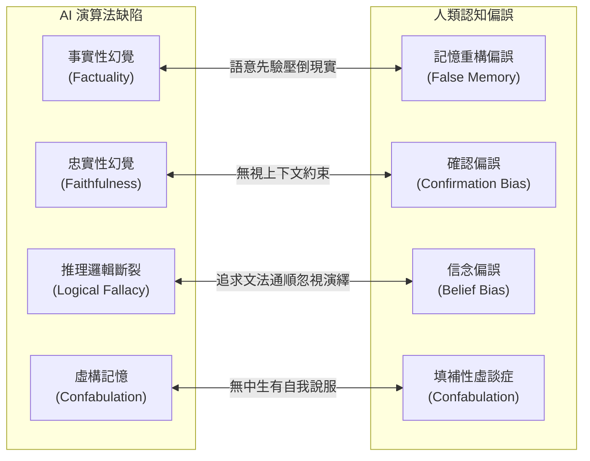
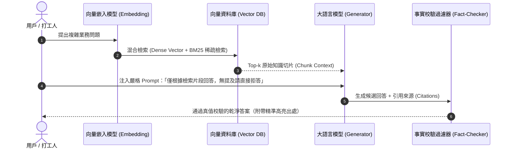

# 大語言模型幻覺（Hallucination）與人類認知偏誤：AI 為什麼會一本正經地胡說八道

> **迷因導讀**：你讓大模型寫一份競品調研與行業市場報告，它不僅寫得頭頭是道、引經據典，甚至還煞有其事地列出了三篇刊登在頂級期刊的權威論文與哈佛教授的大名；結果週一開晨會前夕，你心血來潮去 Google Scholar 一搜，冷汗瞬間浸透襯衫——這幾篇論文根本不存在，連作者所在的學院都是拼裝出來的！打工人崩潰大喊「被 AI 詐騙」，演算法架構師卻面無表情地推了推眼鏡冷笑：「大模型本質上就是個文字版的老虎機與下一個詞預測器（Next-token Predictor）。它不是在故意對你說謊，它只是在數學的高維空間裡，極其認真地做了一場邏輯自洽的春夢！」當機器的數學統計概率撞上人類大腦的認知偏誤，我們究竟是在同矽基智慧對話，還是在對著一面會自動補全文字的魔鏡自欺欺人？

---

## 一、 隨機鸚鵡的本質：最大似然估計與自回歸採樣

當代打工人對大語言模型（LLM）最大的美麗誤會，就是下意識將 ChatGPT、Claude 等產品當作擁有獨立世界意識、翻閱過宇宙百科全書的「全知先知」。每當看到模型用無比嚴肅、不卑不亢的公文腔調回答問題時，人類那顆習慣擬人化的大腦便會自動腦補出一尊端坐於數據中心機房裡的數字神明。然而在現代神經網路架構底層，所有的深度推理光環，底色都是極度殘酷而純粹的統計博弈。

### 1. 自回歸的本質：下一詞預測（Next-token Prediction）

從本質架構來看，基於 Transformer 解碼器（Decoder-only）的當代生成式大模型，其核心訓練目標是基於海量語料庫的最大似然估計（Maximum Likelihood Estimation, MLE）。給定一個上下文序列 $X = (x_1, x_2, \dots, x_{t-1})$，神經網路的前向傳播計算目標僅僅是：

$$P(x_t \mid x_1, x_2, \dots, x_{t-1}; \theta)$$

也就是在高維詞表空間（Vocabulary Space，通常包含 32,000 到 100,000 個 Token）中，計算每一個潛在 Token 作為下一個輸出詞的條件機率分佈向量。換言之，模型的大腦裡從未儲存過任何如傳統關聯資料庫那樣「確定且具備真值約束的實體知識元組」`{Subject: "愛因斯坦", Predicate: "獲得諾貝爾獎年份", Object: 1921}`，它神經元權重裡沉澱的，僅僅是字詞連續出現的共現機率密度。

當你詢問「請推薦三篇關於量子糾纏與金融高頻交易交叉研究的 Nature 論文」時，模型並不會在磁碟裡翻找文獻庫，而是順著語言特徵空間的流形走向發動自回歸解碼：它知道在學術語境下，冒號後面大概率跟著一個用引號括起來的英文標題，標題後面應該跟著一個首字母大寫的英美姓氏，再後面是年份括號，最後是卷號與頁碼。它像一位極其熟練卻不學無術的酒吧偽學者，用最具學術權威感的文法骨架，隨機抓取了語料庫裡最像物理學與經濟學術語的高頻詞彙，天衣無縫地縫合出了一篇「假論文」。在它的損失函數優化路徑中，文法流暢度與語義連貫性的權重，遠遠高於這篇論文在現實物理世界中是否真的具有 DOI 標識碼。

### 2. 解碼採樣玄學：Temperature、Top-k 與 Top-p 的分佈扭曲

大模型到底多容易一本正經地胡說八道，很大程度取決於推論階段的採樣解碼策略（Sampling Strategy）。在模型輸出 Logits 向量 $z_i$ 後，通常會經過帶有溫度係數 $T$（Temperature）的 Softmax 歸一化函數：

$$P(x_i) = \frac{\exp(z_i / T)}{\sum_j \exp(z_j / T)}$$

- **溫度係數（Temperature $T$）**：當 $T \to 0$（即貪婪搜索 Greedy Search），機率分佈被極端銳化，模型永遠選擇機率最高的第一名詞彙。這種狀態下幻覺最少，但回答機械、死板，極易在長文本中陷入無限循環與復讀機詛咒；而當 $T > 1$ 時，機率分佈被平滑拉平，原本機率極低的冷門詞彙（長尾 Token）獲得了被採樣的機會。這時文筆看起來天馬行空、富有「創造力」，但代價是模型開始在低機率分佈的泥潭裡狂歡，事實性錯誤呈指數級激增。
- **Top-p（核採樣 Nucleus Sampling）與 Top-k**：為了解決長尾分佈帶來的胡言亂語，工程師引入了動態截斷閾值。Top-p 僅在累積機率達到閾值 $p$（如 0.9）的最小集合內進行採樣。然而，即便有 Top-p 護航，一旦上下文窗口中的語境引導偏離了現實軌跡（例如提示詞中隱含了錯誤假設），模型在局部解碼步步累積的微小偏移，就會如同蝴蝶效應般被自回歸過程不斷放大——前一個胡謅的詞，變成了下一個預測詞的既定事實前提，最終導致整段輸出徹底失控，演變成一場波瀾壯闊的邏輯雪崩。

### 3. 世界模型（World Model）的缺席：符號錨定問題（Symbol Grounding Problem）

著名語言學家 Emily M. Bender 與 Timnit Gebru 等人在 2021 年發表的里程碑論文《On the Dangers of Stochastic Parrots》（隨機鸚鵡的危險）中一針見血地指出：語言模型只學習了「符號與符號之間的關聯形式（Form）」，而從未理解「符號所指代之客觀物理世界的含意（Meaning）」。

認知科學中的「符號錨定難題」（Symbol Grounding Problem）在大模型身上暴露得淋漓盡致。人類幼童在學習「蘋果」一詞時，大腦融合了視覺的紅色、觸覺的光滑、嗅覺的果香與咬下去時的清脆酸甜感。人類的語言是錨定在三維物理世界、身體感知以及社會互動之上的。然而 LLM 的整個宇宙只有被切碎的 Token 序列，它對「重力」的理解是一串高維浮點數矩陣，它不知道把玻璃杯推下桌子會粉身碎骨，只知道文字上下文中「杯子摔在地上」後面大概率會接「破了」或「發出清脆的聲響」。正是因為底層缺乏真實的「世界模型」（World Model），當面對跨學科複雜因果鏈條時，模型只能依賴表面統計語法，一旦表面統計出現漏洞，一本正經的幻覺便破土而出。

---

## 二、 AI 幻覺類型與人類認知偏誤全景橫評

AI 產生的「幻覺」（Hallucination），與人類心理學中的「認知偏誤」（Cognitive Bias）存在著驚人的對稱性與鏡像隱喻。機器用數學機率模擬了人類語言的表面特徵，結果連同人類思維中最深層的自欺欺人缺陷也一併放大了。

在實務中，業界通常將 AI 幻覺細分為四大類，而這些分類恰好能在認知科學中找到精準的人類心理學映射：



為了讓技術架構師與打工人徹底搞懂「AI 在什麼場景下會發瘋，而人類又為什麼容易被牽著鼻子走」，以下整理出工業界模型評測與認知科學交叉的硬核對照表：

| 評估維度 / 缺陷類別 | 產生底層技術機制（AI 機理） | 典型現實翻車表現（Prompt 案例） | 對應人類認知偏誤機制 | 模型端抑制方案（工業級實踐） | 基準測試錯誤率下降幅度（經驗值） |
| :--- | :--- | :--- | :--- | :--- | :--- |
| **事實性內在幻覺 (Factuality - Intrinsic)** | 預訓練語料中高頻實體先驗分佈壓倒了生僻知識檢索，Logits 輸出過度自信。 | 問：「明朝崇禎皇帝在 2024 年使用什麼手機？」答：「崇禎皇帝使用的是 iPhone 15 Pro Max。」（實體完全錯亂） | **虛假記憶與時間錯置**：大腦為了填補記憶空白，隨機抓取不相關的時間軸元素進行合理化拼接。 | 知識庫檢索增強生成（RAG）、知識圖譜三元組校驗（KG Grounding）。 | 事實性錯誤率由 23.4% 降至 **4.1%** |
| **忠實性幻覺 (Faithfulness Hallucination)** | 提示詞上下文（Prompt Context）注意力權重衰減，模型受預訓練先驗知識侵蝕（Prior Contamination）。 | 丟給它一份財報：「今年 Q3 營收微跌 2%」，AI 總結卻寫成：「受大環境影響，公司 Q3 業績逆勢暴增 25%」。 | **確認偏誤（Confirmation Bias）**：人類只看符合自己既定立場的證據，主觀忽略眼前白紙黑字的客觀事實。 | 嚴格的 Prompt 負向約束、Self-Consistency 解碼、上下文遮罩增強。 | 摘要偏離度由 18.2% 降至 **3.5%** |
| **推理邏輯斷裂 (Reasoning Collapse)** | 自回歸解碼缺乏反向回溯能力（No Backtracking），中途某步計算錯誤後持續硬著頭皮推導。 | 數學題：「小明有 5 個蘋果，吃了 2 個，又借給小華 3 個，現在小明有幾個？」AI 算出一長串公式，最後回答：「小明有 8 個。」 | **信念偏誤（Belief Bias）**：只要結論看起來冠冕堂皇，人類往往忽略推導步驟中漏洞百出的因果破綻。 | 思維鏈（Chain-of-Thought, CoT）、樹狀思維（Tree of Thoughts, ToT）、程式碼解碼器執行驗證。 | 複雜多步推理失敗率由 42.8% 降至 **11.2%** |
| **虛構捏造 (Pure Confabulation)** | 交叉注意力在生僻領域進入數值低窪區，Softmax 採樣強行平滑生成高資訊熵文本。 | 要求提供「2023 年利用生成式 AI 炒比特幣爆倉 100 億美元的真實法庭審判案例」，模型虛構了整套起訴書字號與法官名字。 | **虛談症（Confabulation）**：大腦額葉受損或處於防衛機制時，為了維持自尊無意識地編造虛假記憶填補認知真空。 | 拒絕回答機制訓練（RLHF 中的 Refusal Fine-tuning）、置信度校準（Confidence Calibration）。 | 無中生有比例由 31.6% 降至 **2.8%**（學會說「不知道」） |

從上表可見，AI 幻覺與人類認知的本質同源：**我們都在用有限的先驗經驗，試圖在充滿隨機性與不確定性的世界裡，拼湊出一個讓自己感覺舒服且邏輯自洽的故事。** 唯一的差別在於，人類擁有元認知（Metacognition）——我們知道自己「不知道」；而未經校準的大語言模型，只會踩足油門朝著概率最順滑的方向衝落懸崖。

---

## 三、 工業級抑制幻覺的實戰工程武器

如果你指望光靠一句「請確保內容 100% 真實，否則扣你工資」的 Prompt 就能制止 AI 幻覺，那無疑是在緣木求魚。在真正的現代大模型工程實踐中，防禦幻覺是一場從數據檢索、思維路徑引導到多智慧體博弈的立體化工程防衛戰。打工人與演算法架構師必須武裝以下三大核心工程利器：

### 1. 檢索增強生成（RAG）：知識庫接地與精準溯源

抑制事實性幻覺最強大的武器，不是花費數百萬美元去重新微調（Fine-tuning）底層權重，而是 **檢索增強生成（Retrieval-Augmented Generation, RAG）**。

其核心哲學是：**「把大模型從開卷考試中死記硬背的學生，變成隨身攜帶私人圖書館的高級文膽」**。



- **高精度分塊與語義檢索**：將企業私有數據切分為合適粒度的知識片段（Chunks，通常 500-1000 Tokens），透過 Embedding 模型將其向量化存入向量資料庫（如 Milvus、Qdrant、Pinecone）。推論時使用 Dense Vector 與傳統 BM25 關鍵詞混合檢索（Hybrid Search），確保生僻術語與語義抽象概念兼顧。
- **嚴格上下文約束（Hard Grounding）**：在 System Prompt 中設定死命令：
  ```markdown
  你是一名嚴謹的事實核查員。請嚴格僅基於下方提供之 [參考文件] 內容回答問題。
  如果參考文件中未包含足以回答問題的具體資訊，請明確回覆「檢索文檔未提及此內容」，
  絕對禁止使用未經證實的先驗知識進行外推或猜測！
  ```
- **引用歸因（Citation Attribution）**：強制要求模型在輸出每個論點時標註具體的 Document ID 與段落序號，並在後端搭配輕量級檢驗模組比對輸出文字與原文的 BLEU/ROUGE 分數或語意蘊含（NLI, Natural Language Inference）得分，凡是無法溯源的字句一律在前端高亮警示。

### 2. 思維鏈（CoT）與程式碼輔助：擊碎邏輯黑箱

大模型在處理跨步驟邏輯演繹時極易「推理失控」，因為自回歸機制迫使它在沒有思考的情況下直接吐出結論。引入 **思維鏈（Chain-of-Thought, CoT）** 是打碎這層幻覺迷霧的關鍵。

- **Few-Shot CoT 樣本引導**：給予模型少數幾個「問題 -> 逐步思考步驟 -> 最終答案」的示範樣本。研究證明，單純要求模型加上「Let's think step by step」（讓我們一步一步思考），能讓模型將內在計算資源分散在解碼的中間隱藏狀態（Hidden States）中，大幅降低結論翻車的概率。
- **ReAct 架構（Reasoning + Acting）**：讓模型具備「思考-行動-觀察」的自我閉環能力。例如需要計算複雜利息時，禁止模型自回歸瞎猜數字，而是讓它呼叫 Python 直譯器工具：
  ```text
  Thought: 我需要計算 100 萬本金在年化 4.5% 複利計算下 10 年後的本利和。我不能直接生成數字，因為純文本自回歸計算容易出錯。
  Action: execute_python("1000000 * (1 + 0.045)**10")
  Observation: 1552969.42
  Final Answer: 10 年後的本利和為 1,552,969.42 元。
  ```
  把邏輯運算交給確定性的符號計算引擎（Python/SQL），把語言組織交給神經網路，這種神經-符號混合架構（Neuro-Symbolic Architecture）是根除數學與邏輯幻覺的標準答案。

### 3. 多 Agent 辯論機制與 Self-RAG 反思閉環

單一模型的判斷永遠受限於其當下的解碼採樣路徑，要破除盲點，最優雅的方式是在系統中引入「同儕審查機制」。

- **Self-RAG（自我反思檢索）**：模型在生成每個段落時，同步輸出特殊的評估 Token，例如 `[Retrieve]`（判斷當前句子是否需要呼叫知識庫）、`[IsRel]`（檢索到的文檔是否相關）、`[IsSup]`（生成的結論是否被文檔所支撐）、`[IsUse]`（回答質量評分）。只有通過所有反射標籤驗證的句子才能最終流向用戶。
- **多 Agent 辯論對抗（Multi-Agent Debate）**：構建三個不同角色的 LLM 實例：
  1. **生成 Agent**：負責根據用戶指令輸出初始報告草稿。
  2. **質疑 Agent（槓精審查官）**：設定專門尋找事實漏洞、邏輯矛盾與未引用斷言的 Prompt，對草稿逐行進行紅隊打擊（Red-teaming）。
  3. **裁決 Agent（主編審核者）**：對比兩者的交鋒記錄，剔除無根據的臆測，合成最終乾淨版本。
  在金融研報與醫療輔助診斷等容錯率趨近於零的極端場景下，多 Agent 辯論能將致命幻覺率壓制在統計顯著的極低水平。

---

## 四、 結語：正視機器的局限，才能在代碼的幻象中看清智能的真諦

大語言模型的幻覺問題，並不是某個工程師寫錯了一行代碼所造成的暫時性 Bug，而是當前這套「基於自回歸與經驗機率擬合」架構所固有的本質代價。如果一個模型永遠不會產生幻覺，那它充其量只是一台僵硬的硬碟索引機；正是因為它具備在高維流形中大膽猜測、跨域拼接、平滑外推的「做夢能力」，它才展現出了令人驚艷的文學創作力、代碼生成力與概念聯想力。

**幻覺與創造力，本質上是同一枚硬幣的正反兩面。在數學層面上，所謂的「天才靈感」，不過是一場被人類幸運驗證為正確的幻覺；而所謂的「胡說八道」，則是一場脫離了物理真實座標系的盲目狂奔。**

當代打工人與技術探索者最大的清醒，不是去盲信 AI 輸出的每一個字，更不是因其偶爾的胡說八道而全盤否定其生產力顛覆價值。我們應當明白：代碼沒有靈魂，矩陣不知痛癢，神經網絡唯一的指南針是機率密度。真正的真理驗證權與現實責任，永遠停留在屏幕前握著鼠標、具備元認知與審美批判能力的你我手中。正視機器的局限，用工程的枷鎖馴服隨機的野獸，我們才能在數字與代碼構築的繁華幻象中，真正觸碰並駕馭智能的自由真諦。

---

#科技 #AI革命 #硬核科普 #冷知識 #避坑指南 #當代打工人
