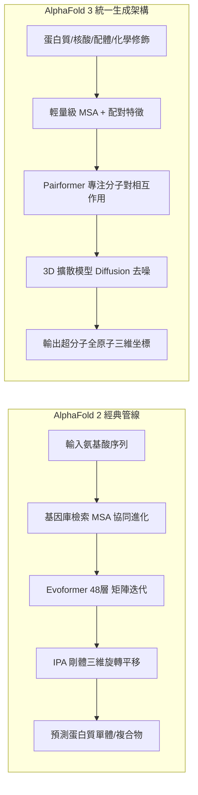

# AlphaFold 顛覆蛋白質結構預測：AI 如何把數十年的生物實驗縮短至幾分鐘

> **迷因導讀**：傳統結構生物學家在零下低溫暗室裡長晶體、跑冷凍電鏡、照 X 射線照到頭髮掉光，博士讀到第六年還在祈禱分子「行行好給個單晶」；結果 DeepMind 的工程師喝著燕麥奶拿卡布奇諾，算力集群按個 Enter 鍵，兩億多個蛋白質結構全部開源白送！諾貝爾化學獎評委會光速滑跪頒獎。這不是降維打擊，這是上帝直接把生命的源代碼反編譯後推送到 GitHub 上，生物狗們集體破防後，含淚重構了自己的職業生涯。

---

## 一、 萊文索爾悖論（Levinthal's Paradox）：大自然最精密的摺紙遊戲

在生物醫藥的世界裡，有一句代代相傳的社畜真理：「序列決定結構，結構決定功能，而解不出結構決定你延畢。」

生命本質上是一臺由蛋白質驅動的高精密奈米機器。無論是幫你運送氧氣的血紅素、在突觸間傳遞快樂多巴胺的受體，還是幫你把昨晚熬夜吃下的炸雞分解掉的消化酶，它們在本質上都只是一串由 20 種基本氨基酸（Amino Acids）串起來的一維「珍珠項鍊」。

但問題來了：一串軟趴趴的一維多肽鏈，根本不具備任何生化催化活性。它必須在水溶液環境中，經過極其精密的扭轉、摺疊、擠壓，把疏水性的氨基酸藏在核心、把親水性的基團暴露在表面，精確摺疊成特定且穩定的三維立體構象（3D Conformation），才能形成鎖孔一般的活性口袋（Active Site），執行化學反應。

這聽起來像是在玩摺紙，但這場摺紙遊戲的複雜程度足以讓所有超級計算機當場死機。

1969 年，美國分子生物學家塞勒斯·萊文索爾（Cyrus Levinthal）提出了一個著名的思想實驗，史稱**「萊文索爾悖論」（Levinthal's Paradox）**：
假設一個非常普通、長度僅有 100 個氨基酸的小型蛋白質。每個氨基酸殘基與相鄰殘基之間的主鏈化學鍵有大約 3 種相對穩定的旋轉二面角（$\phi$ 和 $\psi$ 角）。那麼，這條多肽鏈理論上可能存在的構象總數就是：

$$3^{100} \approx 5 \times 10^{47} \text{ 種可能構象}$$

假設這條多肽鏈是以物理學極限——分子熱運動單鍵旋轉的最快速度（皮秒級，即 $10^{-13}$ 秒探索一種構象）來進行隨機試錯：

$$\text{窮舉所需時間} = \frac{5 \times 10^{47} \times 10^{-13} \text{ 秒}}{3.15 \times 10^7 \text{ 秒/年}} \approx 1.58 \times 10^{27} \text{ 年}$$

要知道，目前我們觀測到的整個宇宙年齡，也不過才 $1.38 \times 10^{10}$ 年（約 138 億年）！換句話說，如果大自然靠「隨機碰撞」去尋找自由能最低的天然穩定態，哪怕從宇宙大爆炸的第一秒開始搖號，搖到宇宙熱寂，這條蛋白質連十億分之一的空間都還沒試完。

然而荒謬而美妙的現實是：**人體細胞內的核糖體剛把這條多肽鏈吐出來，它在幾微秒（$\mu s$）到幾毫秒（$ms$）內，就自發且極其優雅地摺疊成了那個唯一的、正確的活性構象。**

半個世紀以來，人類結構生物學家為了解開這個迷思，付出了近乎自虐的代價：
1. **X 射線晶體學（X-ray Crystallography）**：你得先花幾個月甚至幾年，像養祖宗一樣伺候蛋白質，祈求它在特定鹽濃度與 pH 值下析出完美的「單晶」。如果長不出來？重來。如果長出雜質？重來。長出來後再拿到同步輻射光源去照 X 射線，根據衍射斑點做反向傅立葉變換推導電子雲密度。
2. **冷凍電鏡（Cryo-EM）**：幾千萬台幣一台的 Titan Krios 電鏡，樣品要在幾千分之一秒內急速冷凍在液乙烷中形成玻璃態冰，拍下幾十萬張低信噪比的二維顆粒投影，再用工作站拼命做三維重構。

解一個結構，平均耗時 1 到 3 年，燒掉數十萬美元，無數博士生青絲熬成白髮，甚至發文章時還可能被隔壁組提前兩天搶先提交 PDB（Protein Data Bank）而化為泡影。直到 2020 年 CASP14 大賽，AlphaFold 2 帶著斷崖式領先的分數橫空出世，蛋白質摺疊這座矗立了 50 年的珠穆朗瑪峰，被 AI 用一張顯卡暴力推平了。

---

## 二、 AlphaFold 2 到 AlphaFold 3 的算法架構躍遷

許多外行人以為 AlphaFold 只是個「大號圖像識別卷積神經網絡」或者「照貓畫虎的匹配器」，這完全低估了 DeepMind 那群頂級計算機科學家與生物物理學家的降維設計。蛋白質結構預測之所以能被攻克，本質上是因為 DeepMind 把**演化生物學的協同突變規律**與**現代三維幾何深度學習**做到了極致融合。

到了 2024 年發布的 AlphaFold 3，DeepMind 更進一步將預測範疇從「單純的蛋白質多肽鏈」，一口氣跨越到「蛋白質-DNA-RNA-小分子配體-離子修飾」的全生命複合物！

為了讓大家徹底看懂兩代架構的封神之處，我們整理了底層算法演進的硬核對比：

### 表格：AlphaFold 2 與 AlphaFold 3 算法與物理模塊全景對比

| 維度 / 模塊 | AlphaFold 2 (2020/2021) | AlphaFold 3 (2024) | 技術突破與物理意義解讀 |
| :--- | :--- | :--- | :--- |
| **輸入對象與泛化能力** | 僅限蛋白質單體與寡聚體（AlphaFold-Multimer） | 涵蓋蛋白質、DNA、RNA、化學小分子（配體）、金屬離子及化學修飾 | 擺脫純多肽限制，實現真正意義上的「通用全生物分子複合物」預測 |
| **核心表示與特徵演繹** | **Evoformer (48 Blocks)** 深度交織 MSA 特徵與殘基對（Pair）矩陣 | **Pairformer (48 Blocks)** 大幅簡化 MSA 處理，側重分子間相互作用矩陣 | 減少對超大 MSA 演化信息的剛性依賴，大幅提升對孤兒序列與配體的建模速度 |
| **空間坐標生成核心** | **IPA (Invariant Point Attention)** 結合局部歐幾里得剛體旋轉與平移框架 | **Diffusion Module (擴散模塊)** 類似生圖模型的 3D 坐標去噪網絡（3D Denoising） | 徹底拋棄傳統化學鍵長/鍵角剛體幾何約束，直接在 3D 空間從白噪聲還原原子坐標 |
| **交叉協同注意力機制** | 三角形自我注意力（Triangle Attention） 嚴格滿足幾何三角不等式（$D_{ik} \le D_{ij} + D_{jk}$） | 增強型三角形注意力 + 交叉多模態投影 | 將非共價相互作用、氫鍵網絡、立體位阻以張量幾何約束形式硬編碼進網絡層 |
| **置信度評估指標** | **pLDDT**（局部距離差測試，0-100） **PAE**（預測對齊誤差矩陣） | **pLDDT + PAE + PDE** 新增接觸概率矩陣與配體對齊誤差 | 科研人員不再需要盲猜，模型能明確指出「哪一段是高精度剛體，哪一段是無序柔性環」 |
| **計算效率與資源消耗** | 依賴龐大的外源基因數據庫巨量檢索（Big MSA） | MSA 檢索量縮小 70%，推理階段由擴散模型在幾秒內多次採樣完成 | 將常規大分子複合體預測耗時從數小時壓至幾分鐘，支持更高通量的藥物虛擬篩選 |

#### 1. 為什麼要搞 Evoformer？看懂「協同突變」（Co-evolution）的數學精髓
在 AlphaFold 之前，科學家手裡積累了大量的基因測序數據（一維序列極其便宜且海量），但缺乏三維結構。DeepMind 意識到：生物在億萬年的進化長河中，如果蛋白質內部空間上離得很近的兩個殘基，其中一個因為基因突變變大了（例如甘氨酸變成笨重的色氨酸），為了不把結構撐爆，另一個在空間上與它接觸的殘基通常也必須發生突變變小（例如精氨酸突變成丙氨酸）。
這就是**「協同突變」**！
AlphaFold 2 設計的 **Evoformer** 模塊，不再是簡單地把序列丟進 Transformer，而是建立兩個平行的特徵矩陣：一個是 **MSA 矩陣**（多序列比對，記錄進化軌跡），另一個是 **Pair 矩陣**（殘基與殘基兩兩之間的相對距離與角度）。Evoformer 讓這兩個維度進行深度的交叉注意力運算：MSA 的變異規律不斷修正空間對的距離猜想，空間幾何的合理性又反過來指導 MSA 的特徵提取。

#### 2. 三角形更新（Triangle Attention）：把歐幾里得幾何焊死在注意力裡
你隨意給出任意三個點 A、B、C，它們之間的距離必須滿足歐氏幾何的公理：任意兩邊之和大於第三邊（三角不等式）。早期的神經網絡經常預測出「A 離 B 很近，B 離 C 很近，但 A 離 C 卻繞了銀河系一圈」的荒唐空間悖論。
DeepMind 引入了**三角形自我注意力（Triangle Attention）**與**三角形乘法更新（Triangle Multiplicative Update）**。在計算殘基 $i$ 和 $j$ 的注意力權重時，強制引入第三個頂點 $k$ 進行邊信息的循環乘積運算：

$$Z_{ij} = \sum_{k} W_1(Z_{ik}) \odot W_2(Z_{jk})$$

這相當於直接把「三維空間圖論的度量張量閉包」內化為了神經網絡的前向傳播邏輯！

#### 3. 從 IPA 到 Diffusion：AlphaFold 3 為何轉向生圖架構？
AlphaFold 2 的結構模塊使用的是 **IPA（Invariant Point Attention，不變點注意力）**，它是基於主鏈碳骨架的剛體坐標系（李群 $SE(3)$ 旋轉平移群）進行連續坐標投影。這在蛋白質上運作極好，但一旦遇到 DNA 的磷酸骨架、RNA 的複雜扭結、或者是完全沒有肽鍵剛體參考系的小分子化學藥物（Ligand）時，IPA 的剛體假設就捉襟見肘了。
AlphaFold 3 果斷「壯士斷腕」，廢除了複雜且充滿先驗假設的剛體幾何模塊，換成了當前在圖像生成領域統治級的**擴散模型（Diffusion Module）**！
它將原子坐標完全初始化為高斯白噪聲，在 Pairformer 提供的幾何特徵引導下，進行數百步的反向去噪（Denoising）。就像 Midjourney 從一團雜訊中雕刻出一張賽博朋克美女一樣，AlphaFold 3 在幾秒鐘內，從三維空間雜訊中「去噪」出一個各原子共價鍵、氫鍵、凡德瓦半徑完全符合真實物理化學規律的超分子複合體結構！

---

## 三、 新藥研發的範式顛覆與現實邊界

AlphaFold 的出現，讓整個製藥工業與學術界直接進入了「超音速時代」，但狂歡之後，踩過無數坑的當代藥物研發人逐漸發現：**AI 解決了「靜態結構」的看見問題，但新藥研發的死穴遠不止於此。**

### 1. 靶點發現與先導化合物設計：週期從 5 年暴力壓縮至 6 個月
在過去，一個新藥研發項目（尤其是針對難治性罕見病或全新機制靶點），光是「靶點驗證與結構解析」階段，就能耗死一家初創 Biotech。
有了 AlphaFold：
* **暗物質組學重見天日**：人類基因組編碼的約 20,000 種蛋白質中，過去只有不到 17% 在實驗上有高精度三維結構，剩下超過 80% 全是結構未知的「暗物質」。AlphaFold 數據庫直接開放了 2.14 億個結構預測，覆蓋了幾乎所有地球上已知測序物種（從智人、水稻到深海極端微生物）。
* **虛擬高通量篩選（Virtual Screening）升級**：以前藥企買了上千萬個小分子化學庫，沒有可靠結構就只能靠濕實驗（Wet Lab）一個個樣品管在微孔板裡硬篩，耗資數億。現在可以在電腦裡直接把這兩億個結構拿來跑小分子分子對接（Molecular Docking），初篩命中率提升了數倍。

### 2. 現實邊界一：蛋白質不是一塊「死木頭」，它是跳動的動態機器
這是所有拿著 AlphaFold 結構興沖沖去開藥物篩選會的研發經理最容易摔斷腿的大坑：**AlphaFold 預測的是蛋白質自由能最低的基態（Ground State）靜態熱力學快照，而生命的本質是動態（Dynamics）。**

很多致病受體（如 GPCR 跨膜受體、激酶 Kinase）在人體內存在多種亞穩態構象：
* 當它沒有結合配體時，處於非活性封閉態（Inactive State）；
* 當上游信號分子結合後，它的某個跨膜螺旋會發生 15 度的傾斜外翻，暴露出下游 G 蛋白結合位點，變為活性開啟態（Active State）；
* 甚至許多抑制劑藥物，專門利用蛋白質在過渡態（Transition State）時瞬時閃現的「隱蔽口袋」（Cryptic Pocket）進行結合。

AlphaFold 經常預測出一個極其標準、完美的閉合態結構，但當你試圖設計一個變構抑制劑（Allosteric Inhibitor）時，模型根本無法告訴你這個口袋何時打開、打開的能量屏障有多高。AI 看得見這座建築的毛胚房外觀，但算不透門窗在狂風中開合的流體力學。

### 3. 現實邊界二：耐藥性單點突變（Point Mutation）的「一階微擾盲區」
在腫瘤靶向藥物研發中，最讓臨床醫生頭疼的是**耐藥性突變**。例如肺癌患者服用第三代 EGFR 抑制劑奧希替尼（Osimertinib）一段時間後，EGFR 激酶區經常會發生 **C797S** 單點突變——僅僅是把第 797 位的半胱氨酸（Cysteine）換成了絲氨酸（Serine），共價鍵結合直接失效，腫瘤瞬間復發。

這種單點突變在物理上僅涉及幾個原子的微小改動，但它在生物體內引發的表型是「生與死」的劇變。
然而，因為 AlphaFold 的骨幹特徵極度依賴多序列比對（MSA）中的統計協同演化信號，當你在輸入端僅僅改動一個氨基酸字母時，MSA 的整體矩陣分佈幾乎沒有任何統計學變化。這導致 AlphaFold 輸出的預測結構通常「紋絲不動」，給出幾乎一模一樣的坐標。換言之，**它在捕捉高階全局拓撲上是神，但在預測一階微小突變對熱力學穩定性（$\Delta\Delta G$）和藥物親和力的致命微調時，表現得像個木訥的偏科生。**

### 4. 現實邊界三：無序蛋白（IDR）的「義大利麵深淵」
人體內約有 30% 到 40% 的蛋白質含有大段的**內在無序區域（Intrinsically Disordered Regions, IDRs）**。這些區域在沒有與特定伴侶分子結合時，根本就沒有固定的立體結構，它們在溶液中就像一碗被筷子攪拌的義大利麵，瞬息萬變。
當你把這些無序蛋白丟進 AlphaFold，它的 pLDDT 置信度分數會暴跌至 50 以下（一片刺眼的橘紅色），預測出來的結構呈現一根根極其詭異、張牙舞爪的長麵條飄在空中。這不是模型壞了，而是物理現實本就如此——你逼一個本來就沒有固定結構的混沌實體給出一個確定性笛卡爾坐標，AI 只能交出薛丁格的答卷。

---

## 四、 結語：計算生物學的黎明，生命密碼被數字化的終極省思

2024 年 10 月，諾貝爾化學獎頒給了華盛頓大學的 David Baker，以及 DeepMind 的 Demis Hassabis 和 John Jumper。這是歷史上諾貝爾科學獎項以最快速度追認一項前沿計算技術的里程碑事件。

AlphaFold 的偉大，絕不僅僅在於替結構生物學家省下了幾百萬個小時的單晶衍射實驗時間，而是它徹底宣告了**「生命科學從定性觀察學科，全面邁向定量計算學科」**。

過去三百年，生物學在很大程度上是「集郵式」的科學——我們解剖青蛙、提取抗體、分離菌株、拍照切片，我們在無窮無盡的自然變異中收集樣本，試圖從紛繁複雜的偶然性中總結出幾條脆弱的生化法則。
而 AlphaFold 向我們展示了一種全新的可能性：**大自然哪怕經歷了 38 億年的無序演化，其最核心的分子機器底層，依然運行在嚴謹、優雅且可被高維幾何神經網絡完全編碼的數學幾何規律之上。**

當然，這絕不意味著濕實驗生物學家的失業。相反，那些枯燥、重複、賭運氣的篩選工作被 AI 剝離後，人類科學家終於可以把寶貴的智力資源，投入到真正深刻的本質命題中：
* 細胞內複雜信號網絡的動態串擾；
* 免疫系統如何識別自我與非我；
* 乃至運用逆向工程，進行非天然蛋白質的「從頭設計」（De Novo Protein Design），去創造自然界從未存在過、能直接分解海洋微塑料或精準靶向癌細胞的「人造生命奈米機器」。

人類用幾十萬年的時間學會了閱讀基因組的核苷酸字母；又用了半個世紀學會了理解氨基酸單詞；而今天，借助 AI 的神經突觸，我們終於開始讀懂生命用三維結構寫就的宏大史詩。

---

#科技 #健康 #AI革命 #硬核科普 #冷知識
