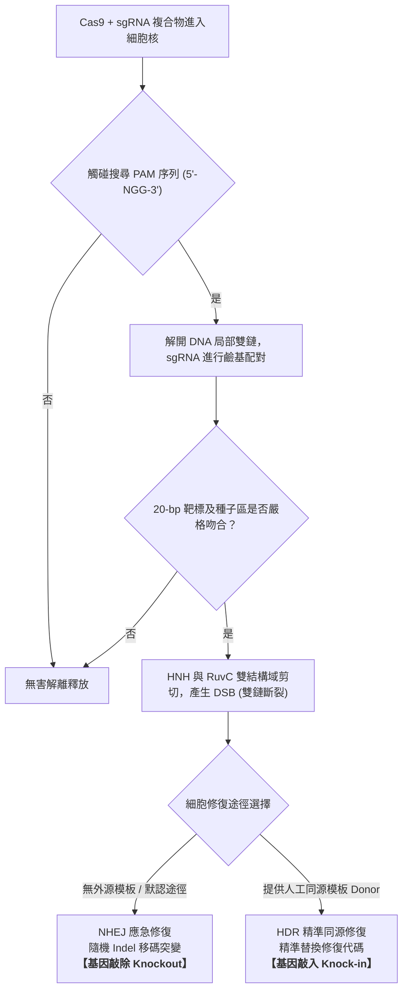

# 合成生物學與上帝代碼：CRISPR 基因編輯、CAR-T 癌症療法與定製生命

> **迷因導讀**：傳統程式設計師用 C++ 寫代碼操控矽基晶片，崩潰了頂多 Core Dump 藍屏重啟；現代合成生物學家坐在通風櫥前，敲著鍵盤用 A、T、C、G 四個鹼基直接在碳基生命染色體上「編譯代碼、燒錄載體、下載到活體細胞裡運行」。這要是寫出個記憶體洩漏或者指針懸掛，可不是重新開機那麼簡單，搞不好就是細胞瘋狂增生、免疫系統全軍覆沒，甚至直接把大自然百萬年演化的生物防火牆轟出個天塹巨坑。當代打工人還在為房貸焦慮，頂級生技極客已經在考慮如何把人類基因組 Git Commit 到「永生版 2.0」。

---

## 一、 細菌的百萬年抗病毒武器庫：CRISPR-Cas9 的分子剪刀原理

如果把地球生命演化史攤開來看，最兇殘、歷時最悠久的網路對抗戰，既不是美蘇冷戰也不是矽谷的駭客攻防，而是**細菌（Bacteria）與噬菌體（Bacteriophage）長達數十億年的攻防拉鋸**。

噬菌體是微觀世界的「硬碟注入木馬」：它降落在細菌表面，用蛋白尾刺狠狠扎穿細菌細胞壁，像針筒一樣將自己的病毒 DNA 暴力注入細菌體內，劫持宿主的轉錄與轉譯工廠瘋狂複製，最後引爆細胞（Lysis）。為了不被這群微觀惡霸滅族，細菌在幾十億年間進化出了一套近乎鬼斧神工的「主動免疫硬體防火牆」——這就是 2020 年斬獲諾貝爾化學獎的 **CRISPR-Cas 系統**。

### 1. 向導 RNA (gRNA) 的雷達鎖定：微觀世界的 GPS 定位
CRISPR（Clustered Regularly Interspaced Short Palindromic Repeats，成簇規律間隔短回文重複序列）本質上是細菌基因組裡的「木馬特徵庫黑名單」。當細菌僥倖從噬菌體口中生還，它的 Cas 蛋白複合體就會像資安工程師截取惡意程式碼特徵一樣，剪下這段病毒 DNA 的片段（稱為 Spacer，間隔序列），物理寫入自己的 CRISPR 磁區中。

在現代合成生物學的改造下，科學家將原本天然系統中分開的 crRNA（識別靶標）與 tracrRNA（結合蛋白）人工融合成了一條單鏈——**向導 RNA（Single Guide RNA, sgRNA）**。
- 這條 sgRNA 長度大約 100 個核苷酸，其中關鍵的前 20 個鹼基就是**客製化導航頭（Spacer region）**。
- 只要科學家在電腦前敲下 20 個鹼基的互補序列，這條 sgRNA 就會像微型巡弋飛彈的尋標器，引導整個切割機械精確滑過人類 30 億對鹼基組成的茫茫遺傳森林，精確定位到那唯一一個發生突變的致病密碼子。

### 2. PAM 原間隔相鄰基序：物理級的防死鎖校驗碼
如果 sgRNA 看到目標序列就無腦切割，那細菌自己的染色體黑名單資料庫豈不是會把自己剁得粉碎？大自然在此設計了一套極其精妙的**雙重驗證協定（2FA）**——**PAM（Protospacer Adjacent Motif，原間隔相鄰基序）**。

以最經典的化膿性鏈球菌（*Streptococcus pyogenes*）Cas9（SpCas9）為例：
- 它所要求的 PAM 序列是極其特定的 **`5'-NGG-3'`**（N 代表任一鹼基，G 為鳥嘌呤）。
- Cas9 蛋白在細胞核內高速隨機熱運動碰撞時，它並不會一上來就解開雙鏈 DNA 去和 sgRNA 硬比對（那樣熱力學能耗太高，算力會被耗盡）。
- 它的物理機制是：**先用蛋白結構域去摸索 DNA 雙螺旋大溝中的 PAM 序列**。只有當它觸摸到 `NGG` 這個物理卡榫，Cas9 的構象才會被瞬間激活，就地撬開局部雙鏈（DNA unwinding），允許 sgRNA 與目標鏈進行鹼基互補配對（Watson-Crick pairing）。
- 如果配對成功，且從 PAM 往上游數的「種子序列（Seed region，約 8-12 bp）」嚴格吻合，信號通路才會通過最後的門禁審查；如果不吻合，Cas9 立刻解離放手，避免誤傷平民。

### 3. Cas9 內切酶雙鏈切割與宿主的修復修羅場
一旦靶向鎖定，Cas9 蛋白體內的兩顆生化利刃便會出鞘：
- **HNH 核酸酶結構域**負責切斷與 sgRNA 互補的那條 DNA 鏈。
- **RuvC 結構域**負責切斷相反的非互補鏈。
- 兩者聯手，在 PAM 序列上游剛好第 3 到第 4 個鹼基的位置，斬下一記俐落的**DNA 雙鏈斷裂（Double-Strand Break, DSB）**。

在細胞的生命邏輯裡，雙鏈斷裂相當於高壓電塔被炸斷，屬於最高等級的警報（DNA Damage Response）。此時，細胞不得不啟動修復程序，而人類科學家正是利用細胞這套焦慮的修復本能，達成了「定製生命代碼」的終極目的：
1. **非同源末端連接（NHEJ, Non-Homologous End Joining）**：
   這是細胞在兵荒馬亂中的「應急膠水補丁」。它不管三七二十一，抓起兩個斷頭就硬接在一起。在拼接過程中，DNA 聚合酶與外切酶極其容易手抖，隨機引入幾個鹼基的插入或缺失（Indels）。這會直接導致蛋白質編碼區發生**讀碼框移碼突變（Frameshift Mutation）**，下游代碼全數錯位，生成提前終止密碼子——**目標基因被完美敲除（Knockout）**。
2. **同源重組修復（HDR, Homology-Directed Repair）**：
   如果我們在注入 Cas9 和 sgRNA 的同時，大量灌入一段人工設計的「修復模板 DNA（Donor Template）」，細胞在修復時就會參考這段模板進行精確複製。此時，科學家便能實現移花接木，在染色體上完成**精準點突變修正、插入特定功能標籤（Knock-in），甚至無中生有寫入一整段全新的生物指令庫**。

---

## 二、 基因編輯與細胞治療前沿技術全景

基因編輯領域的技術迭代速度，甚至超越了摩爾定律。從二十年前如同鈍刀切排骨的早期人工核酸酶，到今天連雙鏈都不用切斷的單鹼基筆刷，再到把人體免疫 T 細胞徹底駭入重構成「活體抗癌終結者」的 CAR-T 療法，整個分子生物學工具箱已經歷了翻天覆地的代際革命。

### 基因治療與細胞工程核心技術縱向對比

| 維度 / 技術指標 | 第一代：鋅指核酸酶 (ZFNs) | 第二代：類轉錄激活因子 (TALENs) | 第三代：CRISPR-Cas9 系統 | 第 3.5 代：單鹼基編輯 (Base Editing) | 第五代：CAR-T 細胞免疫療法 |
| :--- | :--- | :--- | :--- | :--- | :--- |
| **誕生年代與技術本質** | 1990 年代末；人工工程化鋅指蛋白模組串聯 | 2009 年前後；黃單胞菌 TALE 重複結構模組化 | 2012 年爆發；RNA 導向的化膿鏈球菌 Cas 內切酶 | 2016-2018 年；脫氨酶與催化失活 Cas9 (dCas9/nCas9) 融合 | 2010 年代臨床突破；嵌合抗原受體 T 細胞體外重編程 |
| **底層識別機制** | 蛋白-三鹼基DNA結合（每3個鹼基需定制一個指狀蛋白） | 蛋白-單鹼基DNA結合（單個 TALE 模組對應單一 A/T/C/G） | **RNA-DNA 鹼基互補**（僅需更換合成 20nt sgRNA） | RNA 導向，但**不破壞雙鏈骨架**，利用脫氨酶催化化學轉換 | 基因工程化單鏈抗體（scFv）特異性識別腫瘤表面未加工抗原 |
| **靶向脫靶率 (Off-target Rate)** | **高至危險（>5%）**，蛋白交叉結合與細胞毒性嚴重 | 中等（1% - 3%），特異性優於 ZFN 但構建極為繁瑣 | **中-低（0.1% - 1%）**，工程化 High-Fidelity Cas9 可壓至 <0.01% | **極低（<0.001%）**，無 DSB 斷裂，大幅避免染色體易位畸變 | 細胞靶向精準，但存在**靶向脫瘤毒性（On-target off-tumor）** |
| **主流基因遞送載體** | 電轉染質粒 DNA / 逆轉錄病毒 | 電轉染質粒 / mRNA 顯微注射 | **AAV 腺相關病毒**、**LNP 脂質奈米顆粒**、RNP 電穿孔 | **LNP 脂質奈米顆粒包裝 mRNA**、AAV 分割雙載體 | 自體/異體採血，**慢病毒（Lentivirus）**或轉座子體外轉導 |
| **體內作用場所** | 體內（In vivo）或體外細胞行核酸剪切 | 主要用於模式生物胚胎與細胞系體外編輯 | 體內直接注射（肝/眼）或體外造血幹細胞重注 | 體內血管注射直接靶向肝臟脂質代謝基因 | **體外超淨無菌 GMP 工廠培養擴增後回輸體內** |
| **主要適應症與戰場** | 早期 HIV 輔助受體 CCR5 敲除探索 | 植物基因組改造、早生兒白血病應急個案 | 鐮刀型貧血症（Casgevy）、轉甲狀腺素蛋白澱粉樣變性 | 家族性高膽固醇血症（敲除 PCSK9）、早衰症突變修復 | 復發難治性 B 細胞急性淋巴細胞白血病、多發性骨髓瘤 |
| **臨床單次治療費用** | 已基本退出主流商業競爭 | 研發定制成本高昂，商業化管線萎縮 | **約 220 萬美元**（Casgevy 商業定價） | 處於臨床 II/III 期，預估 **150 萬 - 250 萬美元** | **37.5 萬 - 47.5 萬美元**（不含十幾萬美元的 ICU 監護抗 CRS 費用） |

### 關鍵技術深度剖析：

#### 1. 單鹼基編輯（Base Editing）與先導編輯（Prime Editing）：告別暴力碎骨
CRISPR-Cas9 雖然強大，但本質上是把 DNA 砍斷（DSB）。細胞在慌亂修復過程中，有可能引發大片段染色體缺失（Chromothripsis）甚至致癌的染色體易位。
- 哈佛大學 David Liu 實驗室開創的**鹼基編輯器（Base Editor）**，將失去剪切能力的「死 Cas9（dCas9）」或「單鏈切口酶（nCas9）」與胞嘧啶脫氨酶（Cytidine Deaminase）綁定。
- 它就像一隻細微的原子鑷子，把 DNA 雙鏈解開後，**不切斷主鏈骨架**，直接在化學層面上把胞嘧啶（C）脫氨轉化成尿嘧啶（U，隨後複製修復成 T），或者把腺嘌呤（A）轉化成次黃嘌呤（I，隨後變更為 G）。這實現了真正的「基因單字拼寫檢查與原地修改」，將副產物 Indels 發生率壓到幾乎可以忽略不計。

#### 2. 遞送載體的生死博弈：AAV 病毒載體 vs LNP 脂質奈米顆粒
你有全世界最厲害的核酸剪刀，但如果進不去細胞膜，那就連生理食鹽水都不如。
- **AAV（腺相關病毒，Adeno-Associated Virus）**：基因治療界的載人火箭，穿透效率極高、組織嗜性明確（如 AAV8 專攻肝臟、AAV9 專攻神經中樞）。缺點是**貨艙極小（容量上限約 4.7 kb）**，Cas9 蛋白（SpCas9 約 4.2 kb）加上啟動子和 gRNA 塞進去直接艙門焊死，且人體免疫系統會對病毒外殼產生中和抗體，這意味著**人這一輩子通常只能注射一次 AAV，第二次就會被自體免疫飛彈凌空擊落**。
- **LNP（脂質奈米顆粒，Lipid Nanoparticles）**：因為 mRNA 新冠疫苗而聲名大噪的無機護盾。由陽離子脂質、膽固醇、輔助脂質和 PEG 脂質組成，包裹 Cas9 mRNA 和 sgRNA。進入血液後，自發吸附載脂蛋白 E（ApoE），偽裝成乳糜微粒被肝細胞表面 LDL 受體一口吞下，透過內吞體逃逸釋放藥物。其最大的降維打擊優勢在於：**低免疫原性、可反覆給藥、且體內停留時間極短（RNA 翻轉後即降解），大幅降低了脫靶風險**。

#### 3. CAR-T：給免疫系統裝上雷達導引頭與加力燃燒室
如果說 CRISPR 是精準狙擊，那麼 **CAR-T（Chimeric Antigen Receptor T-cell Therapy，嵌合抗原受體 T 細胞療法）** 就是在體外對人體自有的免疫大軍進行賽博龐克式的生化武裝。
1. **抽血提取**：從癌症末期病患體內分離出 T 細胞。
2. **基因刷機**：使用慢病毒載體，把一段人工合成的嵌合抗原受體（CAR）代碼強行植入 T 細胞染色體。
   - **細胞外抗原結合域（scFv）**：取材自高特異性單株抗體的輕重鏈可變區，專門靶向癌細胞表面的專屬身分證（如血液腫瘤表面的 CD19 或 BCMA）。
   - **跨膜鉸鏈區**：穩定結構。
   - **細胞內信號傳導域（CD3ζ）與共刺激域（4-1BB 或 CD28）**：這相當於給 T 細胞裝上了「氮氣加速閥」。一旦 scFv 咬死癌細胞，信號瞬間灌入胞內，引發 T 細胞狂暴增殖，並噴射出海量穿孔素（Perforin）和顆粒酶（Granzyme），將癌細胞打成蜂窩。
3. **百萬大軍回輸**：體外擴增到數億個之後，重新打回患者體內，展開一場滅門式的圍剿。其緩解率在許多無藥可救的白血病患者身上高達驚人的 80% 以上。

---

## 三、 倫理深淵與造物者詛咒

當技術的韁繩從單純的「治病救人」滑向「編輯生命本體」，我們推開的究竟是通往神界的天梯，還是通往潘朵拉魔盒的萬丈深淵？

### 1. 賀建奎事件：被釘在科學恥辱柱上的狂妄盲動
2018 年 11 月，南方科技大學前副教授賀建奎在第二屆人類基因組編輯國際峰會前夕，震撼拋出「世界首對基因編輯嬰兒露露與娜娜誕生」的消息。他利用 CRISPR-Cas9 敲除了這對雙胞胎胚胎中的 **CCR5 基因**，宣稱目的是為了讓她們天生抵抗 HIV 病毒感染。

這場被全球頂級科學界定性為「反人類倫理罪行」的事件，撕開了生技黑客最致命的幾處硬傷：
- **嚴重的脫靶效應（Off-target）與嵌合體現象（Mosaicism）**：在受精卵發育早期進行電穿孔切割，極容易導致一部分卵裂球被編輯、另一部分未被編輯。這對嬰兒體內的細胞組織成了一塊巨大的基因拼圖，且可能背負著數百處未知的隱蔽脫靶突變，可能在未來隨時誘發致命腫瘤。
- **狂妄的生物功能降維假設**：CCR5 絕不僅僅是愛滋病毒的進入門戶，它同時是調節免疫炎症反應與大腦神經可塑性的核心受體。研究顯示，CCR5 缺失的人群在感染西尼羅病毒（West Nile virus）或流感病毒時的死亡率呈幾何級數飆升。用永久破壞重要免疫基因的方式去預防一種現代醫學已有成熟阻斷藥物（PrEP）的傳染病，無異於為了防止手指被紙割傷而提前把雙臂砍斷。
- **生殖細胞編輯的不可逆污染**：體細胞（Somatic cells）編輯的風險終結於個體；而**生殖系（Germline）編輯會將人工篡改的代碼永久寫入人類基因庫**，並隨著繁衍世世代代擴散至全人類基因池，任何一個未曾預料的微小 Bug，都將成為不可逆的物種級詛咒。

### 2. 生理資本主義與階級基因鴻溝：現實版《鐘點戰》
目前的基因編輯療法，本質上是「富豪階級的特權魔法」。
- 前文表格中清晰標註：單次 Casgevy 治療定價 **220 萬美元（約 7000 萬新台幣）**，CAR-T 療法一針 **40 萬美元**。
- 在現有的全球資本分配體系下，全球 99% 的第三世界貧血病患根本無法負擔這項科技紅利。
- 如果這項技術進一步從「修復致病基因」邁向「強化增益基因」（如增強肌肉生長抑素 MSTN 抑制、提高腦源性神經營養因子 BDNF、修改端粒酶延緩衰老），人類社會將迎來有史以來最殘酷的分化：
  **以往的階級差距頂多是財富、房產與教育資源的外在分配；未來的階級差距，將直接固化為染色體長度、神經突觸密度、端粒磨損速率與免疫防禦層級的「生理種姓制度」。** 資本家不僅在資本上壓榨勞工，在生物學層面上也將徹底與普通打工人「物種隔離」。

### 3. 設計嬰兒與生物多樣性的熱力學崩塌
當父母可以像挑選汽車選配一樣挑選胚胎特徵——「加選雙眼皮基因碼、剔除肥胖易感多態性、載入超長耐力慢肌纖維包、超頻智商相關 SNP 位點」：
- **優生學的幽靈將借屍還魂**。社會對「完美人類」的審美將高度趨同，導致人類基因多樣性（Genetic Diversity）遭遇斷崖式毀滅。
- 從演化生物學角度看，**遺傳多樣性是物種對抗未知環境浩劫的唯一緩衝墊**。鐮刀型貧血症的雜合子突變之所以能在非洲演化留存，是因為它能賦予攜帶者對抗瘧疾的生存優勢；囊胞性纖維化的攜帶者對霍亂具有抵抗力。如果人類用當代粗淺且短視的「完美標準」清洗掉了所有被視為瑕疵的基因變異，那麼一場突如其來的未知新型病毒，就足以讓所有擁有「標準化完美代碼」的同質化人類瞬間滅絕。

---

## 四、 結語：當人類掌握了造物主的畫筆，唯有謙卑才是防止自毀的最後煞車

站在合成生物學的奇點邊緣，人類終於第一次從演化的「被動受害者」，僭越成為能夠直接修改生命源代碼的「架構師」。

我們用化膿性鏈球菌這把磨礪了幾十億年的微觀小刀，切碎了遺傳病的枷鎖；我們把白血球調教成巡弋在血管裡的生化鋼鐵人，將絕症晚期的死刑判決改寫為生命的重啟鍵。這無疑是人類理性最璀璨奪目的勝利。

然而，DNA 雙螺旋結構不是開源社區裡隨便一個菜鳥工程師都能隨意 Fork 並暴力 Merge 的無主項目。這本由 30 億個鹼基寫就的生命天書，歷經了四十億年冰川期、大氧化事件與物種大滅絕的血腥單元測試（Unit Test）。每一個看似無意義的「垃圾 DNA（Junk DNA）」，背後可能都隱藏著我們至今未解的三維染色質構象（3D Chromatin Architecture）與表觀遺傳開關。

當我們握緊這支造物主的畫筆時，決定人類文明最終走向星辰大海還是萬劫不復的，絕不是我們的 Cas 酶剪得多快、脫靶率降得多低，而是我們在面對這浩瀚生命法則時，胸膛中究竟還保有多少刻骨銘心的**敬畏與謙卑**。

---

#科技 #健康 #硬核科普 #AI革命 #冷知識 #避坑指南
