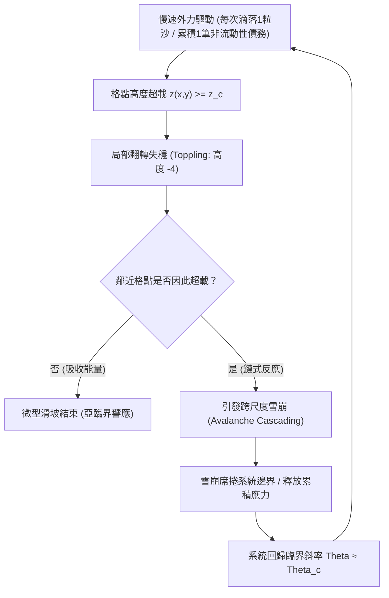

# 複雜系統與崩潰臨界點：自組織臨界性 SOC、沙堆模型、森林火災與金融海嘯

> **迷因導讀**：平靜的日子過了一年又一年，華爾街西裝暴徒、總體經濟國師與各路幣圈KOL天天開香檳，慶祝「大繁榮與永久牛市」；聯準會官員在白板上畫出一條條絲滑的軟著陸曲線，散戶忙著把退休金全倉課金進三倍槓桿ETF。然而就在某個毫無預兆的普通週二，一隻微不足道的蝴蝶在南美洲扇了扇翅膀——或者更精確地說，某個不知名佛羅里達水電工的房貸違約了72美元，又或者一粒平平無奇的沙子從虛空中落在沙堆頂部，瞬間引爆了一場吞噬幾萬億美元資產、將雷曼兄弟送進骨灰罈的超級金融雪崩！事後各路國會聽證會、主流財經名嘴忙著抓替罪羊，怒斥評級機構放水、銀行家貪婪、演算法作弊。這時候，物理學家嘴裡嚼著冷掉的披薩，站在一旁幽幽嘆氣：「別找那隻該死的替罪羊了！整個系統早就在慢速累積中，把自己演化到了『自組織臨界狀態』的刀尖上。當系統進入臨界態，任何一粒沙子、任何一次噴嚏，都注定會成為毀滅宇宙的終極導火索！」

---

## 一、 物理學家的沙堆實驗：自組織臨界性（Self-Organized Criticality）

在傳統牛頓力學或簡化還原論的世界觀裡，人類被灌輸了一種「因果對稱」的直覺謬誤：巨大的結果必然來自於巨大的肇因。飛機失事一定是因為引擎爆炸，帝國滅亡一定是因為百萬雄師壓境，百億基金穿倉必然是因為黑客入侵或國防危機。然而，真實世界不是單擺，更不是乾淨無瑕的斜面滑塊——它是充滿非線性反饋、局部耦合與層級反饋的「複雜系統」（Complex Systems）。

1987年，布魯克海文國家實驗室的丹麥物理學家佩爾·巴克（Per Bak）、美籍華裔物理學家湯超（Chao Tang）與庫爾特·維森菲爾德（Kurt Wiesenfeld）聯手發表了一篇震撼統計物理學界的里程碑論文：《Self-organized criticality: An explanation of 1/f noise》。他們提出的「BTW 沙堆模型」（Bak–Tang–Wiesenfeld Sandpile Model），徹底打破了還原論的幻覺。

### 1. BTW 模型的心智模型與數學機制

想像一個光滑的桌面，你以極其緩慢、均勻的節奏，每次只在中心隨機落下**一粒沙子**（這在動力學中稱為「慢速驅動」，Slow Driving）。

在起初階段，沙堆非常平坦。一粒沙子落下來，頂多滾動半公分就停下，系統的響應極度局部且平淡無奇；隨著沙子越積越多，沙堆逐漸隆起，斜坡的坡度 $\theta$ 開始逼近沙粒物理堆疊的「休止角」（Angle of Repose, $\theta_c$）。

此時，神奇的現象發生了：這座沙堆**不需要任何中央指揮官，不需要外部精細調節溫度、壓力或控制參數**，它純粹靠著底層相鄰沙粒之間的局部摩擦與重力交互作用，自動「自組織」（Self-Organize）進入了一種隨時可能發生微小滑坡、也隨時可能引發覆蓋全場大雪崩的動態平衡狀態——這就是**自組織臨界性（Self-Organized Criticality, 簡稱 SOC）**。

在二維晶格BTW模型中，每個格點 $(x, y)$ 儲存一個代表局部坡度或沙粒高度的離散變量 $z(x, y) \in \mathbb{N}$。
- 當沙子掉落時：
  $$z(x, y) \leftarrow z(x, y) + 1$$
- 若某格點的坡度超過臨界閾值 $z_c$（例如 $z_c = 4$），該格點即刻發生「失穩翻轉」（Toppling），將多餘的沙粒等量分散給四個相鄰格點（快速弛豫，Fast Relaxation）：
  $$z(x, y) \leftarrow z(x, y) - 4$$
  $$z(x \pm 1, y) \leftarrow z(x \pm 1, y) + 1, \quad z(x, y \pm 1) \leftarrow z(x, y \pm 1) + 1$$
- 如果周圍的鄰居原本高度也是 3，被強迫吸收這顆沙粒後，它們的高度瞬間躍升為 4，隨即引發第二輪、第三輪骨牌式的連鎖失穩！



### 2. 局部微小擾動與冪律分佈（Power Law）

最讓古典工程師破防的，是雪崩規模的機率分佈。

在一般常態分佈（高斯鐘形曲線）的世界裡，極端事件的機率以指數級甚至超指數級衰減。長高3公尺的人類是不存在的，股市單日跌幅70%在常態分佈公式裡是「百億年一遇」。但在自組織臨界系統中，雪崩規模 $S$（單次失穩牽涉的格點總數）與發生頻率 $P(S)$ 嚴格遵循**無標度（Scale-Free）的冪律分佈**：

$$P(S) \propto S^{-\alpha}$$

其中 $\alpha$ 通常落在 $1.0 \sim 1.5$ 之間。

這意味著：**系統內不存在所謂的「典型雪崩規模」！**
引發動搖整座山脈的超級大雪崩，與只撥動兩顆沙子的小滑坡，背後的物理機制與輸入源**一模一樣**——都是那「一粒沙」。

在臨界態下，微觀尺度的局域擾動與宏觀尺度的系統崩潰，通過全系統的長程關聯長度（Correlation Length $\xi \to \infty$）無縫連通。當沙堆處於臨界狀態時，整座沙堆的每一個節點都在冥冥之中與遙遠的另一個節點形成了敏感的力學傳導鏈。你根本無法預測下一粒沙子究竟會安靜躺平，還是直接把整座桌子掀翻。

---

## 二、 跨領域臨界雪崩現象全景橫評

物理學最美妙也最令人膽寒的地方在於：大自然極度吝嗇，同一套數學底層會以截然不同的面貌，套用在沙堆、森林、地殼構造板塊、網路伺服器叢集，以及人類極致貪婪的金融市場上。

無論是地殼構造擠壓、易燃松針的掉落堆積，還是高槓桿衍生品憑證的層層嵌套，它們本質上都是「慢速驅動（緩慢充能）與快速弛豫（瞬間洩能）」的複雜非線性系統。

以下為四種經典跨領域自組織臨界崩潰系統的橫向對比：

| 系統維度 / 特徵指標 | BTW 阿貝爾沙堆模型 (Abelian Sandpile) | 森林火災滲流模型 (Forest Fire & Percolation) | 地殼地震系統 (Gutenberg-Richter Law) | 2008 次貸金融海嘯 (Subprime Financial Crisis) |
| :--- | :--- | :--- | :--- | :--- |
| **慢速驅動源 (Slow Driving)** | 均勻微量滴落的單顆沙粒 ($v_{drive} \to 0$) | 樹木緩慢生長機率 $p$ ($p \ll 1$) | 構造板塊以每年數厘米速度緩慢擠壓碰撞 | 信用擴張、低利率放貸、次級抵押貸款證券化包裝 (MBS/CDO) |
| **快速弛豫機制 (Fast Relaxation)** | 超過靜止角的重力崩落與連鎖翻轉 ($t_{relax} \to 0$) | 閃電點燃樹木引發相鄰林木對流燃燒 ($f \ll p$) | 斷層帶靜摩擦力失效，岩層瞬間破裂錯動滑移 | 違約率飆升觸發保證金追加 (Margin Call)、流動性蒸發、連鎖清算 |
| **能量蓄積物理量** | 晶格高度 $z(x, y)$ / 局部坡度差 $\nabla z$ | 單位面積樹木密度 $\rho$ (林冠連續度) | 構造板塊彈性應變能 (Strain Energy) | 金融機構槓桿率、影子銀行期限錯配程度、CDS 信用違約合約暴露總量 |
| **冪律指數 $\alpha$ ($P(S) \sim S^{-\alpha}$)** | $\alpha \approx 1.22$ (2D二維晶格雪崩規模) | $\alpha \approx 1.15 \sim 1.30$ (燃燒面積分佈) | $b \approx 1.0$ (等價於能量分佈 $\alpha \approx 1.67$) | 跨銀行清算損失網絡分佈 $\alpha \approx 1.4 \sim 1.8$ (尾部肥尾特徵) |
| **關聯長度趨勢 ($\xi$)** | $\xi \to L$ (系統邊界尺度的全域傳播) | 簇（Clusters）跨越整個森林邊界 (滲流閾值 $p_c$) | 地質斷層帶應力轉移波及數百公里範圍 | 全球跨國銀行同業拆借網絡完全連通、無死角傳播 |
| **臨界慢化前兆 (Critical Slowing Down)** | 局部幾何構型恢復靜止時間在翻轉前劇烈上升 | 局部小型火災撲滅恢復時間在密度逼近 $p_c$ 時顯著拉長 | 微震群時空群聚性激增、地震波波速比 ($V_p/V_s$) 異常波動 | 隔夜拆借利差 (TED Spread) 異常擴大、波動率均值回歸速度減半 |
| **人工干預阻斷有效性** | **完全無效**（外部邊界僅能耗散質量，無法消除臨界） | **適得其反**（盲目滅火導致易燃物密度過高，終釀超級大火） | **無法干預**（人類技術無法釋放深層構造萬億焦耳應力） | **短期扭曲，長期惡化**（央行無限QE救市掩蓋清算，累積更大系統脆弱性） |

從上表可以看出，2008年次貸危機在數學結構上，幾乎是「森林火災模型」與「BTW沙堆」的華爾街翻版。

在森林火災模型中，如果林務局官員自作聰明，只要一看到哪怕一公頃的林地著火就立刻派直升機撲滅，結果會是什麼？這片森林將無法通過零星的小火來消耗枯枝落葉。幾十年下來，地表的易燃物堆積到了令人髮指的密度 $\rho > \rho_c$。這時，哪怕只是露營者丟下一顆未熄滅的菸蒂，火勢就會瞬間穿透整個連通的大林冠，演變成吞噬數十萬公頃、連消防員都逃不掉的世紀災難。

這在金融界被稱為「**明斯基時刻**」（Minsky Moment）遇上了「**自組織臨界性**」：央行長期壓低利率、為大機構兜底（相當於積極撲滅小火），所有人便認為市場永遠安全，紛紛加滿槓桿持有CDO（積累易燃枯木）。最終，整個金融網絡的連通性達到了臨界滲流狀態。此時，雷曼兄弟倒閉不是原因，雷曼兄弟只是那顆不幸落下的菸蒂。

---

## 三、 臨界慢化（Critical Slowing Down）與早期預警信號

既然自組織臨界系統的崩潰如此防不勝防，那人類是否只能雙手一攤，坐在沙堆前安詳等死？

複雜系統非線性動力學家給出了一個極度硬核的答案：**你無法預測是「哪一顆特定的沙子」引爆雪崩，但你可以定量測量「系統當前是否已經命懸一線」！**

當一個動態系統逼近分岔點（Bifurcation Point）或臨界相變點時，其狀態空間的吸引子盆（Basin of Attraction）會變得極度平坦。這種現象在物理學中稱為**臨界慢化（Critical Slowing Down, CSD）**。

```mermaid
graph LR
    subgraph 遠離臨界點 (高韌性穩態)
        A1["深吸引子勢阱 (Well)"] --> B1["微小擾動外力"]
        B1 --> C1["強勁負反饋 (恢復極快)"]
        C1 --> D1["低自相關性 / 低方差"]
    end
    subgraph 逼近臨界點 (臨界慢化 CSD)
        A2["勢阱被拉平 (Flat Valley)"] --> B2["微小擾動外力"]
        B2 --> C2["恢復力衰退 (恢復極度緩慢)"]
        C2 --> D2["滯後記憶 / 滯回自相關激增 AR(1) -> 1"]
        D2 --> E2["系統方差發散 (Variance Explosion)"]
    end
```

### 1. 自相關性激增（Autocorrelation Function Lag-1 Spike）

考慮一個一維朗之萬方程（Langevin Equation）所描述的系統狀態 $x(t)$：

$$\frac{dx}{dt} = -V'(x) + \sigma \eta(t)$$

其中 $V(x)$ 為系統的勢能函數，$\eta(t)$ 為高斯白雜訊。若將系統在穩態平衡點 $x^*$ 附近進行泰勒展開線性化：

$$\frac{d\Delta x}{dt} = -\lambda \Delta x + \sigma \eta(t)$$

這裡的 $\lambda = -V''(x^*)$ 代表系統遭受打擊後的**恢復速率**（Resilience Rate）。離散化採樣週期為 $\Delta t$ 的自回歸過程 $AR(1)$ 可表示為：

$$x_{t+1} = \rho x_t + \epsilon_t, \quad \text{其中 } \rho = e^{-\lambda \Delta t}$$

- **當系統處於安全穩態時**：勢阱極深，曲率 $V''(x^*) \gg 0$，因此恢復速率 $\lambda$ 極大，自相關係數 $\rho \to 0$。此時若有一陣外力風吹草動，系統能在幾個震盪週期內迅速拉回平衡點，彷彿一隻不倒翁。
- **當系統逼近臨界崩潰點時**：勢能曲率塌縮 $V''(x^*) \to 0$，導致 $\lambda \to 0$！這意味著系統失去了自我修復的彈性，自相關係數 $\rho \to 1$。系統開始出現「記憶殘留」——昨天的波動會百分之百傳導到今天，前天的混亂會累積到明天。

### 2. 方差發散與閃爍現象（Variance Explosion & Flickering）

根據漲落耗散定理（Fluctuation-Dissipation Theorem），系統在擾動下的方差（Variance）可表示為：

$$\text{Var}(x) = \frac{\sigma^2}{2\lambda} = \frac{\sigma^2}{1 - \rho^2}$$

請仔細觀察這個分母：當 $\lambda \to 0$（即 $\rho \to 1$）時，**系統的方差 $\text{Var}(x) \to \infty$！**

在金融市場崩盤前夕、心臟驟停前的心室纖顫、或是冰川崩解前夕，系統並不會悄無聲息地死去。相反地，它會開始劇烈震顫。原本只在 $1\%$ 區間窄幅震盪的指標，突然動輒出現 $5\% \sim 10\%$ 的極端上下假動作，這在非線性動力學中被稱為**閃爍（Flickering）**。這是因為平坦的勢阱已經無力約束系統，微小的隨機雜訊就能把狀態推到離平衡點極遠的地方。

### 3. 當代實戰者的三大硬核避坑指南

理解了自組織臨界性與臨界慢化，我們該如何在個人投資、組織架構與職業生涯中保命？

#### 指南一：拋棄「高斯分佈」盲思，用「極值統計學」為肥尾資產定價
別再相信那些宣稱「回撤不超過三個標準差」的理財顧問。在處於SOC態的金融世界中，極端回撤不是「黑天鵝」，而是內生生成的「灰犀牛」。
- **避坑操作**：切勿使用未經厚尾修正的夏普比率（Sharpe Ratio）或VaR（在險價值）來評估風險。當你發現你持有的投資標的其一階自相關係數 $AR(1)$ 連續數週逼近 $0.8$ 以上、且滾動30天的波動方差突然脫離長期基準向上發散時，別聽信基本面利多，那是臨界慢化的死神警鐘，立刻降低槓桿、提高現金部位。

#### 指南二：警惕組織與系統的「過度優化」（Hyper-Optimization Trap）
在商業管理與軟體架構中，所有追求「極致零庫存（Just-In-Time）」、「算力利用率99.9%」的降本增效行為，本質上都是在向沙堆上強制倒沙，拔除所有的吸收緩衝區（Damping Buffer）。
- **避坑操作**：高韌性系統的秘訣在於**模組化隔絕（Modularity）**與**適度冗餘**。就如同核反應堆的防護罩、輪船的水密隔艙，你必須確保單一節點超載翻轉時（Toppling），能有物理隔斷阻止雪崩跨層穿透。如果你是一家新創公司的架構師，寧可浪費 $20\%$ 的雲端預算保留冷備援，也不要讓微服務架構變成無阻尼的骨牌陣列。

#### 指南三：停止人為壓抑微小波動，主動引入「受控火災」（Controlled Burns）
任何試圖壓抑局部波動的人工維穩手段，最終都會將系統推向自組織臨界態的毀滅深淵。
- **避坑操作**：在個人職涯與團隊管理中，學會像林務局正確管理森林一樣，定期主動進行「受控燒荒」（Controlled Burns）。不要把所有的不滿與Bug壓到年終大審判，不要將所有的技術債封存到下個季度。小震不斷，大震不來；允許系統在局部持續釋放微小應力，是唯一能讓整體遠離全局臨界雪崩的生存哲學。

---

## 四、 結語：我們生活在一個由複雜網絡交織的脆弱世界，理解臨界點是人類避免自我毀滅的必修課

20世紀的科學巨塔由量子力學與相對論築起，那是一個追求極致精確、確定性與微分方程解析解的黃金年代；然而21世紀的科學前沿，卻屬於複雜系統、網絡拓撲與混沌相變。

從微觀的單個神經元放電，到宏觀的大腦意識湧現；從太平洋上空一片雲彩的對流凝結，到全球氣候暖化的不可逆臨界點（Tipping Points）；從高頻交易櫃檯的一行微秒級代碼，到牽動數十億人命運的全球金融海嘯——**我們從未生活在一個機械鐘錶般的確定性宇宙，我們始終寄居在一座無時無刻不在自我演化、自我堆疊的宏大沙堆之上。**

人類傲慢的根源，在於總以為自己能憑藉算力與制度，精準馴服並預測這個世界的每一次脈動。但自組織臨界性（SOC）冷酷地提醒我們：崩潰不是系統的「異常故障」，崩潰恰恰是複雜系統維持動態存在的「內生機制」。

理解臨界點，不是為了習得未卜先知的超能力，而是為了在下一次不可避免的沙崩來臨之前，學會收斂盲目擴張的槓桿，學會在平靜的牛市中看懂臨界慢化的警訊，並在脆弱的系統節點之間，親手築起一道道謙卑而堅固的防火牆。

---

#科技 #財經 #硬核科普 #搞錢思維 #冷知識 #避坑指南
