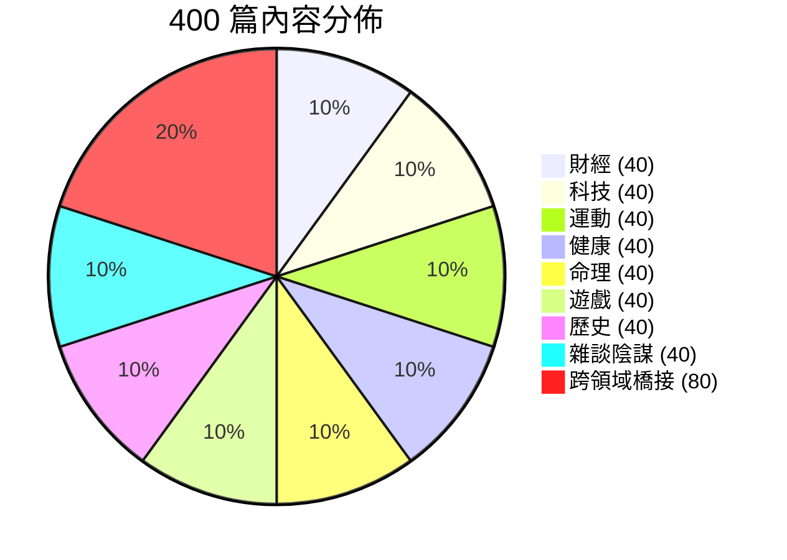

# EpsilonFeed 400 篇內容策略與推薦系統 Embedding 藍圖

本文件規劃了 **400 篇中篇幅高品質 Markdown 文章** 的主題分類、跨領域橋接、向量空間設計與篇目大綱，專為 **基於 Embedding / pgvector 的推薦系統**（含 Epsilon-Greedy 探索策略）所設計。

---

## 總體架構與分佈策略

- **總篇數**：400 篇
- **核心領域 (80%)**：320 篇（8 大主題 × 每主題 40 篇）
- **跨領域橋接 (20%)**：80 篇（8 組跨界組合 × 每組 10 篇）
- **篇幅標準**：中篇幅（約 500 ~ 900 字 / 篇），具備結構化 Markdown 排版（H2/H3、摘要引言、重點列表、數據表格/代碼塊/名言引用、標準 Tags）



---

## 向量空間（Embedding）與推薦系統設計

1. **向量空間幾何特性 (768 維度空間)**：
   - **8 大純粹簇 (Dense Clusters)**：8 大主題各自擁有 40 篇核心詞彙高度集中的文章，形成 8 個清晰的向量聚類重心（Centroids）。
   - **80 篇跨領域橋樑 (Bridge Nodes)**：分布在兩個或多個簇的中間地帶。例如，當使用者偏好「科技」，在探索（Exploration）模式下點擊了「AI醫療」，系統能平滑過渡並推薦「健康」主題的相關內容。
2. **Embedding 生成文本構建方式**：
   採用 **結構化混合文本** 進行向量化：
   ```text
   ${Title}
   【摘要】${Summary}
   【主題標籤】#${Tags.join(' #')}
   【引言】${FirstParagraph}
   ```

---

## 主題與篇目詳細規劃 (400 篇)

### 1. 財經 (Finance) - 40 篇純核心
- **子題 1：美股與全球總經 (10 篇)**：聯準會利率決策機制、美債殖利率倒掛意涵、標普500指數成分股輪動、通膨與停滯性通脹解析、美元霸權現狀等。
- **子題 2：台股與產業價值投資 (10 篇)**：半導體供應鏈營收循環、高股息 ETF 迷思與真實報酬、價值投資護城河分析、本益比與自由現金流估值、財報三表速讀法。
- **子題 3：加密貨幣與去中心化金融 (10 篇)**：比特幣減半週期模型、以太坊Layer 2擴展方案評析、DeFi流動性挖礦風險與機制、冷錢包與自託管安全性、RWA（真實世界資產）上鏈前景。
- **子題 4：個人理財與資產配置 (10 篇)**：四本存摺理財法、指數化投資長期複利效應、緊急預備金與保險配置底線、房貸寬限期與槓桿風險、提早退休 FIRE 運動實踐手冊。

### 2. 科技 (Tech) - 40 篇純核心
- **子題 1：人工智慧與大語言模型 (10 篇)**：Transformer 架構演進史、Retrieval-Augmented Generation (RAG) 實務、AI Agent 自主智能體架構、開源模型（Llama/Mistral）生態、提示工程（Prompt Engineering）技巧。
- **子題 2：前端與現代 Web 生態 (10 篇)**：React Server Components 深入剖析、Vite 與現代打包工具變革、Tailwind CSS 設計思維、TypeScript 5.x 進階型別系統、WebAssembly 實用案例。
- **子題 3：後端架構與分散式系統 (10 篇)**：PostgreSQL 進階索引與 pgvector、微服務與單體架構權衡、Kafka 與事件驅動架構、Redis 緩存穿透與雪崩防禦、Docker 與輕量容器化實踐。
- **子題 4：軟體工程與資安防護 (10 篇)**：Gitflow 與 Trunk-based 開發流、Zero-Trust 零信任安全架構、OAuth 2.0 與 JWT 認證陷阱、CI/CD 自動化部署最佳實踐、Clean Code 與重構心法。

### 3. 運動 (Sports) - 40 篇純核心
- **子題 1：NBA 與職業籃球 (10 篇)**：現代籃球空間小球戰術、擋拆（Pick & Roll）防守策略解析、三分球革命如何改寫進攻效率、傳奇球星生涯經典戰役盤點、選秀選秀權價值與薪資上限規則。
- **子題 2：歐洲足球與頂級聯賽 (10 篇)**：高位逼搶（Gegenpressing）戰術流派、傳控足球（Tiki-Taka）演變、歐冠經典逆轉戰術覆盤、現代邊後衛在攻守轉換中的角色、VAR 影像輔助判決對比賽節奏的衝擊。
- **子題 3：重訓健身與力量訓練 (10 篇)**：深蹲/硬舉/臥推三大項力學細節、肌肥大機制（機械張力 vs 代謝壓力）、週期化力量訓練計畫設計、漸進式超負荷實踐原則、核心肌群在全身發力中的傳導。
- **子題 4：耐力運動與路跑馬拉松 (10 篇)**：Zone 2 低心率有氧耐力訓練、半馬與全馬補給策略規劃、跑步動態與步頻步幅調校、超補醣法在賽前運作機制、運動恢復與筋膜放鬆。

### 4. 健康 (Health) - 40 篇純核心
- **子題 1：睡眠科學與神經調控 (10 篇)**：非快速動眼（NREM）與慢波睡眠修復機制、褪黑激素與晝夜節律光線管理、睡眠呼吸中止症的隱形危害、咖啡因代謝半衰期與攝取時機、多相睡眠（Polyphasic Sleep）真相。
- **子題 2：營養學與飲食策略 (10 篇)**：間歇性斷食（168 / 204）的自噬作用、生酮與低碳飲食的代謝切換、微量營養素（鎂、維生素D3、鋅）補充指南、腸道菌群與腦腸軸溝通機制、超加工食品對大腦獎勵中樞的綁架。
- **子題 3：心理健康與壓力自癒 (10 篇)**：皮質醇長期偏高對身體的慢性損耗、正念冥想（Mindfulness）的神經科學依據、認知行為療法（CBT）思維辨識、職業倦怠（Burnout）修復步驟、呼吸法（Box Breathing）快速穩定自律神經。
- **子題 4：現代人亞健康與預防醫學 (10 篇)**：久坐對心血管與骨盆前傾的損害、脂肪肝逆轉關鍵方針、慢性發炎的成因與抗發炎飲食、定期健康檢查報告關鍵數據解讀、近視與藍光眼睛保護策略。

### 5. 命理 (Astrology & Divination) - 40 篇純核心
- **子題 1：西洋占星與本命星盤 (10 篇)**：太陽、月亮、上升星座黃金三角、水星逆行天文背景與心理投射、十二宮位人生課題解析、四元素（火土風水）性格特質、土星回歸（Saturn Return）生命轉折。
- **子題 2：東方八字與陰陽五行 (10 篇)**：天干地支與四柱八字基礎入門、五行相生相剋平衡哲學、十神（正官、偏財、傷官等）性格特徵、大運流年推算原則、八字用神與格局判定。
- **子題 3：紫微斗數 (10 篇)**：紫微十四主星性格特質速查、命宮與身宮的相互影響、化祿化權化科化忌四化星奧秘、官祿宮與財帛宮的職場布局、疾厄宮看身心潛在隱患。
- **子題 4：塔羅占卜與象徵學 (10 篇)**：大阿爾克那22張愚人之旅隱喻、小阿爾克那四元素能量象徵、塞爾特十字牌陣（Celtic Cross）深度解讀、塔羅直覺引導與潛意識投射、逆位牌意義剖析。

### 6. 遊戲 (Gaming) - 40 篇純核心
- **子題 1：3A 大作與深度評測 (10 篇)**：開放世界地圖引導設計優劣對比、類魂（Soulslike）遊戲關卡與難度曲線、敘事驅動型遊戲情感共鳴設計、CRPG 自由度與選擇後果分支樹、光線追蹤與現代遊戲畫質技術。
- **子題 2：獨立遊戲與創新玩法 (10 篇)**：Roguelike / Roguelite 隨機機制成癮性、銀河戰士惡魔城（Metroidvania）箱庭地圖設計、Deckbuilder 卡牌構築機制解析、解謎遊戲引導心流的心理技巧、像素風格美學的現代復興。
- **子題 3：電競與競爭機制 (10 篇)**：MOBA 視野控制與資源滾雪球經濟學、FPS 射擊遊戲彈道預判與反應架構、格鬥遊戲幀數（Frame Data）優劣與判定、天梯積分（Elo / MMR）機制背後數學原理、電競隊伍溝通與團隊士氣維護。
- **子題 4：遊戲歷史與主機世代 (10 篇)**：雅達利崩潰（Atari Shock）歷史教訓、任天堂的遊戲哲學（枯萎技術的水平思考）、PlayStation 與 Xbox 主機大戰演進、經典街機時代的黃金記憶、掌機演變史（GB 到 Steam Deck）。

### 7. 歷史 (History) - 40 篇純核心
- **子題 1：中國古代與三國爭霸 (10 篇)**：三國演義 vs 正史三國志人物重評、商鞅變法與秦帝國集權制度、唐代安史之亂與藩鎮割據形成、宋代士大夫政治與經濟繁榮、明代東廠錦衣衛特務政治剖析。
- **子題 2：歐洲古代與古典帝國 (10 篇)**：羅馬共和國走向帝國體制的關鍵裂痕、亞歷山大大帝東征的文化融合效應、中世紀黑死病如何瓦解歐洲封建農奴制、文藝復興人文主義的誕生、十字軍東征對地中海貿易格局的重塑。
- **子題 3：近現代革命與世界大戰 (10 篇)**：法國大革命思想激盪與雅各賓專政、第一次世界大戰壕溝戰與塹壕僵局、諾曼第登陸盟軍情報欺敵戰術全景、冷戰古巴飛彈危機關鍵十三天、明治維新如何讓日本脫亞入歐。
- **子題 4：古代文明與考古謎團 (10 篇)**：古埃及金字塔建造物流與勞工階級考證、兩河流域漢摩拉比法典法治精神、馬雅文明崩潰氣候因素新研究、絲綢之路上的文化與宗教傳播、三星堆青銅器造型未解之謎。

### 8. 雜談陰謀 (Mystery & Conspiracies) - 40 篇純核心
- **子題 1：太空、幽浮與地外文明 (10 篇)**：費米悖論與大過濾器（Great Filter）假說、羅斯威爾事件解密檔案真偽、黑騎士衛星傳說與太空垃圾真相、火星人臉地貌與高畫質衛星闢謠、地心空洞說與極地探險傳聞。
- **子題 2：歷史知名懸案與陰謀 (10 篇)**：甘迺迪遇刺事件與單一子彈理論爭議、開膛手傑克身份百年歷史考證、迪亞特洛夫事件山難最新雪崩研究、鐵達尼號掉包保險詐欺陰謀論剖析、百慕達三角洲磁場異常與流言終結。
- **子題 3：秘密結社與都市傳說 (10 篇)**：共濟會與光明會符號學真相、骷髏會（Skull and Bones）名流歷史脈絡、費城實驗與軍事時空傳聞、51區軍事基地與黑科技研發解密、曼德拉效應（Mandela Effect）集體記憶錯置。
- **子題 4：深海、古代科技與超常現象 (10 篇)**：馬里亞納海溝未解巨型生物目擊考、亞特蘭提斯沉沒地點假說盤點、通古斯大爆炸隕石 vs 反物質假說、尼斯湖水怪環境 DNA 最新檢驗結果、麥田圈幾何圖形人為製造與電磁異常研究。

---

### 9. 跨領域交叉 (Cross-Domain Bridges) - 80 篇 (20%)

| 組別 | 交叉領域組合 | 篇數 | 核心主題與篇目大綱 |
| :--- | :--- | :---: | :--- |
| **B1** | 📈 財經 × 💻 科技 | 10 | **FinTech & AI 交易**：高頻量化交易演算法機制、晶片供應鏈地緣政治戰略價值、生成式 AI 算力基礎設施商業模式、區塊鏈零知識證明（ZK-Rollups）金融應用、SaaS 訂閱制財務估值指標等。 |
| **B2** | 💻 科技 × 🥗 健康 | 10 | **AI 智慧醫療與生物科技**：AlphaFold 如何顛覆蛋白質結構預測、穿戴裝置即時心電圖（ECG）監測、CRISPR 基因編輯技術倫理與前景、腦機介面（Neuralink）進展、數位療法（Digital Therapeutics）。 |
| **B3** | 🏀 運動 × 🥗 健康 | 10 | **運動科學與生理恢復**：運動員飲食熱量週期化、延遲性肌肉酸痛（DOMS）成因與冷療冷水浴、高強度間歇運動（HIIT）心肺適能重塑、運動傷害預防之功能性動作檢測（FMS）、運動營養品（肌酸、乳清）科學驗證。 |
| **B4** | 💻 科技 × 🎮 遊戲 | 10 | **遊戲技術與虛擬實境**：Unreal Engine 5 Nanite 與 Lumen 即時渲染黑科技、生成式 AI NPC 智慧對話系統、VR 空間音訊與前庭神經防暈技術、雲端串流遊戲網路架構與邊緣計算、物理引擎破壞模擬。 |
| **B5** | 🏛️ 歷史 × 📈 財經 | 10 | **金融歷史與經濟危機**：17世紀荷蘭鬱金香狂熱與投機心理學、18世紀英國南海泡沫事件與牛頓炒股、1929年華爾街股災與大蕭條教訓、羅馬帝國銀幣貶值與貨幣崩潰、宋代交子紙幣通膨制度史。 |
| **B6** | 🏛️ 歷史 × 👁️ 雜談陰謀 | 10 | **歷史謎團與秘史**：聖殿騎士團瓦解與秘寶下落考證、阿波羅登月冷戰背景與陰謀論闢謠、圖坦卡門法老詛咒背後的真菌科學、希特勒南美逃亡傳聞與解密檔案、莫斯科紅場地下神秘地鐵二號線傳聞。 |
| **B7** | 🔮 命理 × 💻 科技 / 心理 | 10 | **現代命理與認知科學**：榮格心理學「共時性」與塔羅占卜關聯、AI 大模型算命與演算法命理分析、巴納姆效應（Barnum Effect）如何影響星座認同、大數據統計與八字命理特徵相似度探討、數位占卜風潮與現代人焦慮解方。 |
| **B8** | 🏀 運動 × 💻 科技 / 📈 財經 | 10 | **運動數據革命與商業帝國**：魔球理論（Moneyball）現代進階數據革命（WAR, PER）、職業體育轉播權百億美元商業版圖、NBA 球員追蹤系統（Second Spectrum）光學數據、電競戰隊估值與賽事贊助商業模型、運動鞋與運動科技材質專利戰。 |

---

## 範例文章格式標準 (Template)

每篇產生的 Markdown 文章均符合以下格式，既有結構化元數據，又保有生動中篇幅正文：

```markdown
# 晶片戰略與全球算力競賽：誰掌控了下一個十年的科技咽喉？

> **導讀**：從先進製程、極紫外光（EUV）微影設備到封裝瓶頸，半導體不僅是科技產品的心臟，更是全球地緣政治與金融市場的焦點戰場。

## 1. 摩爾定律放緩下的物理極限

隨著電晶體尺寸逼近 2 奈米甚至埃米（Angstrom）世代，量子穿隧效應讓晶片微縮面臨嚴峻挑戰。ASML 的 High-NA EUV 微影設備成為推進晶圓製造的關鍵突破口...

## 2. 算力即國力：AI 加速器重塑供應鏈

生成式 AI 與超大規模資料中心對 GPU 與 TPU 的爆發性需求，帶動了先進封裝技術（如 TSMC CoWoS）的產能爭奪戰...

| 關鍵節點 | 核心技術挑戰 | 代表性廠商 |
| :--- | :--- | :--- |
| **微影曝光** | 0.55 NA High-NA EUV 光學系統 | ASML |
| **晶圓製造** | GAAFET 環繞閘極電晶體架構 | TSMC, Samsung, Intel |
| **先進封裝** | 3D 矽中介層與高頻寬記憶體 (HBM) | TSMC, SK Hynix |

## 3. 未來觀察與資產配置意涵

對投資人與科技觀察者而言，晶片產業已脫離單純的消費電子週期，轉為結構性增長的基礎設施...

---
#科技 #財經 #半導體 #人工智慧 #硬體架構
```

---

## 下一步行動

1. 本計畫已完整列出 400 篇主題與結構。
2. 接下來可建立 **批次文章生成與載入工具**（例如 `post/generate_400_posts.ts`），利用結構化模板批量產製完整的 400 篇 Markdown 內容與 Tags。
3. 產生完成後，可配合 `backend/src/seed.ts` 或向量生成腳本，將文章匯入 PostgreSQL 並計算 768 維度向量，完成完整的推薦系統 Demo 資料庫建置。
